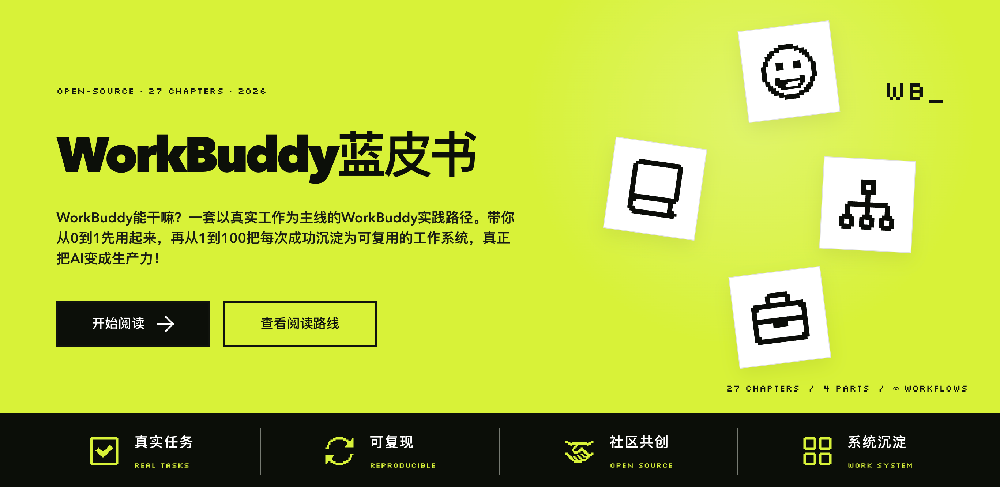

<p align="center">
  <a href="https://workbuddy.homes/">
    
  </a>
</p>

<h1 align="center">The WorkBuddy Bluebook</h1>

<p align="center"><strong>From your first task to an AI team</strong></p>

<p align="center">
  English · <a href="./README.md">简体中文</a> ·
  <a href="https://workbuddy.homes/">Read Online</a> ·
  <a href="./docs/reading-guide.md">Reading Guide</a> ·
  <a href="./CONTRIBUTING_en.md">Contribute</a>
</p>

> This is a task-driven field guide, not a rewritten feature manual. It starts with installation and a first successful task, then moves into office work, knowledge management, professional workflows, content automation, multi-agent systems, and reusable team practices.

## Read Online

The recommended reading experience is **[workbuddy.homes](https://workbuddy.homes/)**. The website provides full navigation, local search, page outlines, dark mode, rendered diagrams, and mobile support.

The book is currently written primarily in Simplified Chinese. English contributions and translation proposals are welcome.

## What Is Inside

| Section | Topics |
| --- | --- |
| Part I · User Manual | Installation, interface, first task, Skills, connectors, APIs, and automation |
| Part II · Cases | Office work, files, remote control, news, knowledge, meetings, investing, video, content, and GEO |
| Part III · Advanced | Building Skills, multi-agent system design, and reliable automation |
| Part IV · Roles and Industries | Role-based learning paths and industry workflows |
| Appendices | Reusable instructions and a scenario lookup table |

## How to Read

- **New to WorkBuddy**: start with Chapter 1 and complete Part I in order.
- **Have a specific task**: jump to a matching case in Part II, then use Part III to turn the result into a reusable system.
- **Rolling out to a team**: focus on Parts III and IV, including permissions, acceptance criteria, and failure recovery.

## Local Development

Node.js 20–24 is supported; Node.js 22 is recommended.

```bash
npm install
npm run dev
```

Build and preview the static site:

```bash
npm run docs:build
npm run docs:preview
```

## Contributing

Contributions are welcome, including:

- corrections for typos, broken links, and outdated information;
- reproducible real-world WorkBuddy cases;
- Skills, connectors, API, and automation practices;
- role-specific and industry-specific workflows;
- improvements to navigation, search, design, and accessibility;
- English translations.

Read the [Contribution Guide](./CONTRIBUTING_en.md) or open an [Issue](https://github.com/AlephAITech/WorkBuddyGuide/issues).

## Deployment

The site uses **VitePress + Cloudflare Pages + GitHub**. Cloudflare Pages builds and deploys the `main` branch automatically. See [DEPLOYMENT.md](./DEPLOYMENT.md) for the exact settings.

## Authors

Thanks to the authors who create and maintain The WorkBuddy Bluebook. Click a card to view the full-size image and scan its QR code.

<p align="center">
  <a href="./assets/authors/jia-mu-wei-lai-pai.png"></a>
  <a href="./assets/authors/mo-yu-xiao-li.png"></a>
</p>

<p align="center">
  <a href="./assets/authors/dai-shu-di-ai-ke-zhan.png"></a>
  <a href="./assets/authors/liu-cong-nlp.png"></a>
</p>

<p align="center">
  <a href="./assets/authors/cang-he.png"></a>
</p>

## Disclaimer

This is a community-maintained WorkBuddy practice guide. For time-sensitive product details—including features, UI, pricing, availability, and security policies—refer to official WorkBuddy sources.

## License

This project is licensed under the [MIT License](./LICENSE). You may use, copy, modify, and distribute it, provided that the original copyright notice and license text are retained.
