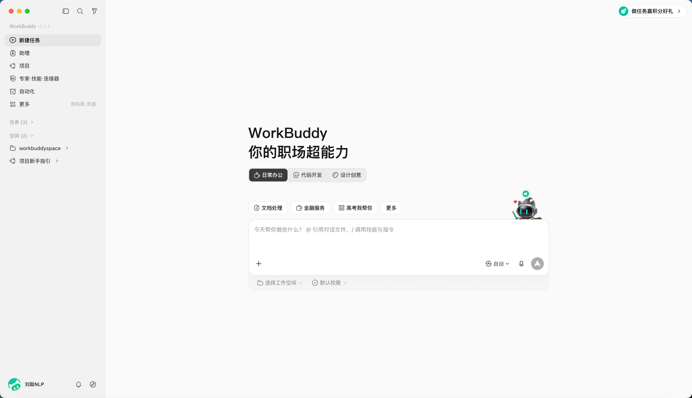
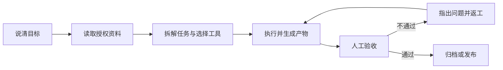
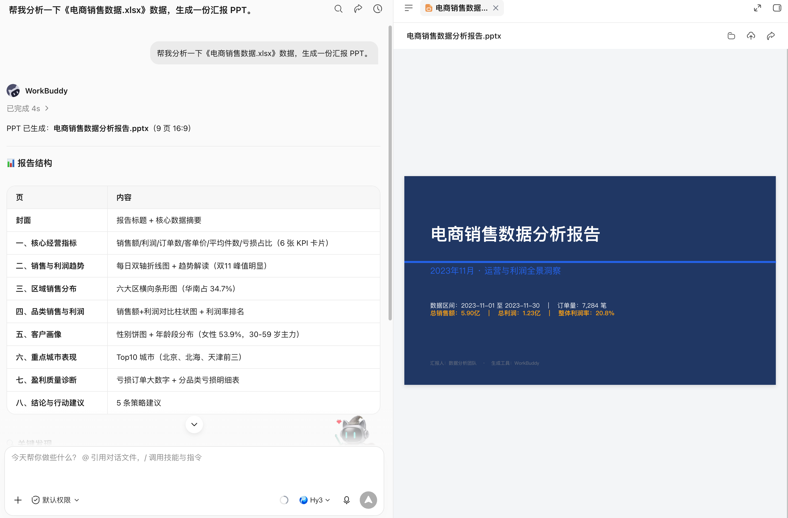

# 第 1 章 初识 WorkBuddy

**WorkBuddy** 是腾讯最新推出的全场景职场 AI 智能体工作台，

面向 人力资源、行政、运营、销售、研发等不同职场角色，是一款能够像真正同事一样思考、执行任务并交付结果的 AI 办公应用。

## 从“回答问题”到“交付结果”

与传统 AI 助手不同，WorkBuddy 不只是陪用户聊天、回答问题或者给出建议。

用户只需要用一句自然语言描述需求，它就可以理解任务目标，在本地电脑中自主规划执行步骤，并完成复杂的多模态任务。

在获得用户授权后，WorkBuddy 可以读取和处理本地文件，自动完成批量文件处理、文档生成、表格分析、PPT 制作、多模态内容创作、行业调研、本地知识库构建等工作。

对于更加复杂的任务，它还可以自主拆解步骤，并通过多个智能体（Agents）并行，减少人工在不同工具、文件和任务之间反复切换的成本。

例如，用户可以直接告诉 WorkBuddy，分析这个文件夹中的销售数据，并生成一份汇报 PPT。

WorkBuddy 会自主读取相关文件，理解数据内容，完成分析和总结，并生成最终可以查看和修改的工作成果。

整个过程中，用户不需要手动上传每一个文件，也不需要一步一步告诉 AI 下一步应该做什么。

WorkBuddy 面向的是完整的工作任务。

它的核心能力可以概括为三点，**听得懂人话，能够自主思考规划，也真的能够操作电脑交付成果。**

为了完成不同类型的任务，WorkBuddy 还提供了多模型切换（混元/DeepSeek/GLM/Kimi/MiniMax 等）、MCP Server、Skills 技能包等能力。

用户可以根据不同任务选择合适的模型，也可以通过 MCP 和 Skills 扩展 WorkBuddy 的工具和专业能力。

同时，针对本地文件操作、终端执行等场景，WorkBuddy 还提供高危指令拦截和权限控制机制，降低 AI 自主执行过程中的风险。

