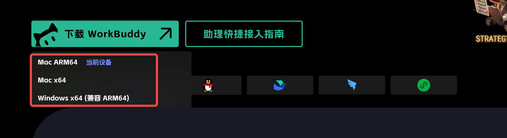
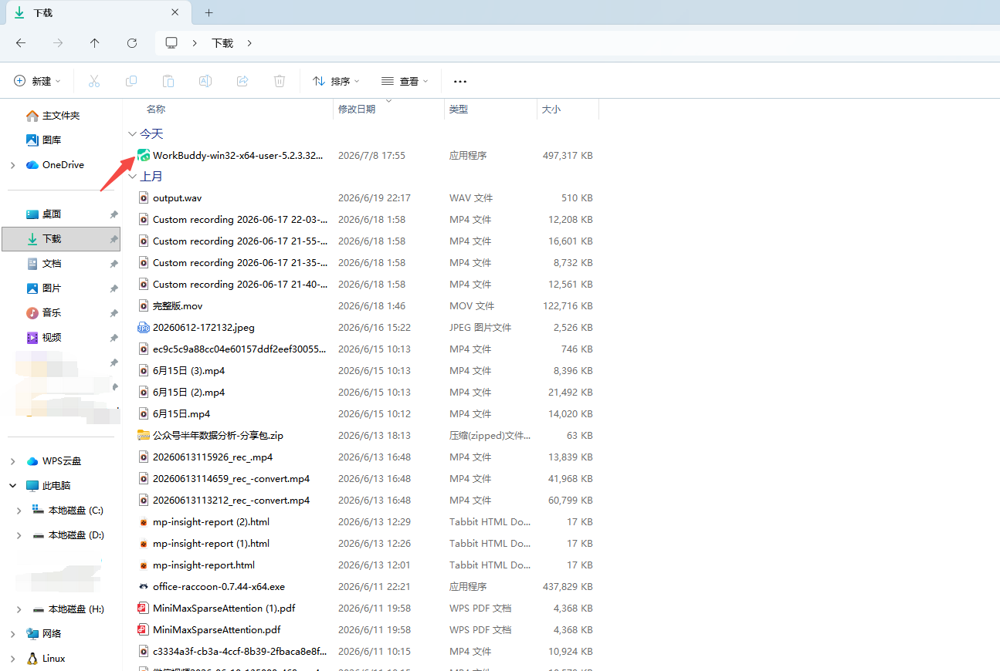
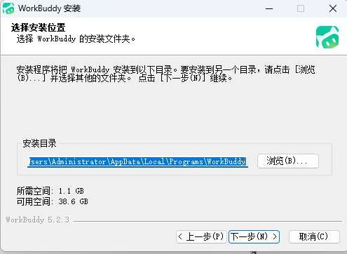
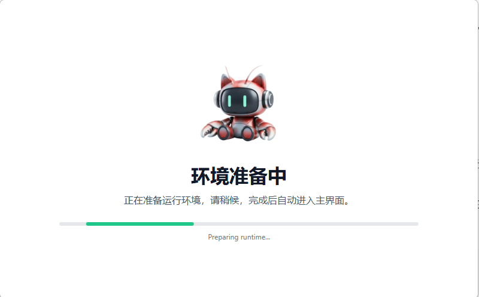
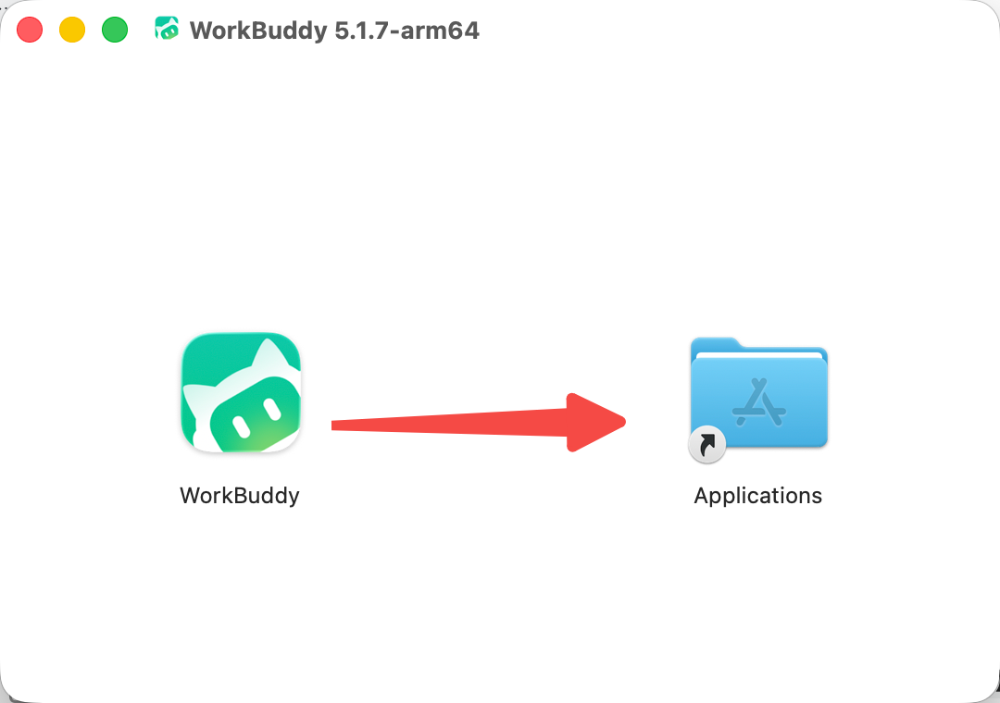
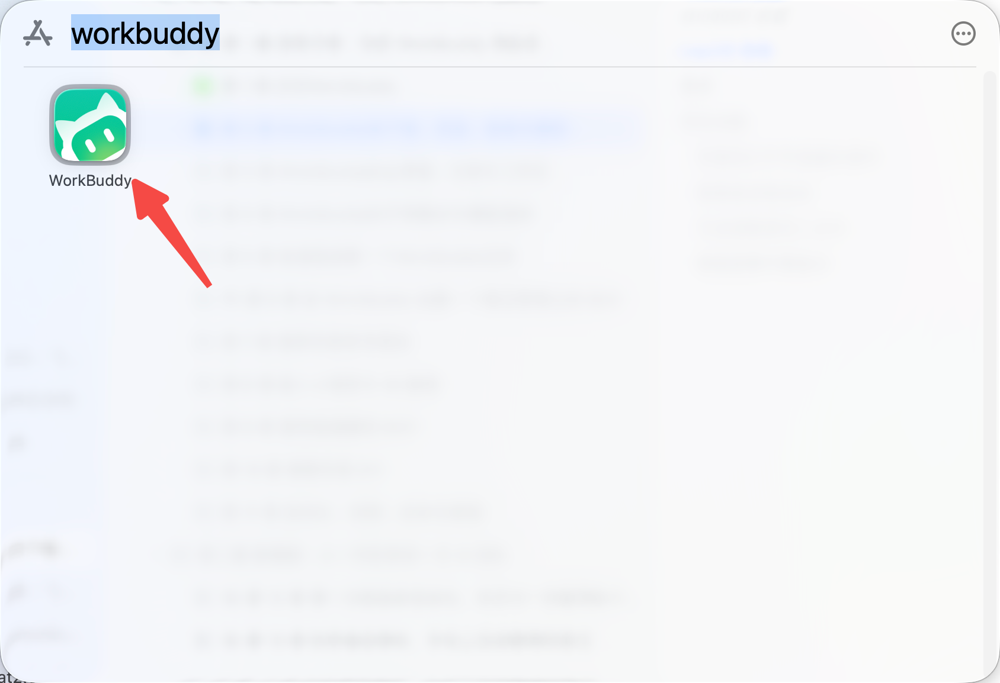
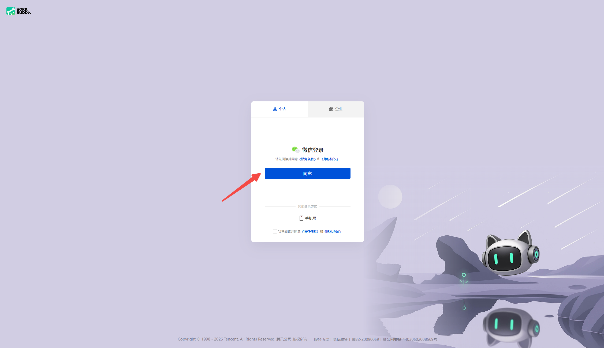
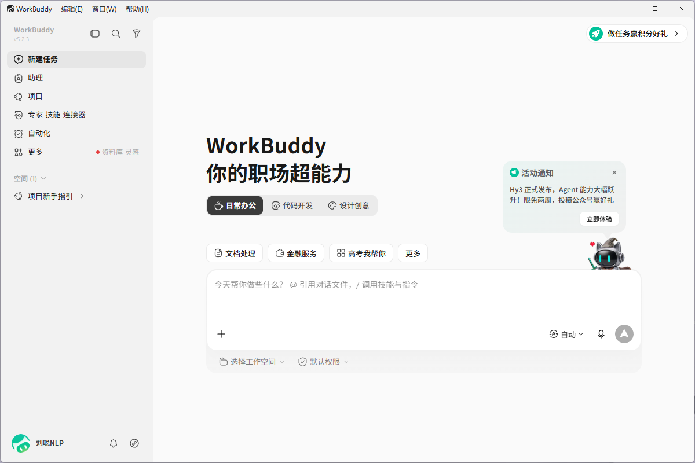

# 第 2 章 WorkBuddy的下载、安装、登录与更新

## WorkBuddy下载

下载WorkBuddy，点击官方地址（https://www.codebuddy.cn/work/），选择WorkBuddy，点击“下载WorkBuddy”即可下载。

网站会自动检查你当前设备，判断你是什么版本，Mac ARM64、Mac x64或者Windows x64。

***切记：从官方入口进入下载，不从网盘或不明镜像获取安装包。***

## Windows 安装

1. 下载完成后双击安装文件。

1. 如系统弹出安全提示，先核对发布者与下载来源，再决定是否继续。

1. 按安装向导完成安装并启动 WorkBuddy。

1. 进入准备运行环境

## macOS 安装

1. 打开安装文件，将 WorkBuddy 拖入“应用程序”；

1. 从“应用程序”启动；

## 登录

点击登录按钮

自动跳转网页登录

选择微信扫码登录，也可以手机号登录

完成后，即可使用WorkBuddy进行工作

*PS：若公司电脑禁止安装软件，不要绕过终端安全策略，应联系 IT 管理员确认白名单或企业部署方式。*

## 更新

点击左下角个人中心，选择“检查更新”，检查是否有新版本，若有新版本，可更新

## 常见问题

### 安装包打不开或提示损坏

先删除安装包并从官网重新下载，核对系统和芯片版本。仍失败时记录系统版本、安装包名和报错截图，通过官方反馈渠道处理，不要随意关闭系统安全功能。

### 登录后没有反应

检查默认浏览器是否拦截登录回跳、网络代理是否影响认证、系统时间是否准确。退出应用后重试，并保留日志与截图。

### 无法读取或写入文件

确认任务选择的工作目录是否正确、系统是否授予对应目录权限、文件是否被其他程序锁定。先用一个空白文本文件测试，不要直接拿重要文件反复试错。

### 更新前要不要备份

应用更新一般不应修改工作文件，但长期项目仍应把输入、产物、配置和自定义 Skill 纳入版本管理或定期备份。