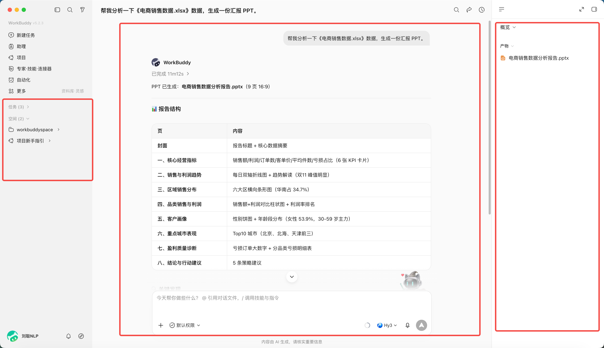
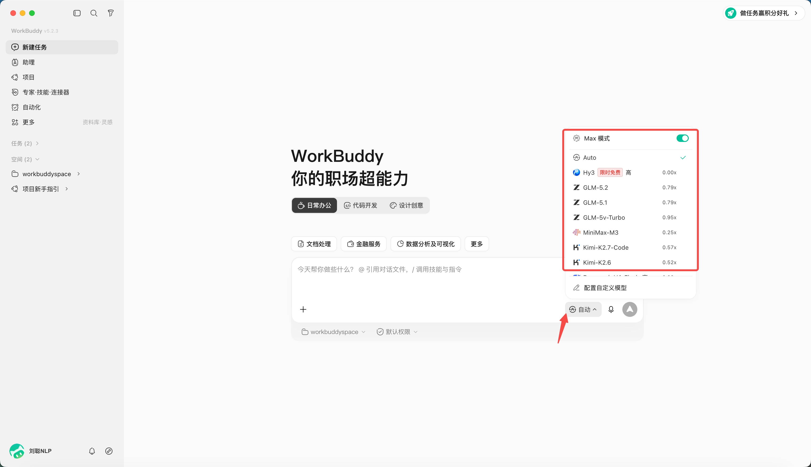

# 第 3 章 WorkBuddy 的主界面、任务与工作区

WorkBuddy 主界面可以理解为三个区域：左侧（侧边栏）管理任务，中间（对话区）下达和追踪任务，右侧（结果区）查看文件、变更、预览和最终产物。

## 三个区域分别做什么

| 区域 | 主要用途 | 使用时重点检查 |
|-|-|-|
| 侧边栏 | 新建、搜索、切换和管理任务 | 是否进入了正确任务 |
| 对话区 | 描述需求、补充信息、确认计划 | 目标和约束是否完整 |
| 结果区 | 查看产物、全部文件、变更与预览 | 文件名、路径和改动是否符合预期 |

## 为什么要隔离工作目录

工作目录既是效率设置，也是安全边界。把发票、周报、客户材料混在同一个大目录里，会增加误读、误改和信息串用的风险。

推荐按任务建目录空间。

同时，可以对目录空间的权限进行设置，当开启“允许完全访问”（开启完全访问后智能体可读写授权目录外文件，请谨慎使用并优先按任务限定目录。）

## 三种工作模式

WorkBuddy 提供三种工作模式：

| 模式 | 中文界面 | 能做什么 | 适合场景 |
|-|-|-|-|
| Ask | 问一问 | 问答、理解和查看，不修改文件 | 先了解资料、确认需求 |
| Craft | 做一做 | 可直接操作本地文件、运行代码及系统指令 | 路径清楚、风险较低的任务 |
| Plan | 想一想 | 先生成计划，确认后再执行 | 多步骤、跨系统、重要文件任务 |

## 选择不同的模型

默认为自动模式，可以指定你想使用的模型，不同模型积分消耗不同。

模型名称和能力会随产品更新，不建议长期记住“某个模型只适合某类任务”。更稳妥的做法是按任务选择，并先用同一份脱敏小样本比较结果。

| 任务特征 | 优先关注 | 建议验证 |
|-|-|-|
| 大量文本与长资料 | 上下文长度、事实保持和中文结构能力 | 能否覆盖全部材料并准确引用 |
| 图片、截图或音视频 | 是否支持相应输入模态 | 能否识别关键内容和细节 |
| 表格、代码和文件处理 | 工具调用、格式生成和错误修复能力 | 产物能否打开、计算和复现 |
| 高频简单任务 | 响应速度和使用成本 | 质量达到要求后再批量使用 |
| 高风险专业任务 | 推理深度、证据意识和边界表达 | 只生成辅助材料，交专业人员复核 |

最新模型通常能力更全面，但不代表每项任务都更合适。模型更新后应重新做小样本测试，并以 WorkBuddy 当前界面显示的能力和使用规则为准。
