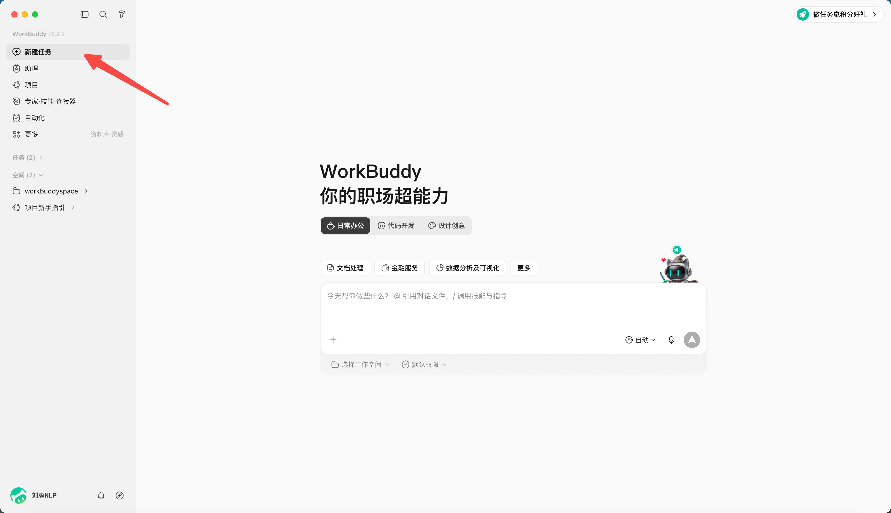
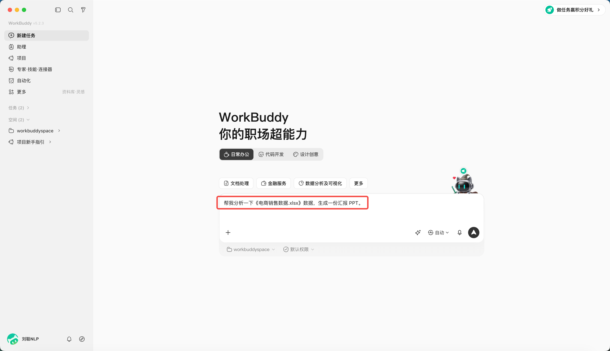

# 第 4 章 快速完成第一个 WorkBuddy 任务

## 快速创建一个 WorkBuddy 任务

1. 点击“新建任务”；



2. 选择或创建独立工作目录；

*PS：WorkBuddy 采用文件夹级授权与高危拦截，首次操作请先在演练目录进行、留意授权范围，处理真实业务数据前谨慎确认*


3. 判断应该使用模式，默认为Craft，还可以设置成Ask或Plan；


4. 选择模型，可以指定你想使用的模型，不同模型积分消耗不同。


5. 输入任务说明，“帮我分析一下《办公能耗练习数据.xlsx》，生成一份内部汇报 PPT。”



6. 如有必要，指定 Skill、专家、连接器或资料库，这里暂时忽略


7. 发送后观察计划、工具调用和文件变更；


8. 在结果区预览产物并验收。

文件可以本地打开、上传云端、或分享，注意分享前先确认产物不含敏感或涉密信息，按公司规范选择共享范围。


## 如何写一个任务说明

| 要素 | 要回答的问题 |
|-|-|
| 目标 | 最终要解决什么问题 |
| 输入 | 使用哪些文件、目录或链接 |
| 动作 | 需要分析、整理、转换还是生成 |
| 约束 | 哪些不能改，采用什么规范 |
| 输出 | 交付什么文件，放到哪里 |
| 验收 | 用什么标准判断合格 |

### 入门任务 A：整理文件

```text
目标：整理 input 目录中的练习文件，便于按类型查找。
输入：仅处理当前工作区的 input 目录。
动作：识别文件类型，提出分类和重命名方案。
约束：不删除、不覆盖原文件；重名时保留两份并标记序号。
输出：先生成 inventory.xlsx 和 proposed-actions.md。
验收：清单文件数与 input 实际文件数一致，所有动作可追溯。
在我确认 proposed-actions.md 前，不移动文件。
```

### 入门任务 B：生成会议纪要

```text
请把 input/meeting.txt 整理为结构化会议纪要。

请按以下格式输出:

## 会议基本信息
- 会议主题:
- 参会人员:
- 会议时间:
- 会议时长:

## 核心议题
提取3-5个主要议题，每个用一句话概括

## 讨论详情
对每个议题展开说明:
- 议题名称
- 主要观点(控制在150字以内)
- 不同意见
- 达成的共识

## 决策事项
所有确定的决策，格式:
【已决策】决策内容 | 执行要求 | 负责人

## 待办任务
格式:任务内容 | 责任人 | 截止时间

## 遗留问题
【待讨论】问题描述 | 涉及方

## 验收要求
必须包含：核心议题、决策事项、待办事项、负责人、截止日期、遗留问题。
不能从原文确认的负责人或日期写“待确认”，不要自行补全。
输出 output/会议纪要.md 和 output/待办清单.xlsx。
验收：每一项结论可以在原文找到依据；待办不遗漏负责人和时间状态。
```

### 入门任务 C：Word 转 PPT

```text
把 input/项目汇报.docx 转成 10 页以内的内部汇报 PPT。
受众：部门负责人；汇报时长：8 分钟。
保持原文事实和数字，不新增未经证实的数据。
结构：背景、现状、问题、方案、计划、需要决策。
使用 reference/brand-guide.pdf 中的颜色与字体规范。
输出 output/项目汇报_v1.pptx，同时提供逐页内容清单。
验收：每页只有一个核心观点，数字与原文一致，正文在投影状态可读。
```
