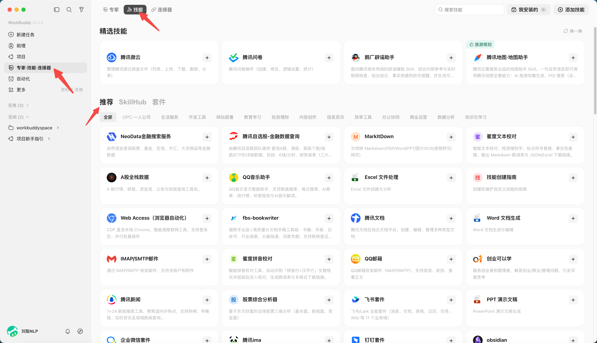
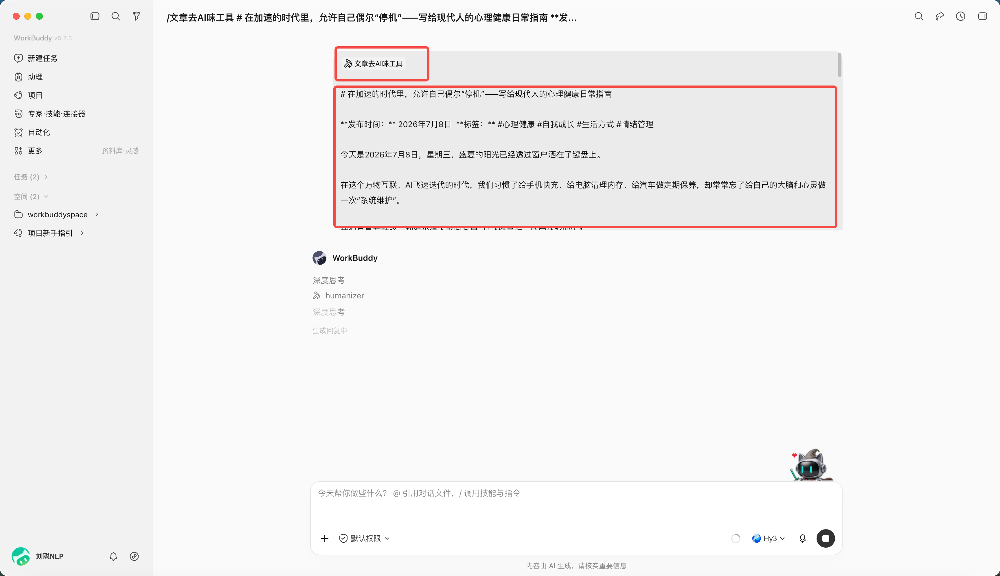
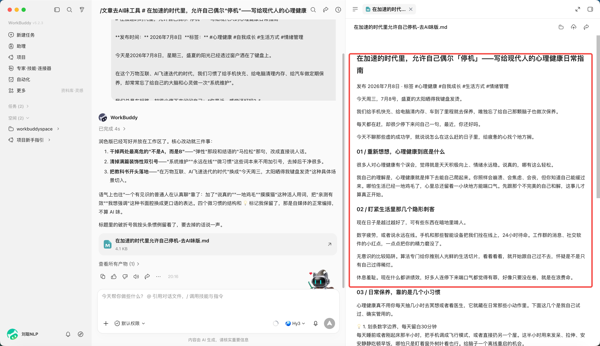
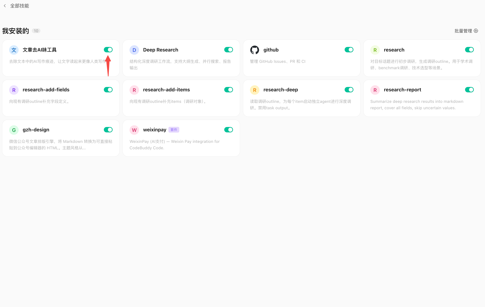

# 第 5 章 WorkBuddy加载一个真正用得上的 Skill

## Skill 是什么

WorkBuddy 本身负责理解任务和组织执行；Skill 则是一组可复用的说明、脚本、参考资料和资源，告诉 Agent 某类任务应该怎样做、调用什么工具、交付什么格式。


Anthropic 在 2025 年 10 月正式推出 Agent Skills，2025 年 12 月将其发布为开放标准。

一个最标准的 Skill，大概长这样：

```Plain Text
my-skill/
├── SKILL.md
├── scripts/
│   └── check.py
├── references/
│   └── guide.md
└── assets/
    └── template.pptx
```

其中只有 `SKILL.md` 是必须的。

```Markdown
---
name: tech-article-writing
description: 用于撰写 AI 产品、模型评测和科技行业相关文章
---

收到写作任务后：

1. 先确认文章核心角度
2. 查找一手资料
3. 对核心事实交叉验证
4. 根据用户写作风格完成初稿
5. 检查禁用句式和 AI 味表达
```

还可以带上：

```Plain Text
references/style.md
```


## Skill 是怎么工作的

Skill 最关键的设计，其实不是 SKILL.md，而是 Progressive Disclosure，渐进式披露。

假设你的 Agent 装了 100 个 Skill。

它不会一上来把 100 个 Skill 的完整内容全部塞进上下文。这样不仅浪费 Token，还会让模型被大量无关指令干扰。

标准做法分三层。

第一层，Agent 启动时只看所有 Skill 的名称和 description。

比如：

```Plain Text
pptx
处理 PowerPoint 创建、编辑、读取任务

pdf
处理 PDF 提取、合并、编辑、填写任务

tech-article-writing
撰写 AI 和科技行业文章
```

第二层，当用户说：

```Plain Text
帮我写一篇 WorkBuddy 的公众号文章
```

Agent 根据 description 判断 `tech-article-writing` 可能相关，这时才加载完整的 `SKILL.md`。

第三层，执行过程中发现需要模仿你的写作风格，才继续读取：

```Plain Text
references/style.md
```

需要检查 AI 味，才执行：

```Plain Text
scripts/check-ai-phrases.py
```

标准规范建议，所有 Skill 启动时只加载数十至上百Token的元数据，Skill 激活后再加载完整说明，其他资料和脚本继续按需读取。OpenAI Codex 也采用类似机制，先向模型暴露 Skill 的名称、描述和路径，再在模型决定使用时读取完整内容。

所以 Skill 解决了一个长期困扰 Agent 的问题：

**怎么给 Agent 很多知识和工作方法，又不把所有东西永远塞在 Prompt 里。**


## Skill 跟 Prompt 到底有什么区别

这是最核心的问题。

<div class="embed-note">
  <strong>配套对照表：</strong>本节在飞书原文中包含一张“Prompt 与 Skill”的对照表。当前离线版本保留了表格入口；如有访问权限，可<a href="https://my.feishu.cn/sheets/LTSAsjfnIhVDmyt0ApLcBRedndh?sheet=hnuXuj" target="_blank" rel="noreferrer">打开飞书源表</a>。
</div>

最简单的理解是：

```Plain Text
Prompt = 任务
Skill = 做法
```


## Skill 有哪些作用

**第一个作用，是给模型补充程序性知识。**大模型往往知道大量知识，但未必知道你的事情具体应该怎么做，比如它知道 SQL，但它不知道你公司的：

```Plain Text
canonical user_id 在哪张表
subscriptions 表是 append-only
查询退款时必须排除某个状态
Grafana 对应 dashboard ID 是多少
```

这些知识非常适合做 Skill，Anthropic 在内部使用了数百个 Skill，最终发现主要集中在 API 和内部库使用、产品验证、数据分析、业务流程自动化、代码脚手架、代码审查、CI/CD、故障 Runbook 和基础设施运维九类场景。


**第二个作用，是固定复杂工作流，**比如做一次行业调研。

普通 Prompt 可能是：

```Plain Text
详细调研一下 WorkBuddy
```

模型每一次都会重新思考：

```Plain Text
去哪里找资料
先查什么
怎么验证
跟谁对比
输出什么结构
```

Skill 可以把流程固定下来：

```Plain Text
1. 官方网站
2. 官方公众号和发布会
3. 产品文档
4. 实际产品测试
5. 同类产品对比
6. 核心观点提炼
7. 事实核验
```

这种能力称为 Encoded Preference Skill。模型本来能完成每一个单独步骤，但 Skill 把这些步骤按照团队或个人的工作方式组织起来。

另一类是 Capability Uplift Skill，给模型补充它原本做不好或不稳定的能力，例如复杂文档、PDF 和 PPT 处理。


**第三个作用，是减少重复 Prompt。**

你现在跟 AI 合作，其实有大量内容是在重复说，比如你经常告诉我：

```Plain Text
不要写得太 AI
长短句结合
不要过度点列
要有自己的判断
技术内容要克制
不要编造例子
```

这些其实已经天然适合做成一个 `writing-style` Skill。

以后你的 Prompt 只需要：

```Plain Text
写一篇 WorkBuddy 文章
```

写作习惯、资料标准、禁用表达、文章流程，都由 Skill 提供。


**第四个作用，是把个人经验和组织经验资产化。**

传统 Prompt 最大的问题是容易散落在：

```Plain Text
聊天记录
飞书文档
Notion
个人脑子里
```

Skill 是文件，所以它可以：

```Plain Text
Git 管理
版本回滚
团队共享
A/B 测试
自动评测
持续更新
```

这件事情很关键。


## WorkBuddy里找到合适的Skill

打开左侧“专家·技能·连接器”，可以从技能市场搜索，也可以用“查找技能”描述需求。



也可以在SkillHub技能市场里找到合适的Skill


除了从推荐列表里直接安装，还可以**导入自己下载的技能**。

比如你在网上看到一个好用的技能包，下载下来是一个 zip 压缩文件，操作流程是这样的：点击"上传技能"，把 zip 文件加载即可


## 使用Skill解决一个任务

比如，你让AI写了一篇文章，需要去除AI味，你可以找到“文章去AI味工具 ”Skill，安装之后，使用时，直接 “/” 可以换出。


你只需要引用Skill内容，把文章给到即可，



WorkBuddy 会先加载skill的内容，


根据skill中的规则，来执行，比如要去除不是而是、双引号等内容，


修改之后，可以得到结果，确实去除了AI味。




## Skill的关闭和卸载

从全部技能中，点击我安装的


按钮关闭（则关闭该Skill）



点击“···”，可以选择删除或编辑该Skill


