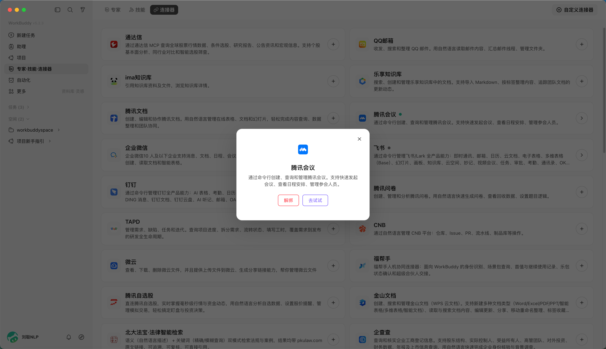
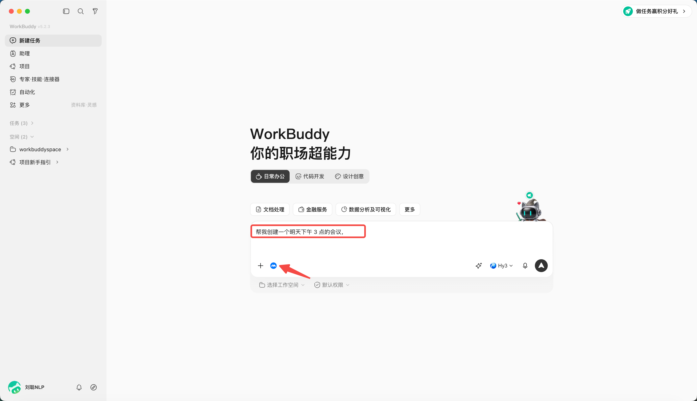
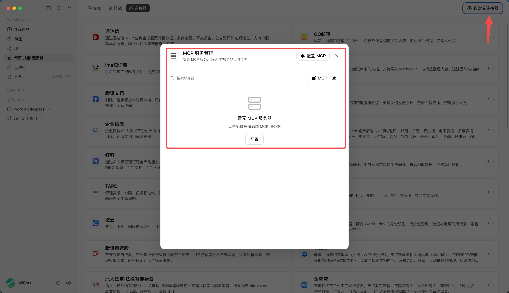

# 第 7 章 WorkBuddy 使用连接器

::: warning 安居建业内部使用提示
仅连接公司批准的系统、账号与数据源。首次接入应从只读、最小权限和测试目录开始；访问令牌、密码和连接串不得写入提示词、截图或共享文档。涉及业务系统写入、外部发送或批量处理时，必须先确认授权范围并保留操作记录。
:::

**MCP**指的是 **Model Context Protocol（模型上下文协议），**是由 Anthropic 于 2024 年底推出并开源的一个开放标准协议，目前已经成为 AI 领域最热门的基础设施之一。

用一个通俗的比喻：**MCP 就是 AI 世界的“USB-C 接口”。**

## 为什么需要 MCP？

在过去，如果你想让一个 AI 助手（Agent）连接外部工具（比如 GitHub、本地文件系统、PostgreSQL 数据库、Slack 等），开发者必须为“每一个 AI 应用”和“每一个工具”编写专门的对接代码。如果有 10 个 AI 应用和 10 个工具，就需要写 100 个接口（N × M 的集成噩梦）。

有了 MCP，工具开发者只需要按照 MCP 标准开发一个“MCP Server”（相当于 USB-C 设备），而任何支持 MCP 的 AI 应用（如 Cursor、各类 Agent 框架）只需内置“MCP Client”（相当于 USB-C 接口），就能**即插即用**。这就把 N × M 的复杂开发工作，简化成了 N + M。

## MCP 的核心特点

- 统一的标准化协议（告别重复造轮子）

MCP 提供了一套通用的规范（基于 JSON-RPC）。无论是读取本地文件、查询数据库，还是调用第三方 SaaS API，AI 都能通过同一套协议逻辑去理解和调用。这大幅降低了 Agent 开发中工具集成的门槛，让开发者可以把精力集中在 Agent 的核心逻辑上，而不是写繁琐的 API 对接代码。

- 支持三大核心能力

MCP 不仅能让 AI “做事”，还能让 AI “看数据”和“按套路出牌”，它标准化了三种核心原语：

- **Tools（工具）**：允许 AI 执行操作。例如：运行一段代码、在 Jira 创建一个任务、向数据库写入数据。
- **Resources（资源/上下文）**：允许 AI 读取外部数据。例如：获取 Git 仓库的文件列表、查询向量数据库中的特定片段，作为回答问题的上下文。
- **Prompts（提示词模板）**：提供预定义的交互模板，让用户或 AI 能以标准化的方式触发特定的复杂工作流。

- C/S 架构与高度解耦，MCP 采用客户端-服务端（Client-Server）架构：

  - **MCP Host**：你使用的 AI 宿主应用（如 IDE、Agent 平台）。
  - **MCP Client**：Host 内部负责与 Server 保持 1:1 连接的组件。
  - **MCP Server**：轻量级的独立程序，专门负责暴露特定工具或数据的能力。

这种解耦意味着你可以随时替换底层的大模型，或者随时增加新的数据源，而无需重构整个 Agent 系统。

- 本地优先与安全性（隐私友好）

MCP 支持通过本地标准输入输出（stdio）或本地 HTTP 进行通信。这意味着你的 MCP Server 可以完全运行在本地电脑上。敏感数据（如本地代码、私有数据库内容、电商后台数据）不需要上传到云端第三方服务器，AI 模型只在需要推理时获取必要的上下文，极大提升了企业级应用的数据安全性。

## 加载一个连接器

**当前已支持 QQ 邮箱、腾讯文档、腾讯乐享、腾讯会议、TAPD 等连接器。**

比如加载腾讯会议连接器，

## 创建一个任务

帮我创建一个明天下午 3 点的会议，

主题“项目讨论”，时长1h

创建成功

## 新建连接器

连接器管理页右上角点“自定义连接器”，按引导配置 MCP（含服务地址、鉴权方式），并提示自定义连接器的访问范围由用户配置

