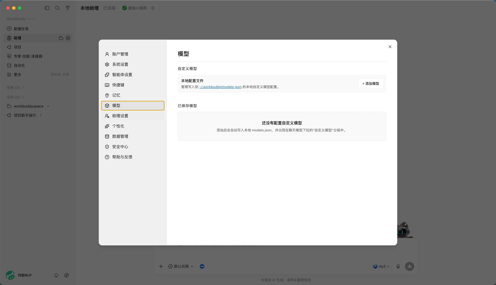
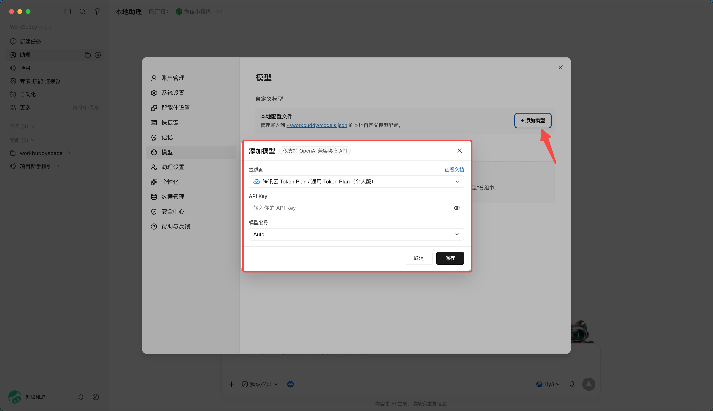
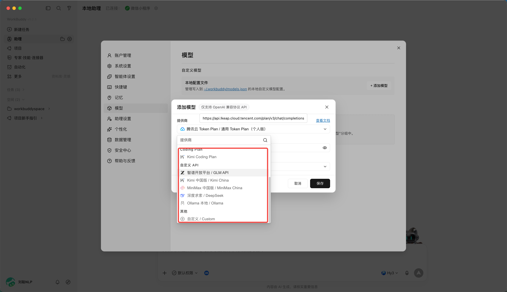

# 第 9 章 如何接入外部 API

::: warning 安居建业内部使用提示
仅使用公司批准的模型服务和账号。API Key 应存放在受控的密钥配置中，不得直接写入提示词、文档、截图或代码仓库。接入前应确认供应商、数据处理范围和留存策略；“本地模型”也不等于可以绕过公司数据分类与终端安全要求。
:::

你也许没有积分，但是你有自己的LLM API，

WorkBuddy支持接入其他 LLM 的 API，以及 Coding Plan、Token Plan 等套餐。

直接从设置中进入，

选择模型选项，

点击添加模型，

可以选择各种coding plan或者自定义的api

比如，DeepSeek，你只需要输入api key即可，

或者接入本地ollama模型，需先本地启动 Ollama（默认端口 11434，OpenAI 兼容接口），本地模型优势为数据不出本机、可离线、零 Token 成本。

