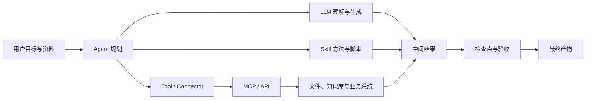
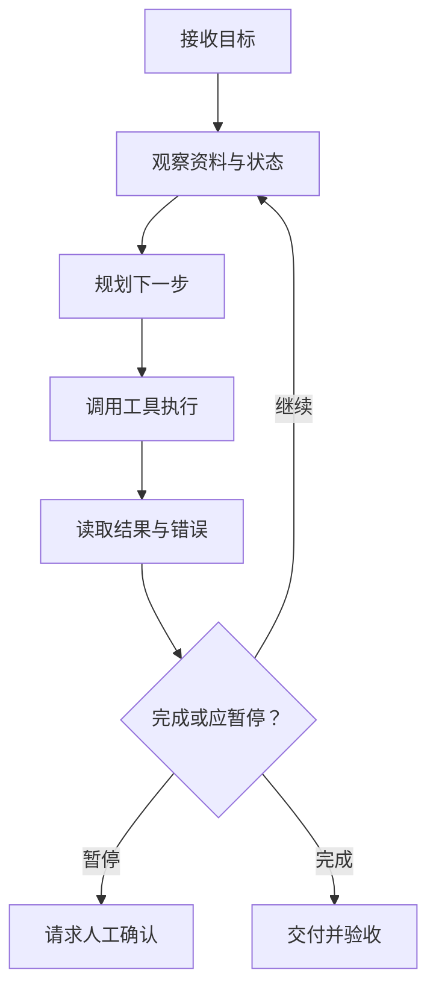

# 课外阅读：一章看懂 AI 工作系统

## 先看全景：一次 AI 任务里发生了什么



这张图可以用一句话解释：**模型负责理解和生成，Agent 负责围绕目标组织行动，Skill 提供专业方法，工具与 MCP/API 让行动触达真实世界，人负责边界与验收。**


把一次真实任务拆开看，信息大致这样流动：


你提出一个目标 → Agent 把它拆成几步 → 遇到专业子任务就加载对应的 Skill，遇到要碰外部系统就调用工具 → 工具通过 MCP 或 API 真正读写数据库、发消息、改文件 → 结果回到模型，模型判断下一步 → 你做边界把控和最终验收。


五类角色里，**模型是大脑，Agent 是调度员，Skill 是专家手册，工具与接口是手脚，人是裁判**。后面每一节就是把其中一个角色讲清楚，顺便标出它能和不能的边界。


## LLM：会根据上下文预测内容的基础模型


LLM 是 Large Language Model，大语言模型。它从大量数据中学习语言和知识模式，根据当前输入生成最可能的后续内容。

它本质上是个「预测下一个内容」的引擎，不是数据库，也不是会替你负责的人。

### 它擅长什么

- 理解、归纳和改写文本；
- 从材料中提取结构；
- 生成草稿、方案和代码；
- 根据示例模仿格式和风格；
- 在工具返回结果后继续分析。


### 它不天然保证什么

- 不保证每个事实都正确；
- 不知道企业最新内部状态，除非提供资料或连接系统；
- 不会因为语言自信就拥有真实证据；
- 不自动拥有文件、账号、数据库和网络权限；
- 不承担业务和法律责任。

### 为什么会「幻觉」

模型的目标是生成连贯内容，不是内置事实数据库。当资料缺失、问题含糊或要求它给出确定答案时，它可能用合理但不真实的内容填补空白。


这不是 bug，是「按概率补全」这件事的副作用。理解了这点，你就不会再追问「它明明说得很肯定，为什么是错的」——肯定和正确是两件事。


### 降低幻觉的办法

- 提供可靠资料；
- 要求引用位置（说清楚结论来自哪段材料）；
- 允许回答「无法确认」；
- 把事实提取与建议生成分开；
- 对高影响结论人工复核。

## Token 与上下文窗口：模型眼前能看到多少

Token 是模型处理文本的基本单位，不完全等于字数。中文里一个字可能对应一个或几个 Token，代码和标点也单独计费。上下文窗口是一次推理中模型能够处理的输入、历史对话和输出总量。

把 Token 想成模型的短期记忆容量：装得下才看得见，装不下就得丢或压缩。


### 上下文变长不一定更好

把所有文件和几个月对话都塞进一个任务，可能导致：

- 旧要求与新要求冲突；
- 关键资料被大量无关内容淹没；
- 成本和等待时间增加；
- 模型引用了过期版本。

窗口越大，越容易「水漫金山」——重要的反而被冲淡。


### 更稳妥的做法

按项目整理「当前规则、已确认事实、决策记录和本次输入」，长项目使用文件和项目记忆，而不是依赖无限对话。

简单说：**别把所有聊天记录当数据库用**，该落盘的落盘，该分项目的分开。


## Prompt：任务说明，不是神秘咒语

Prompt 是给模型或 Agent 的输入，包括目标、背景、资料、约束、示例和输出要求。好的 Prompt 不以长度取胜，而以信息是否足够执行和验收取胜。

写 Prompt 不是在「念咒」，是在写一份能交给同事执行的任务单。


### 六要素

| 要素 | 要回答的问题 |
|-|-|
| 目标 | 最终解决什么问题 |
| 输入 | 使用哪些资料或系统 |
| 动作 | 分析、整理、生成还是写入 |
| 约束 | 不能做什么，采用什么规则 |
| 输出 | 交付什么文件或结构 |
| 验收 | 怎样判断正确和可用 |

六要素里最容易被忽略的是「验收」：没有验收标准，模型只能按自己的理解交差，你也就没法说它错在哪。


### Prompt、任务卡与 SOP

- **Prompt**：本次怎么说；
- **任务卡**：同类任务可以填写的结构；
- **SOP**：固定步骤、角色、检查点和异常处理；
- **Skill**：把稳定 SOP、脚本和资源封装成可执行能力。

四者是从「一次性说明」到「可复用能力」的逐级固化。

**不是每个 Prompt 都值得变成 Skill。** 先重复成功，再逐步固化。一个只做过一次的任务，先写好 Prompt 跑通；跑顺三五次、模式稳定了，再考虑沉淀成 Skill。


## Agent：能围绕目标循环行动的执行体

Agent 不只是「回答一次」，而是持续执行一个循环：**理解目标、观察环境、决定下一步、调用工具、读取结果、修正计划，直到交付或触发停止条件。**




聊天模型是「你问一句它答一句」；Agent 是「你给目标，它自己一步步推进，中途还会看结果、改路线」。


### Agent 与聊天模型的区别

| 维度 | 聊天模型 | Agent |
|-|-|-|
| 核心动作 | 生成回答 | 规划、调用工具、执行和交付 |
| 工作对象 | 当前对话 | 文件、工具、系统和任务状态 |
| 过程 | 通常一次生成 | 多轮观察与行动 |
| 风险 | 内容错误 | 内容错误 + 真实操作影响 |
| 控制 | 提示与复核 | 权限、检查点、日志和回滚 |


关键差异在最后一行：聊天模型说错了，最多误导你；Agent 做错了，可能真的删了文件、发了邮件、改了数据库。所以 Agent 需要的不是更聪明的提示，而是更硬的护栏。


### Agent 的停止条件

好的 Agent 不应「永远想办法继续」。出现以下情况，应暂停并请求人处理：

- 关键输入缺失；
- 目标冲突；
- 权限不足；
- 成本超预算；
- 动作不可逆；
- 结果无法验收。

知道什么时候停下来问人比 什么都自己硬扛 更专业。一个不会停的 Agent，比一个笨 Agent 更危险。


## Tool ：让 Agent 真的能做事

Tool 是 Agent 可以调用的具体能力，例如读取文件、执行搜索、生成表格或发送消息。Connector 通常是产品已经封装好的第三方服务连接，强调授权后直接使用。


### 模型知道不等于模型能做

模型可以解释「如何发送邮件」，但只有获得邮件工具和账号权限后才能实际创建草稿或发送。模型可以写 SQL，但只有数据库工具、网络和账号允许时才能查询。


这点是普通用户最容易误解的：**模型「懂」一件事，不代表它「能」做这件事。** 能不能做，取决于有没有对应的工具、权限和连接。任务失败时，先问「工具通没通、权限给没给」，而不是「模型是不是不行」。


### 每个工具要问五件事

1. 使用谁的身份；
2. 能读取什么；
3. 能修改什么；
4. 数据会发到哪里；
5. 失败后如何停止和回退。

## Skill：可复用的专业工作方法

Skill 不是更聪明的模型，而是把某类任务需要的说明、脚本、知识和模板组织起来，让 Agent 更稳定地完成动作。

Skill 的价值不在「让模型变强」，而在「把容易做错、容易遗漏的环节固定下来」。同样的发票处理，让模型每次现写，十次可能有三种写法；写成 Skill，十次走同一条被验证过的路。


### 一个 Skill 可能包含

```Plain Text
invoice-skill/
├── SKILL.md          # 触发条件、步骤、边界与输出
├── references/       # 字段、分类和业务规则
├── scripts/          # OCR、校验、表格处理
├── templates/        # Excel 和报告模板
└── tests/            # 正常与异常样例
```

SKILL.md 是入口，告诉 Agent「什么时候用我、怎么用、边界在哪」；references 放业务知识；scripts 放真正执行的代码；templates 保证输出格式一致；tests 保证异常情况也被覆盖。


### Skill 与 Prompt 的区别

Prompt 往往只影响本次对话；Skill 可以被不同任务调用，并能携带脚本、资源和稳定流程。但 Skill 仍可能出错，也可能请求本地、网络或第三方权限。

记住：**Skill 是「方法封装」，不是「能力保证」。** 装了 Skill，Agent 更可能走对路，但不等于永远不会出错。


### 安装第三方 Skill 的风险

- 读取不必要的本地目录；
- 外发输入材料；
- 获取 API Key 或账号；
- 执行系统命令；
- 包含恶意提示或代码；
- 依赖过期、无人维护。

因此应检查来源、代码、权限、网络、凭证、成本和停用方法，并先在隔离目录测试。第三方 Skill 和装浏览器插件一个道理：方便，但要先看它要什么权限。


## MCP：让 AI 接入工具与数据的标准接口

MCP 是 Model Context Protocol。它规定 AI 客户端如何发现和调用外部工具、读取资源或获取提示模板，可以理解为 AI 工具生态的一类标准接口。

把 MCP 想成「AI 世界的 USB 接口」：工具提供方按一套标准暴露能力，AI 客户端按同一套标准去用，不用每家重新适配。


### MCP 解决什么

如果每个 AI 产品都要为每个系统开发一套专用连接，集成成本很高。MCP 让工具提供方和 AI 客户端按统一方式描述能力，降低重复适配。

没有 MCP 时，接一个 CRM 要写一套适配，接一个数据库又写一套；有了 MCP，工具方一次性按标准暴露，所有支持 MCP 的客户端都能直接用。


### MCP 不解决什么

- 不自动判断数据是否合规；
- 不替你保管好所有密钥；
- 不保证工具结果正确；
- 不自动实现身份与最小权限；
- 不等于连接后可以开放生产写入。

MCP 解决的是「怎么连」，不解决「连了之后安不安全、对不对」。安全那层仍然是你的责任。


### 用户级与项目级

- **用户级**适合多个项目复用的公共能力；
- **项目级**适合客户、数据库或业务专属工具。

敏感连接优先项目隔离，避免跨项目误调用。比如公司的生产数据库，只该在对应项目里接，别放成全局用户级，否则另一个无关任务也可能摸到它。


## API 与 MCP 的关系

API 是软件之间交互的接口，例如通过 HTTP 查询数据或创建记录。MCP Server 可以在内部调用一个或多个 API，再以 Agent 更容易使用的方式暴露工具。


一句话：**API 是地基，MCP 是在地基上盖的、Agent 能直接进出的门。** Agent 通常不直接跟一堆原始 API 打交道，而是通过一个 MCP Server 间接调用它们。


### 直接用 API 还是用 MCP

- **直接使用 API** 更灵活，但需要理解认证、参数、错误和限流；
- **使用成熟 MCP** 更方便，但仍要审查它封装了什么请求和权限。

方便不等于免审。MCP 帮你省了适配活，但「它背后到底调了什么 API、用了什么权限」你得心里有数。


## 知识库、RAG 与记忆

这三者都和「AI 依据什么」有关，但保存的东西和失效方式完全不同。


### 知识库

保存可检索的制度、产品、案例、SOP 和其他资料。它解决「AI 依据什么」，不等于 AI 永远记住一切。

知识库是external 的资料室，模型用时才去翻，翻完不保证下次还记。


### RAG

RAG 是 Retrieval-Augmented Generation，检索增强生成。系统先从资料库找到相关片段，再把片段提供给模型回答。效果取决于资料质量、分段、元数据、检索和引用。


RAG 不是「接了知识库就聪明」，它是一根链条：资料差、切得烂、检索偏，回答就跟着歪。引用机制很重要——能指出结论来自哪段，你才能判断信不信。


### 记忆

记忆用于保存偏好、长期规则、项目决策或历史状态。错误记忆会被反复放大，因此重要信息要有来源、日期、负责人和更新机制。

记忆最危险的地方是「它自己不会发现过期」。一条半年前的错误规则，会被 Agent 当真理反复用。


### 三者的区别

| 概念 | 保存什么 | 主要风险 |
|-|-|-|
| 对话上下文 | 当前任务交流 | 太长、冲突、过期 |
| 知识库 / RAG | 可检索事实与资料 | 来源差、版本旧、检索不到 |
| 记忆 | 偏好、长期规则、项目状态 | 错误被长期沿用 |

一句话区分：**上下文是这次聊天的短期记忆，知识库是随时可查的资料室，记忆是跨任务保留的长期设定。**


## Workflow 与 Agent 的区别

前面把 Agent 讲清楚了，但还有一个常被混用的词：**Workflow（工作流）**。它和 Agent 不是替代关系，而是两种「组织行动」的思路。


### 一句话区分

- **Workflow 是标准化的生产线**：步骤在设计时就定好，按顺序或分支执行。
- **Agent 是会思考、能自己拿主意的执行者**：只给目标，运行时自己决定下一步怎么走。

打个比方，Workflow 像一份写了「第一步做 A，第二步做 B，B 通过后做 C 否则做 D」的 SOP；Agent 像你雇的一个人，你只说「把这批发票处理完」，他中途自己判断要先查哪张、卡住了问你。


### 核心区别：决策权在哪

Workflow 的每一步「走哪条路」在设计阶段就固定了；Agent 的下一步由模型在执行阶段根据环境实时决定。这是两者最本质的差别，其他差别都从这儿长出来。

### 对比表

| 维度 | Workflow（工作流） | Agent（智能体） |
|-|-|-|
| 一句话 | 标准化的生产线 | 会思考、能自己拿主意的执行者 |
| 路径是否预设 | 是，步骤在设计时定好 | 否，运行时根据环境决定 |
| 决策时机 | 设计阶段固定 | 执行阶段动态 |
| 谁来选下一步 | 流程定义 | 模型自己 |
| 可控性 | 高，容易预测和回滚 | 较低，路径可能变化 |
| 调试难度 | 低，步骤清晰可追 | 高，需看日志和中间状态 |
| 适用场景 | 步骤明确、可重复、合规要求高 | 路径不确定、需环境反馈、开放目标 |
| 典型失败 | 卡在某步、分支没覆盖 | 跑偏、无限循环、越权操作 |
| 与 LLM 关系 | 管道里可嵌入模型，但控制流是人定的 | 模型驱动控制流 |

### 什么时候用 Workflow

- 固定 SOP，比如「收到工单 → 分类 → 派给对应人」；
- 批量处理，比如「把 100 张图统一压缩加水印」；
- 合规审批，每一步都要留痕、可审计；
- 可重复的报表生成。

这些任务路径清楚，用 Workflow 更稳、更便宜、更好查。


### 什么时候用 Agent

- 目标清楚但路径不清，比如「调研竞品并出对比报告」；
- 需要多工具探索、中途看结果再决定；
- 环境会变，需要边做边调整；
- 开放性强、难以写成固定步骤的任务。

### 常见误区

- **「Agent 一定比 Workflow 强」**：不对。确定任务用 Workflow 更稳更省，硬上 Agent 反而容易跑偏、难审计、成本高。
- **「Workflow 不能含智能」**：错。Workflow 的节点完全可以调用模型做摘要、分类、抽取，只是「走哪条路」仍由流程定。
- **「Agent 全自动就最好」**：过度放权会让失败更难定位。真复杂的系统，往往是 Agent 在高层决策，把稳定环节交给 Workflow。

### 两者如何协同

不是二选一，而是嵌套使用：

- **Agent 内含 Workflow**：Agent 把已经稳定的子任务写成固定流程（比如一个 Skill 背后就是 Workflow），只在不确定处自己判断；
- **Workflow 节点调 Agent**：生产线上某个判断节点，交给一个 Agent 处理非结构化输入。