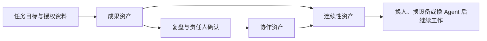

# 第三篇 进阶系统：把方法变成可复用工作流

当一个任务能够稳定通过验收，再考虑沉淀为方法卡、Skill、多 Agent 或自动化。本篇只使用通用方法和合成样例。

## AI 协作资产全景图

一项任务完成后，值得保留的内容不只有最终文件。长期使用 WorkBuddy 时，应同时管理工作成果、协作方法和接续能力，让资产在更换人员、设备或 Agent 后仍然可用。

| 资产类别 | 保存什么 | 典型内容 | 治理目标 |
|---|---|---|---|
| 成果资产 | 已经完成并通过验收的工作结果 | 文档、表格、代码、图片、项目数据和发布记录 | 来源清楚、版本可辨、权限明确、能够交接 |
| 协作资产 | 让人和 Agent 按同一方法继续工作的上下文 | 任务边界、协作规则、模板、Skill、已确认决策和长期记忆 | 经过确认、按需读取、可维护、可迁移 |
| 连续性资产 | 让前两类资产在故障或更换环境后恢复使用的保障 | 源文件、历史版本、独立快照、校验清单、恢复说明和演练记录 | 有多个时间点、可校验、能恢复、恢复过程有记录 |

三类资产需要分别治理：成果资产保留原件、版本和验收记录；协作资产只沉淀稳定且会复用的方法和背景；连续性资产通过独立快照、校验与恢复演练证明可用。聊天流水、临时要求和未经确认的推断不直接进入长期协作资产。

本篇重点讲协作资产如何逐步变成方法卡、Skill、多 Agent 分工和可靠自动化。相关成果仍按第 12、16、20 章管理来源与版本，备份、校验与恢复演练方法见第 23 章。

## 子页面

- [第 22 章 把模板、规范与步骤制作成 Skill](%E7%AC%AC%2022%20%E7%AB%A0%20%E6%89%93%E9%80%A0skill%EF%BC%9A%E5%B0%86%E4%B9%A6%E5%92%8C%E8%A7%86%E9%A2%91%E8%92%B8%E9%A6%8F%E4%B8%BA%E5%8F%AF%E6%89%A7%E8%A1%8C%20Skill/index.md)
- [第 23 章 备份、校验与恢复演练](%E7%AC%AC%2023%20%E7%AB%A0%20%E5%85%B6%E4%BB%96%E7%94%A8%E6%B3%95%E8%A1%A5%E5%85%85%EF%BC%9AWorkBuddy%20%E5%AE%9E%E6%93%8D%E6%A1%88%E4%BE%8B%E9%9B%86/index.md)
- [第 24 章 多 Agent 分工、汇总与复核](%E7%AC%AC%2024%20%E7%AB%A0%20%E5%A6%82%E4%BD%95%E8%BF%9B%E8%A1%8C%E5%A4%9A%20Agent%20%E7%B3%BB%E7%BB%9F%E8%AE%BE%E8%AE%A1/index.md)
- [第 25 章 可靠自动化：预检、确认、日志与回退](%E7%AC%AC%2025%20%E7%AB%A0%20%E8%87%AA%E5%8A%A8%E5%8C%96%E5%B7%A5%E4%BD%9C%E6%B5%81%E7%9A%84%E5%8F%AF%E9%9D%A0%E6%80%A7/index.md)
