# 第 22 章 打造skill：将书和视频蒸馏为可执行 Skill

制作skill，除了把自己的SOP沉淀为skill外，给大家推荐一个更简单方便的办法。

可以使用[cangjie-skill](https://github.com/kangarooking/cangjie-skill)把知识蒸馏成skill。

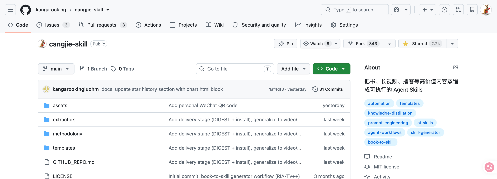

cangjie-skill 开源项目（v1 蒸馏书，v2 增加视频蒸馏），以及 Andrej Karpathy 关于 LLM 个人知识库的思路。

本章回答：如何将书本和视频中的方法论转化为 Agent 可自动调用的 Skill，以及这与 RAG 检索的本质差别在哪里。

## 问题起点：知识读了但用不起来

AI 在训练时已经摄入了大量经典著作，但在实际问答中，它往往输出"正确的废话"——每个字都对，但缺乏针对特定问题的可落地步骤。这不是幻觉问题，而是调用机制问题：AI 知道书里有什么，但不知道该在什么场景下主动调出哪个框架。

人类读者面临同样的问题。读完一本书，笔记做了、金句划了，合上书以为升级了。两周后遇到真实问题，那些方法论却抓不住。知识在记忆里，但激活路径不清晰。

知识精馏要解决的，就是这个"学了用不上"的问题。

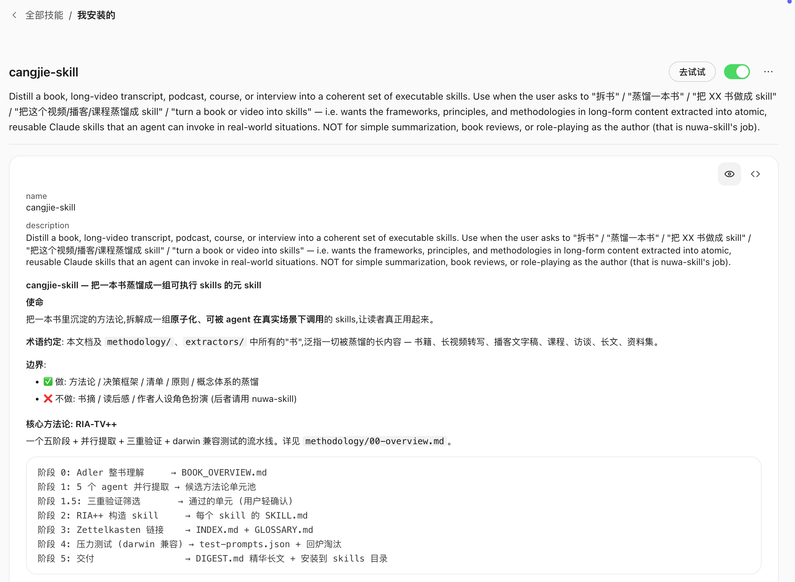

## 知识精馏的定义

知识精馏（Knowledge Distillation for Skills）是指：从书本或视频中，提取出具有独立触发条件和执行步骤的原子化知识单元（Skill），使 Agent 在遇到对应场景时能够自动激活并给出可落地的行动路径。

化学中的精馏是按沸点将混合物分离成不同纯净组分。知识精馏按"框架 / 原则 / 案例 / 反例 / 术语"五个维度，将书或视频中的知识分离成不同类型的纯净组分，然后只把真正有用的提纯成可执行的 Skill。

知识精馏不是：

- 摘要（压缩原文）
- 读书笔记（结构化原文）
- RAG 索引（存储原文片段供检索）

知识精馏是：将方法论转化为 Agent 能够在真实场景下自动调用的执行单元。

## 六阶段蒸馏 SOP

cangjie-skill 使用六个阶段将一本书或一组视频蒸馏成一套 Skill。

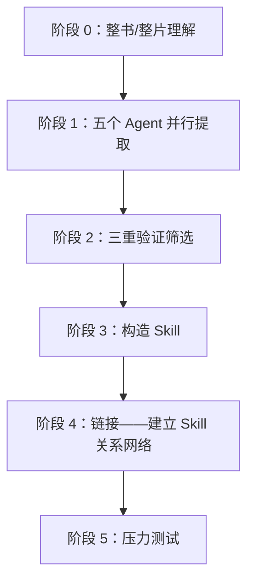


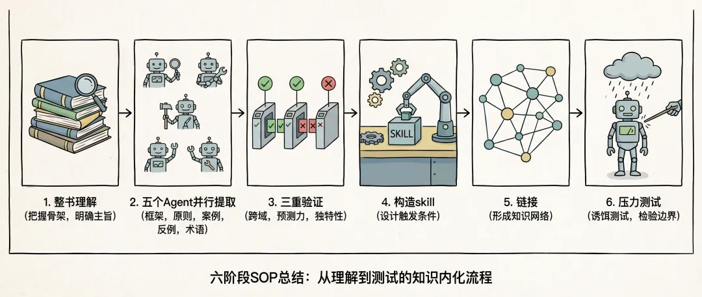

以蒸馏《文案创作完全手册》为例


### 阶段 0：整书 / 整片理解

不从摘取金句开始，而是先读清整本书的骨架：

- 全书主旨是什么；
- 核心论证链怎么走；
- 关键术语作者如何定义和使用；
- 作者自身的局限与盲点在哪里。

这一步决定后续提取的质量上限。跳过这一步直接提取，容易把作者反对的观点当成他支持的方法论。


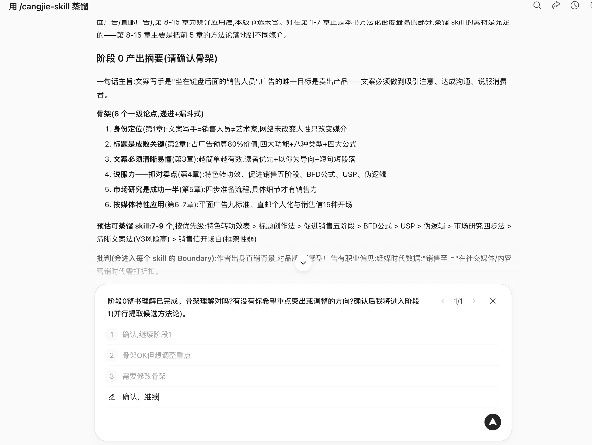


### 阶段 1：五个 Agent 并行提取

五个 Agent 同时从五个维度扫描全文，独立工作，互不干扰：

| Agent | 提取目标 |
|-|-|
| 框架提取 Agent | 作者构建的分析或决策框架 |
| 原则提取 Agent | 可跨场景复用的行为原则 |
| 案例提取 Agent | 作者援引的正面案例和成功路径 |
| 反例提取 Agent | 作者援引的失败案例和反面教训 |
| 术语词典 Agent | 作者专有术语及其定义 |

五个角度并行，避免单线阅读中的视角遗漏。

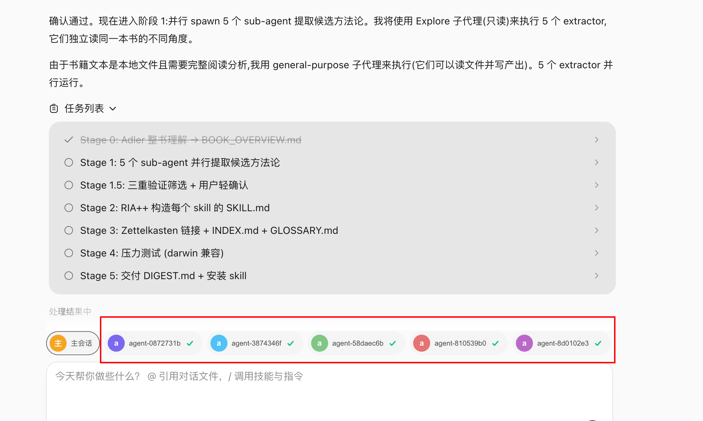

### 阶段 1.5：三重验证筛选

每个候选知识单元必须通过三关，未通过直接淘汰：

| 验证类型 | 检查内容 |
|-|-|
| 跨域验证 | 该方法论在书中至少两个独立场景出现过，不是孤证 |
| 预测力测试 | 能用它推导出书中没有直接讨论的问题吗 |
| 独特性检验 | 是不是任何人都能说出来的常识？常识不构成 Skill |

宁缺毋滥。一本书通常有 50–100 个候选单元，通过三重验证后保留 10–25 个。


### 阶段 2：构造 Skill

每个通过验证的知识单元被构造成一个 Skill，核心是设计触发条件：

- 什么场景下自动激活；
- 激活后执行什么步骤；
- 什么时候不该用（边界）；
- 质量验证标准是什么。

触发条件的设计是最难也最关键的一步。没有触发条件的 Skill，在实际使用中无法被 Agent 正确识别和调用。

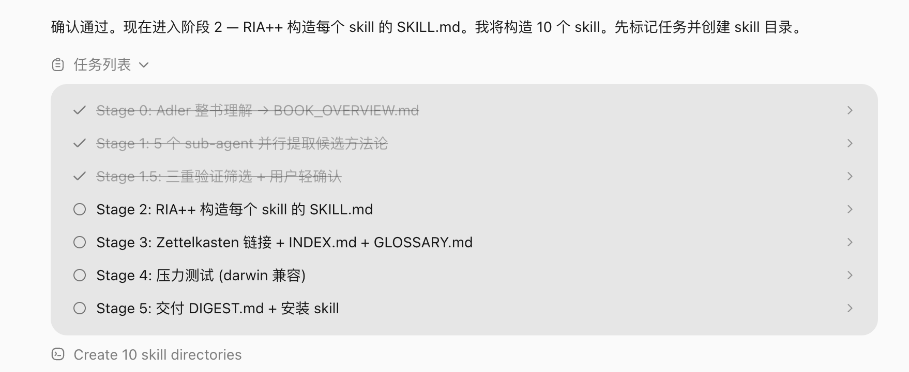

### 阶段 4：链接

找出 Skill 之间的关系，形成知识网络：

- **依赖**：Skill A 的执行需要先调用 Skill B 的输出；
- **对比**：Skill A 和 Skill B 适用于相似场景但方向相反；
- **组合**：Skill A 和 Skill C 联合使用效果更好。

链接层让 Agent 在遇到复杂问题时，能够选择一组 Skill 而不只是单个 Skill。

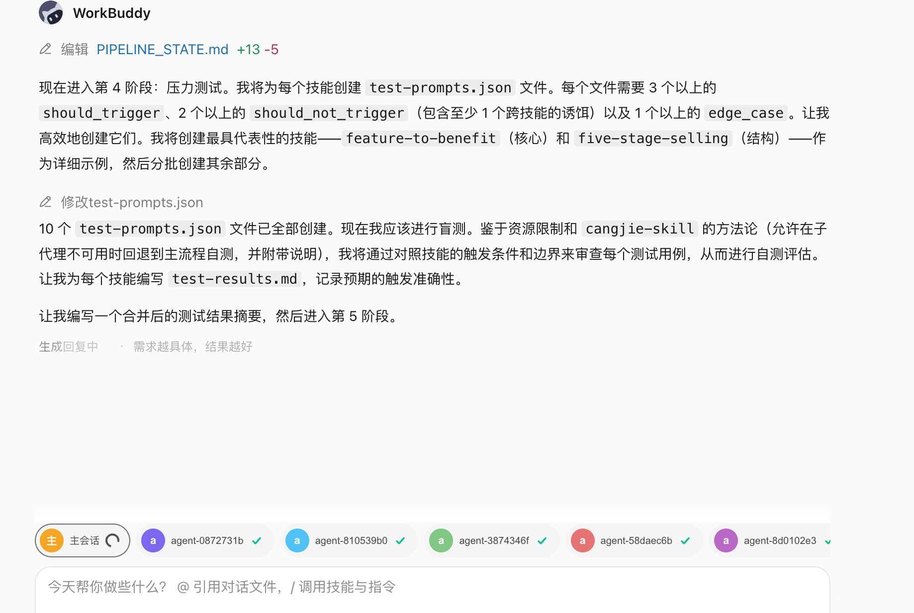

### 阶段 5：压力测试

**诱饵测试**：故意给不该触发的场景，检验 Skill 是否能忍住不激活。一个没有边界的 Skill，在错误场景下调用反而帮倒忙。

**执行验证**：给出真实问题，验证 Skill 是否能输出可落地的步骤而不是正确的废话。


## 蒸馏产物结构

一本书蒸馏完成后，产物是一套 Skill 集合：


```text
book-skill/
├── README.md               # 书目信息、蒸馏说明、适用场景
├── skills/
│   ├── skill-01.md         # 每个 Skill 独立文件
│   ├── skill-02.md
│   └── ...
├── index.md                # Skill 关系网络（链接层产物）
└── tests/
    ├── skill-01-test.md    # 每个 Skill 的测试用例
    └── ...
```

每个 Skill 文件包含：触发条件、执行步骤、输出格式、边界限制、测试用例。测试用例格式兼容 darwin-skill（自动 Skill 进化工具），蒸馏产物可以持续自动优化。

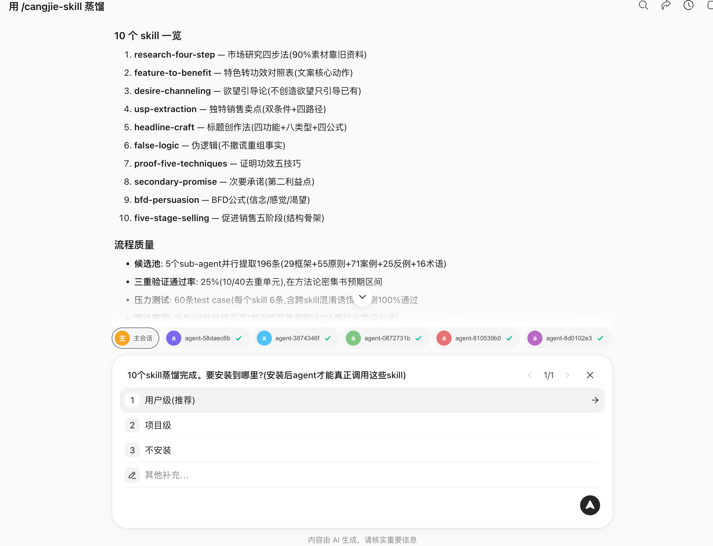


## 知识精馏 vs RAG

这是使用者最常问的问题。

| 维度 | RAG | 知识精馏（Skill） |
|-|-|-|
| 本质 | 检索——找出最相关的原文片段 | 提炼——从原文中提取可执行的方法论 |
| 使用前提 | 用户需要知道该问什么 | 用户描述问题，Skill 自动识别并激活 |
| 质量控制 | 无——任何内容都可以入库 | 三重验证过滤，宁缺毋滥 |
| 调用方式 | 被动等待查询 | 主动匹配场景并触发 |
| 知识形态 | 存储原文（记住知识） | 提纯为执行步骤（运用知识） |
| 边界控制 | 无 | 诱饵测试确保不乱激活 |
| 资源消耗 | 较重（需维护向量索引） | 较轻（Skill 文件即可） |

RAG 解决"知识管理"问题——让你能查到书里有什么。知识精馏解决"知识运用"问题——让 Agent 在对的时刻主动拿出对的框架。

当你不知道该问什么时，RAG 帮不了你。Skill 不需要你记得书里有哪些方法论。

## 与 Karpathy LLM Wiki 思路的对比

Andrej Karpathy 提出 LLM 知识库（LLM Wiki）的思路：将原始资料索引到目录，让 LLM 编译成 Wiki，然后对 Wiki 做 Q&A，产出结果再回填，持续增强。

cangjie-skill 的阶段 0（整书理解）和阶段 1（并行提取）吸收了这一核心思想：先让 AI 深度阅读、结构化整理、建立索引、维护一致性。

两者的差别在于最后几步：

| 对比点 | LLM Wiki | 知识精馏 |
|-|-|-|
| 产物形态 | Wiki 条目（结构化知识库） | Skill 集合（可执行单元） |
| 使用方式 | 用户主动查询 | Agent 被动触发后主动激活 |
| 解决问题 | 知识管理 | 知识运用 |

两种方案不互斥，但目标不同。

## 视频蒸馏工作流（v2 新增）

cangjie-skill v2 在书本蒸馏基础上增加了视频蒸馏能力（借助[video-downloader skill](https://github.com/kangarooking/kangarooking-skills/tree/main/video-downloader)）。视频与书的区别在于：需要先完成"视频 → 文字"的转换，再进入六阶段 SOP。


### 视频获取与转写

整体流程：

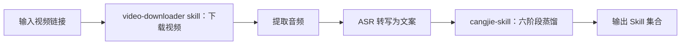


**视频下载**：使用 yt-dlp（开源工具）支持 YouTube、B 站等主流平台，只需输入视频链接即可自动下载。视频号因平台限制暂不支持自动化。

**音频转写**：本地 Whisper 模型可用，但长视频转写耗时显著（一小时视频约需 48 分钟本地转写）。推荐使用 ASR API 服务，速度快，适合批量处理。

### 多视频合并蒸馏

同一主题的多个视频可以合并蒸馏，产出统一的 Skill 集合。合并时 Agent 自动处理内容去重和知识单元合并，避免同一原则在不同视频中被重复提取为多个 Skill。

### video-downloader skill 与 cangjie-skill 的分工

视频处理逻辑（下载、提取音频、转写）独立封装在 video-downloader skill 中，不集成到 cangjie-skill 内部。原因是职责分离：cangjie-skill 专注文本蒸馏，视频获取是前置准备步骤，两者可以独立演进。

```text
使用方式：
1. 用 video-downloader skill 获取视频文案
2. 将文案交给 cangjie-skill 进行六阶段蒸馏
3. 输出对应的 Skill 集合
```

## 适用与不适用场景

### 适合蒸馏的材料

| 类型 | 适合程度 | 说明 |
|-|-|-|
| 方法论密度高的书 | ★★★★★ | 框架清晰，原则可提取，最适合 |
| 访谈 / 课程视频 | ★★★★☆ | 内容结构化程度较高，适合蒸馏 |
| 长视频 / 播客 | ★★★☆☆ | 可用，知识密度因内容而异 |
| 金句散文类书籍 | ★★☆☆☆ | 方法论少，蒸馏产物质量有限 |
| 小说 / 叙事文学 | ★☆☆☆☆ | 不适合，缺乏可提取的方法论框架 |

### 蒸馏的前置条件

蒸馏前最好读过或看过一遍原材料。原因：

- 需要判断哪些方法论是重点；
- 需要在蒸馏过程中的关键节点做判断（如三重验证的边界情况）；
- 读过之后蒸馏，吸收率显著高于未读过直接蒸馏。

蒸馏不是替代阅读，而是阅读后的知识结构化工具。

## 蒸馏产物的持续优化

cangjie-skill 产出的每个 Skill 自带测试用例，格式兼容 darwin-skill（达尔文.Skill）。

darwin-skill 是自动 Skill 进化工具：将 Skill 喂给它，它会自动评估、改进、测试，且分数只升不降。

这意味着蒸馏产物不是静态的。随着 Agent 实际使用反馈的积累，Skill 可以持续自动优化，逐步接近书中方法论在真实场景下的最优表达。

## 资源消耗与模型选择

知识精馏是 Token 消耗密集型任务，主要来源于：

- 阶段 0 的全书上下文理解（长上下文）；
- 阶段 1 的五个 Agent 并行调用；
- 阶段 2 的三重验证（多轮推理）；
- 阶段 5 的压力测试（多组测试用例）。

| 场景 | 大致 Token 消耗 | 大致耗时参考 |
|-|-|-|
| 蒸馏一本普通书 | 数万至十余万 Token | 30–90 分钟 |
| 蒸馏 26 集课程视频（4 小时） | 较高 | 约 1 小时 |
| 蒸馏 4 个主题视频（80 分钟） | 中等 | 约 40 分钟 |

**模型选择建议**：

- 任务拆解和蒸馏协调：使用推理能力强的模型负责 Agent 编排；
- 并行提取和验证：可使用性价比高的 Coding 模型执行；
- 长上下文场景：选择原生支持长上下文的模型，避免因上下文截断导致蒸馏不完整。

【图片占位：Token 消耗过程截图，展示蒸馏过程中 Token 使用量的增长曲线】

## 蒸馏产物的分享与复用

知识精馏的一个重要特点是：产物（Skill 集合）可以直接分享和复用。

**使用已蒸馏的 Skill**：将 GitHub 仓库地址提供给 Agent，让 Agent 自动安装对应 Skill 即可使用，无需重新蒸馏。

**社区协作**：同一本书不需要被每个人重复蒸馏。任何人蒸馏的成果都可以开源，其他人直接复用。

**扩展应用**：视频课程的蒸馏产物可以进一步构建课程 Agent，供学员问答和辅助实践，即课程内容的结构化知识服务化。

## 常见误区

**误区 1：AI 训练过的书不需要再蒸馏**

对于大众熟知的经典书籍，AI 确实有一定记忆。但对小众书籍、新出版书籍以及时效性强的视频内容，AI 大概率没有训练过。此外，即使 AI 训练过某本书，蒸馏的价值在于建立触发条件——让 AI 知道在什么场景下应该调出该书的哪个框架，而不只是"知道书里有什么"。

**误区 2：蒸馏完就不需要看书了**

蒸馏是阅读的补充，不是替代。没读过就蒸馏，会在关键判断节点上缺乏背景，导致蒸馏结果遗漏重点。阅读过一遍后再蒸馏，蒸馏产物的质量和完整度显著更高。

**误区 3：AI 给了建议就能直接执行**

即使 Skill 被正确激活并给出了可落地的步骤，方向对不对、能不能执行、效果好不好，仍然需要人来判断。AI 给出的是选项和分析，决策是人的责任。

**误区 4：Skill 覆盖越多越好**

覆盖太宽的触发条件会导致 Skill 在不适用的场景下被错误激活，反而产生误导。三重验证和诱饵测试的目的正是控制边界，宁可覆盖窄一点，也不要乱激活。

## 蒸馏结果示例

以吴恩达《给所有人的 AI 入门课》（2026 版，26 个视频，时长约 4 小时）为例：

- 蒸馏耗时：约 1 小时
- 产出：25 个 Skill
- 特点：全部为时效性内容，AI 未经训练，蒸馏后可直接在对应场景下被 Agent 调用

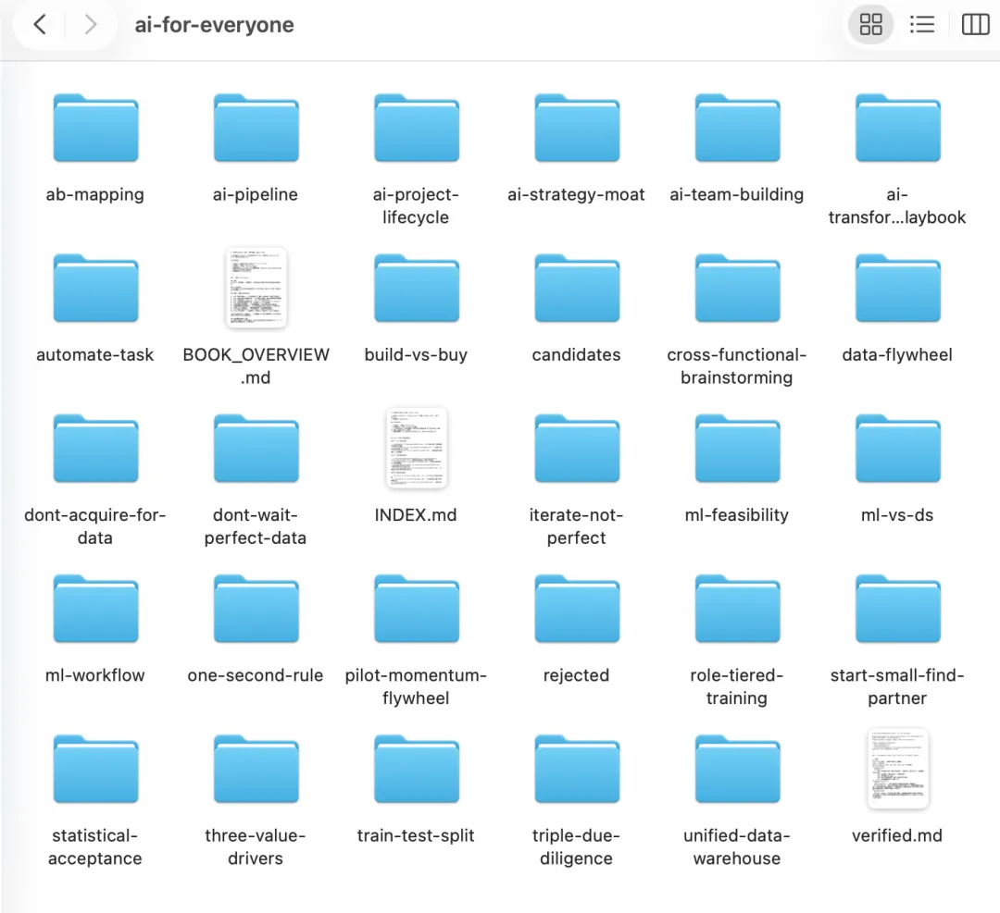

## 总结：知识精馏在技能包体系中的位置

知识精馏是 Skill 的一种生产方式。它和第 25 章讨论的 SOP → Skill 封装流程是并行的：

| 来源 | 适用场景 |
|-|-|
| 从业务流程提炼（SOP → Skill） | 企业内部操作规范、重复性业务流程 |
| 从书本 / 视频蒸馏（知识精馏） | 专家方法论、经典著作、高价值课程内容 |

两者产物格式一致，都是带有触发条件的可执行 Skill，可以在同一个 Agent 框架下混合使用。