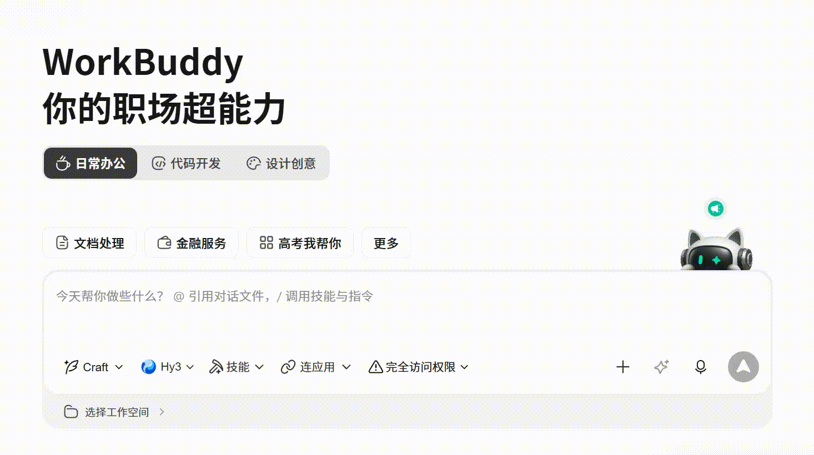
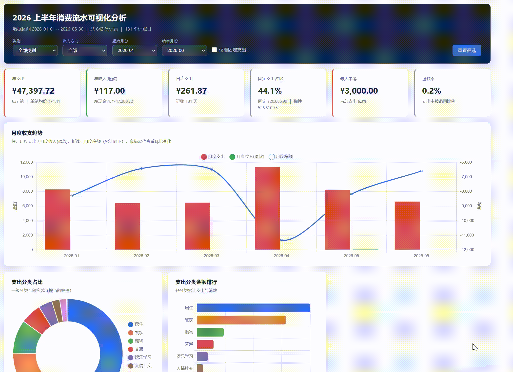

# 第 23 章 其他用法补充：WorkBuddy 实操案例集

前面的章节介绍了 Agent 工具链的核心能力：文件处理、数据库操作、MCP 连接和企业协作。这一章补充几类容易被忽略但实际价值很高的用法，以 WorkBuddy 为例，覆盖短任务、设计创意、Skill 联动、浏览器自动化和项目管理等场景。

WorkBuddy 与大多数 AI 聊天软件的核心区别在于三点：能直接读取和修改本地文件，学习门槛低，入口清晰。对于还没有系统搭建 Agent 工作流的读者，这些案例可以作为起点。

## 模型与成本：先把免费额度用透

WorkBuddy 内置了多款国产大模型。每日签到领取的积分基本能覆盖轻度使用的全部消耗。新发布的模型通常附带免费体验期——以 HY3 为例，发布后有两周免费额度，即使过期，定价也属于国产模型性价比第一梯队。

如果拿不准做什么，WorkBuddy 已经按应用场景预设了模板，选一个直接开始即可。



## 短任务实战：Excel 可视化与数据清洗

HY3 在短任务上表现突出。PPT 生成、数据清洗、Excel 图表可视化分析都能直接完成。

从开屏界面出发，输入任务描述后点击右下角"优化提示词"按钮，WorkBuddy 会自动补全细节并执行。

**提示词示例：**

```text
帮我可视化这份流水账数据并分析一下。
重点关注：
1. 每月收支趋势；
2. 支出分类占比；
3. 异常大额支出标注；
4. 给出 3 条可操作的省钱建议。
```

执行过程可能较慢，但最终产出的可视化效果通常超出预期——包括图表、趋势分析和文字总结。数据清洗和 PPT 生成同理。




## 设计创意：用提示词生成完整网站

这是一个容易被低估的用法。勾选"网站设计"场景后给出提示词，可以生成可运行的前端页面。以下是两个经过验证的模板。

### 模板一：个人作品集 Hero Section

生成一个带有视频背景、鼠标交互和响应式布局的全屏 Hero 页面。

**提示词：**

```text
Build a full-screen hero section for a creative portfolio using React, Vite, Tailwind CSS, and the Figtree Google Font.

要求：
1. 三个全屏循环视频作为背景，通过 crossfade 切换，透明度过渡 1200ms；
2. 顶部导航栏：左侧导航项格式为"01 / Works"，右侧显示邮箱和实时时钟；
3. 底部内容区：左侧大字名称（200px），右侧介绍文案和 CTA 按钮；
4. 按钮 hover 效果：背景色从底部填充上来；
5. 支持平板和手机端的响应式适配；
6. prefers-reduced-motion 下禁用所有动画。
```

<video controls preload="metadata" src="./assets/003_asset_HE1Nb74Hfo.mp4"></video>


### 模板二：创意机构 Landing Page（鼠标控制视频）

这个模板的特色是视频不自动播放，而是跟随鼠标水平移动控制播放进度。

**提示词：**

```text
Build a full-screen hero landing page for a creative agency called "Mainframe" using React, TypeScript, Vite, and Tailwind CSS.

核心交互：
1. 全屏视频背景，不自动播放；
2. 鼠标水平移动控制视频播放进度（sensitivity = 0.8）；
3. 顶部导航：左侧 Logo + 装饰星号，中间导航链接用逗号分隔，右侧 CTA；
4. Hero 内容：模糊的介绍文字 + 打字机效果的主文案 + 圆角药丸按钮组；
5. 移动端：汉堡菜单，CSS Grid 展开动画；
6. 按钮 hover：白色填充变黑色文字。
```

以上两个模板全程使用 HY3 模型完成。


## Skill 联动：跨服务的智能推荐

WorkBuddy 的 Skill 系统允许 Agent 连接日常使用的各类服务。这种跨服务联动是 Skill 生态的核心价值——不是替代某个 App，而是成为多个 App 之间的连接层。

**示例：微信读书 + QQ 音乐**

安装并连接微信读书和 QQ 音乐的 Skill 后，可以实现跨服务的智能推荐：

**提示词：**

```text
根据我最近在微信读书中阅读的书目，推荐适配阅读氛围的歌单。
要求：
1. 先读取最近 7 天的阅读记录；
2. 分析书目的情绪基调和主题；
3. 在 QQ 音乐中匹配风格相近的歌单；
4. 输出推荐理由和歌单链接。
```


微信读书 Skill 的安装链接可以在官方页面获取：`https://weread.qq.com/r/weread-skills`。
