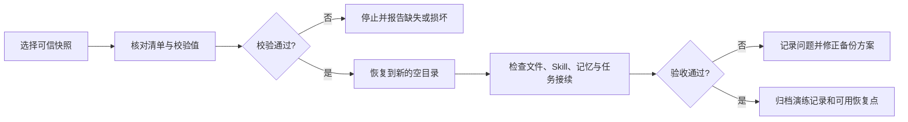

# 第 24 章 备份、校验与恢复演练

备份的价值由恢复结果决定。看到“复制完成”或“同步成功”只能说明流程执行过；只有校验通过，并且资产已经在新的空目录中恢复且能够继续使用，才能证明恢复链路有效。

本章提供通用治理方法，不指定公司正式存储系统、保留周期或恢复责任。具体位置、权限、保密要求和恢复目标应由信息化、安全、业务和资料责任人共同确认。

## 需要保护哪些 AI 协作资产

| 资产类别 | 建议纳入范围 | 恢复后检查什么 |
|---|---|---|
| 成果资产 | 正式文件、项目数据、代码、图片及验收记录 | 文件可打开，数量、版本和关键内容一致 |
| 协作资产 | 任务规则、模板、Skill、已确认记忆和维护说明 | Agent 能读取正确版本，规则和来源关系完整 |
| 连续性资产 | 快照、文件清单、校验结果、恢复说明和演练记录 | 能找到可用时间点，恢复步骤和责任人清楚 |

密钥、Token、密码、私钥、个人账号文件、缓存和原始会话记录默认排除。确需备份的敏感配置应使用公司批准的凭证管理和加密方案，不得混入普通协作资产包。

## 备份、同步和恢复分别解决什么

| 能力 | 主要作用 | 需要注意的限制 |
|---|---|---|
| 工作目录 | 保存当前正在使用的最新状态 | 误删、误改会立即影响正式资产 |
| 同步 | 在设备或服务之间保持接近一致的状态 | 删除和错误也可能被同步传播 |
| 时间点快照 | 保留多个独立历史状态 | 同盘快照无法应对整块磁盘损坏 |
| 异地副本 | 应对设备、磁盘或单一位置不可用 | 必须使用公司批准的位置和访问权限 |
| 恢复演练 | 证明快照完整、步骤可执行、工作能够接续 | 应恢复到新位置并记录验收结果 |

一个可靠方案通常同时保留当前工作目录、多个独立时间点和经过批准的第二位置，并定期做恢复演练。

## 六步闭环

### 1. 建立资产与责任清单

列出需要保护的目录、文件类型、负责人、敏感级别、更新频率、允许存放的位置和恢复优先级。没有明确来源或无权保存的材料不得擅自纳入。

### 2. 生成独立时间点快照

快照放在工作目录之外，使用日期和批次形成独立目录。生成时记录成功、跳过、排除和失败项；重复运行不能静默覆盖已有快照。

### 3. 生成并检查校验清单

为快照生成文件路径、数量、大小和哈希等校验信息。校验要能发现缺失、损坏和意外新增的敏感文件。看到脚本退出成功仍需检查清单和日志。

### 4. 管理保留周期和第二位置

根据资产变化频率和恢复目标保留多个时间点。需要应对磁盘、设备或办公地点故障时，将快照复制到公司批准的第二介质或异地存储；不得自行上传到个人云盘或未批准服务。

### 5. 恢复到新的空目录

选择一个已校验快照，恢复到不包含现有文件的目标目录。演练阶段不覆盖正式工作区，也不直接写回 Agent 的用户级配置。

### 6. 验收并留下演练记录

至少完成以下检查：

- 资产目录和必需文件完整，文件数量与校验清单一致。
- 抽样文件可以打开，关键数据、版本和引用关系正确。
- 至少一个模板或 Skill 能被读取并完成脱敏测试任务。
- 已确认记忆、来源、状态和适用范围能够继续查询。
- Agent 可以根据恢复后的规则接续一个测试任务。
- 演练日期、快照时间、执行人、验收人、问题和修正措施已经记录。

## 恢复演练流程



## 合成示例：一份项目资料的恢复演练

某测试项目包含 20 份文档、1 份任务规则和 1 份校验清单。执行人先确认快照中不含凭证和个人信息，再将它恢复到一个新建的空目录。验收人核对文件数量和校验值，抽样打开文档，并使用恢复后的任务规则完成一次脱敏测试。只有数量、校验值、抽样文件和测试任务全部通过，该快照才被记录为可用恢复点。

## 可复制恢复演练模板

```text
请对这份 AI 协作资产快照执行只读校验和恢复演练。

快照位置：{位置}
恢复目标：{必须为空的新目录}
资产责任人：{责任人}
本次验收人：{验收人}
允许读取范围：{范围}
禁止写入范围：{正式目录、用户级配置、外部系统等}

请按以下步骤执行：
1. 检查快照目录、文件数量、校验清单和日志；
2. 发现缺失、损坏、敏感文件或路径异常时立即停止；
3. 校验通过后恢复到指定空目录，不覆盖现有目录；
4. 检查必需文件，并抽样打开成果文件；
5. 检查一个模板或 Skill、已确认记忆及其来源关系；
6. 使用恢复目录完成一个脱敏测试任务；
7. 输出演练结果、问题清单、可用恢复点和修正建议。

没有责任人确认，不替换正式目录，不恢复账号凭证，不重新开启自动化。
```

## 发生事故后的恢复顺序

1. 停止仍在运行的 Agent、脚本、同步和自动重试。
2. 保护现场日志、受影响目录和时间信息，避免继续写入。
3. 确认最近一个未受影响且校验通过的快照。
4. 在新的空目录恢复并完成验收。
5. 由责任人确认业务影响、丢失范围和正式恢复方案。
6. 替换正式资产前再次建立当前现场副本，保留调查和回退能力。
7. 恢复完成后收回临时权限，修正触发条件、备份范围或处置流程。

## 常见弯路与安全边界

- 只检查备份任务显示“成功”，无法发现文件缺失、排除规则错误和快照损坏。
- 把同步目录当作唯一恢复来源，误删和误改可能已经传播到所有设备。
- 只保留最新一份副本，发现问题较晚时无法回到更早的可信状态。
- 在正式目录上直接测试恢复，会覆盖现场并扩大影响。恢复演练必须使用空目录。
- 未检查敏感文件排除结果，可能把凭证和个人信息复制到更广范围。
- 备份位置、访问权限、保留期限和销毁方式必须符合公司制度和第三方材料授权。

## 验收标准

- 快照包含经过确认的资产范围，并有清单、校验值和运行日志。
- 至少保留多个可识别时间点，第二位置符合公司批准范围。
- 恢复操作在空目录完成，没有覆盖正式资产和用户级配置。
- 文件、Skill、记忆和测试任务均通过验收。
- 演练记录能够说明使用了哪个快照、发现了什么问题、由谁确认和怎样修正。
