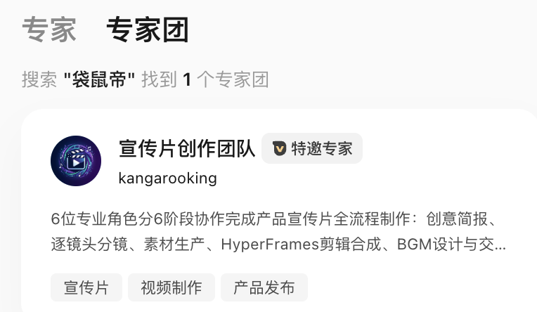
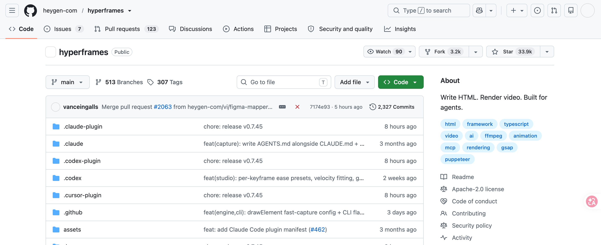
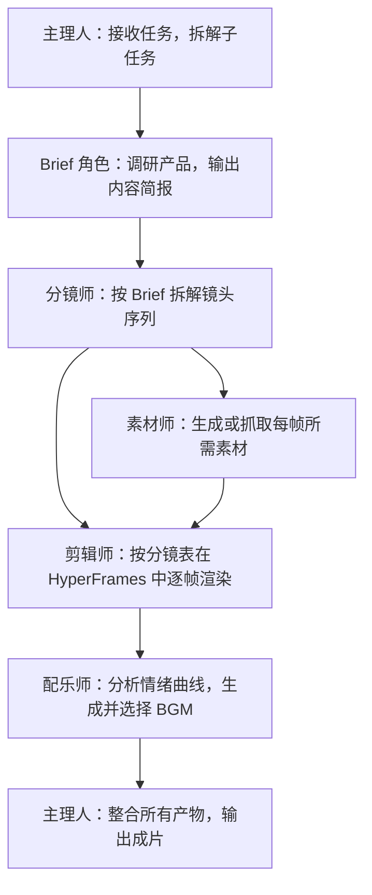
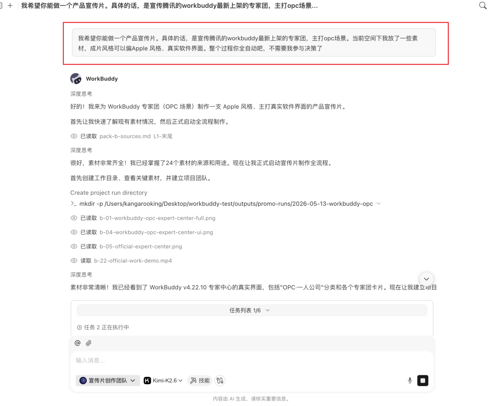
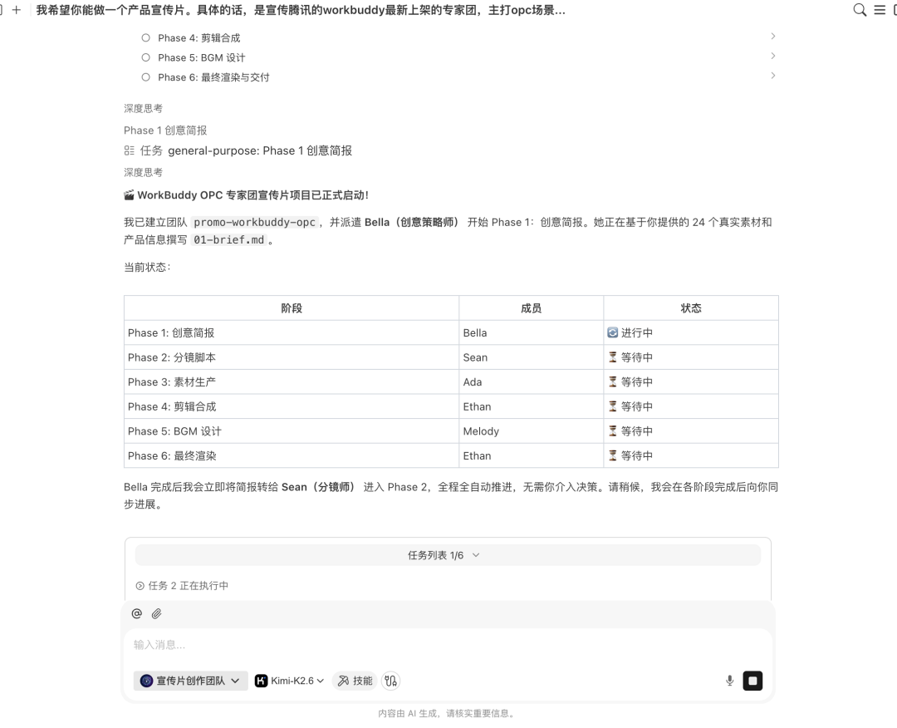
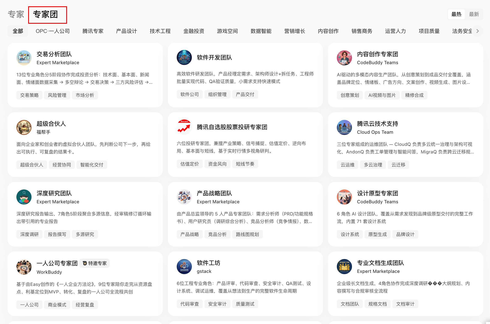

# 第 24 章 如何进行多 Agent 系统设计

一人公司产品宣传部实践（HyperFrames + 多 Agent）、WorkBuddy 专家团产品。本章以产品宣传片专家团的实际案例，回答：多 Agent 系统如何设计分工、如何串联产物、何时值得拆分。



## 单 Agent 和多 Agent 的真正差别

| 维度 | 单 Agent | 多 Agent |
|-|-|-|
| 上下文 | 所有信息在一个任务 | 角色只接收必要上下文 |
| 分工 | 一个执行体串行完成 | 多角色并行或接力 |
| 工具 | 同一组权限 | 可按角色隔离工具和权限 |
| 质量 | 自己生成、自己检查 | 可设置独立评审者 |
| 成本 | 较低 | 协调、模型和工具调用更多 |
| 风险 | 一处错误影响整体 | 错误可能在角色间传播 |

多 Agent 的价值来自专业分工、并行、权限隔离或独立评审，不来自角色数量。


## 任务是否值得拆分

满足越多，越适合多 Agent：

- 至少两个子任务可以独立进行；
- 子任务需要不同方法、资料或工具；
- 输出可以定义清楚的交接格式；
- 并行能显著缩短等待；
- 有明确总负责人和最终验收；
- 预算允许多轮调用。

只改一封邮件、总结一份 PDF 或格式化一个表格，不需要专家团。

## 案例：产品宣传片专家团

### 任务背景

HyperFrames 是 HeyGen 开源的视频渲染框架（截至案例时 GitHub 17.7K Star），核心特点是对 AI Agent 友好：Agent 可以自动生成基于 HTML 的视频帧并渲染输出。产品宣传片具有相对固定的套路——无需口播和演员，主要由产品展示、概念字幕和 BGM 构成。这类任务适合 Agent 团队分工处理。



### 工序设计

产品宣传片专家团的完整工序如下：



### 角色契约

| 角色 | 输入 | 输出 | 禁止动作 |
|-|-|-|-|
| 主理人 | 用户任务描述、素材空间 | 任务拆解、状态追踪、成片 | 不跳过子任务验收直接交付 |
| Brief 角色 | 产品官网、介绍文档 | brief.md（产品定位、核心价值、目标用户） | 不直接写脚本 |
| 分镜师 | brief.md | 分镜表（时间码、画面、字幕、转场、动效） | 不引入 Brief 未确认的信息 |
| 素材师 | 分镜表 | 产品截图、概念图、界面素材 | 不使用无版权来源素材 |
| 剪辑师 | 素材、分镜表 | 逐帧 MP4 片段 | 不改动分镜结构 |
| 配乐师 | 分镜表、情绪标注 | BGM 候选及推荐理由 | 不只输出一个选项 |

### 专家团演示

在做产品宣传片之前，需要先把相关素材放到工作空间内。

```Plain Text
我希望你做一个产品宣传片，具体的话，是宣传腾讯的workbuddy最新的专家团，主打opc场景。当前空间下我放了一些素材，成片风格可以偏apple风格、真实软件界面。整个过程全自动
```



团长先接到任务：把"做一支宣传片"拆成了一串子任务：先得搞清楚 WorkBuddy 专家团到底是什么、卖给谁、核心价值是什么；再决定叙事结构、镜头数量、节奏；然后再分头去做素材、剪辑、配乐。


brief 角色先开工：去把 WorkBuddy 官网、产品介绍、专家团列表都翻了一遍，输出一份 brief ，这是什么产品、目标用户是谁、最值得放进 60 秒的几个核心点。


分镜师接着 brief 干活：把 60 秒拆成了 7 个镜头，每个镜头都细到时间码、画面、文字、转场、动效、需要的素材类型。


然后 素材师 和 剪辑师 开始干活：一个去生成 / 抓产品截图、概念图，另一个把素材按分镜表往 HyperFrames 里塞，逐镜头渲染出每一段 MP4。


最有意思的是 配乐师：它不是简单写个"科技感 BGM"的 prompt 完事，它会先把分镜表读一遍，研究每个镜头的情绪曲线，标好哪些地方需要鼓点卡产品 reveal、哪些地方需要降下来做留白、哪些地方需要一个 hit point 推 CTA。然后再去调用音乐模型生成候选 BGM。


最后由 团长 把所有产物整合，跑最后一道剪辑，输出成片。



整个过程我基本就是个旁观者：偶尔在关键节点拍一下板，比如分镜要不要这么排、BGM 喜不喜欢、字幕文案要不要改。

最后出来的片子，还挺不错的。

<video controls preload="metadata" src="./assets/006_asset_Um2SbSClHo.mp4"></video>


## 共享产物层

多个 Agent 不应各自维护一份"产品事实"。建立单一产物路径：

```text
project/
├── brief.md                  # 产品简报（Brief 角色产出，主理人确认）
├── storyboard.md             # 分镜表（分镜师产出，主理人确认）
├── assets/                   # 素材（素材师产出）
│   ├── screenshots/
│   └── concepts/
├── clips/                    # 逐帧片段（剪辑师产出）
├── bgm/                      # BGM 候选（配乐师产出）
└── output/final.mp4          # 成片（主理人整合）
```

下游角色只读取上游已确认的产物。角色之间不通过对话传递关键内容细节。

## 并行与串行

**可以并行：** 素材生成与剪辑准备、不同镜头段落的渲染。

**必须串行：** Brief 确认后才写分镜、分镜确认后才生成素材、素材就绪后才剪辑、成片完成后才配乐合成。

并行计划必须标明汇合点。素材和剪辑可以并行准备，但最终合成必须等待所有素材就位。

## 主理人的职责

主理人（制片人）是工作流控制器：

- 解释用户任务并维护子任务状态；
- 分发最小必要上下文给各角色；
- 检查上游产物是否满足交接格式；
- 决定并行、等待或重试；
- 在关键节点（如分镜确认、BGM 选择）请用户拍板；
- 汇总所有产物，执行最终合成；
- 对成片做一致性检查（画面、字幕、BGM 节奏是否对齐）。

## 三个必须由人确认的点

1. **Brief 确认**：产品定位、目标用户、核心卖点是否准确；
2. **分镜确认**：叙事结构、镜头数量、节奏是否符合预期；
3. **BGM 选择**：情绪风格是否与成片调性匹配。

Agent 负责生成和执行，不能替代品牌方向和风格判断。

## 产品化路径：从自建到预置专家团

### 自建团队

将上述角色封装为一套 Skills，在 Agent 框架中自行编排。适用场景：开发者需要完全控制每个角色的提示词、工具权限和交接格式。门槛包括：定义角色职责、设计交接格式、调试并行与串行逻辑。

### 预置专家团

WorkBuddy 专家团将上述分工产品化：团长负责任务拆解和分配，团员并行执行，用户只需描述任务。

创建专家团也很简单在专家->我的专家->创建专家


就会跳转到workbuddy的对话框，根据它给定的格式即可快速创建属于自己的专家。


当前专家团覆盖的典型场景：

| 场景类别 | 代表专家团 |
|-|-|
| 内容创作 | 产品宣传片、爆款内容创作、全域分发 |
| 软件研发 | 软件开发、代码测试 |
| 商业分析 | 深度研究、投资分析、数据分析 |
| 业务支持 | SEO、销售、营销、财税合规、HR |
| 法律合规 | 中文法律 |



### 两种路径的选择

| 维度 | 自建 Skills | 预置专家团 |
|-|-|-|
| 适用人群 | 开发者，需要深度定制 | 一人公司，直接使用 |
| 上手门槛 | 高（需定义角色、调试流程） | 低（描述任务即可） |
| 灵活度 | 高（可修改任意环节） | 中（支持自定义模型接入） |
| 速度 | 取决于搭建时间 | 即开即用 |

## 质量影响因素

成片质量主要受以下因素影响：

- **Agent 底座模型**：Agent 模型的指令跟随和推理能力直接影响分镜质量和任务拆解准确性；
- **图像生成模型**：影响产品截图的清晰度和概念图的视觉质量；
- **用户提供的素材**：提前放入素材空间（图片、视频）可显著提升成片质量；
- **浏览器工具接入**：若 Agent 具备浏览器操作能力，可自动抓取官网截图和产品界面，减少人工准备。

全自动方案适合快速出片（开源项目介绍视频、产品演示视频等）。对品质要求高的场景，建议以 Agent 产物为基础再做一轮人工二次剪辑。

## 失败传播控制

| 角色失败 | 降级方式 |
|-|-|
| Brief 角色无法获取产品信息 | 用户补充基础信息后重试 |
| 素材生成失败 | 使用用户预置素材或标记空缺位置 |
| 剪辑渲染超时 | 交付已完成的片段和分镜表 |
| BGM 生成失败 | 提供推荐 BGM 类型描述，由用户自选 |
| 主理人合成失败 | 交付各角色产物清单，由用户手动合成 |

降级交付必须说明缺失内容，不伪装成完整成果。

## 多 Agent 任务 Brief 模板

```text
目标：为 [产品名称] 制作一支 [时长] 的产品宣传片。
风格：[参考风格，如 Apple 风、极简风]。
素材：[素材空间路径或已提供的图片/视频]。
角色：主理人、Brief、分镜师、素材师、剪辑师、配乐师。
确认节点：Brief 完成后、分镜完成后、BGM 选择时，需用户确认后继续。
模型：Agent 模型 [指定]；图像生成模型 [指定]。
全自动/半自动：[说明是否需要中间节点人工介入]。
```
