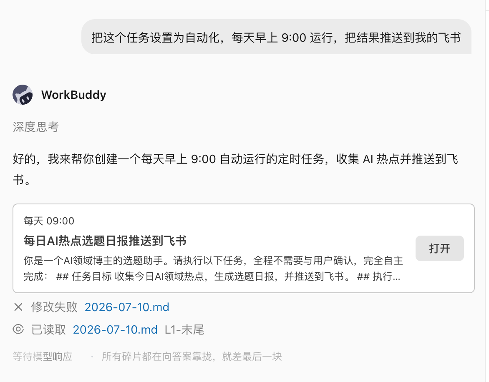
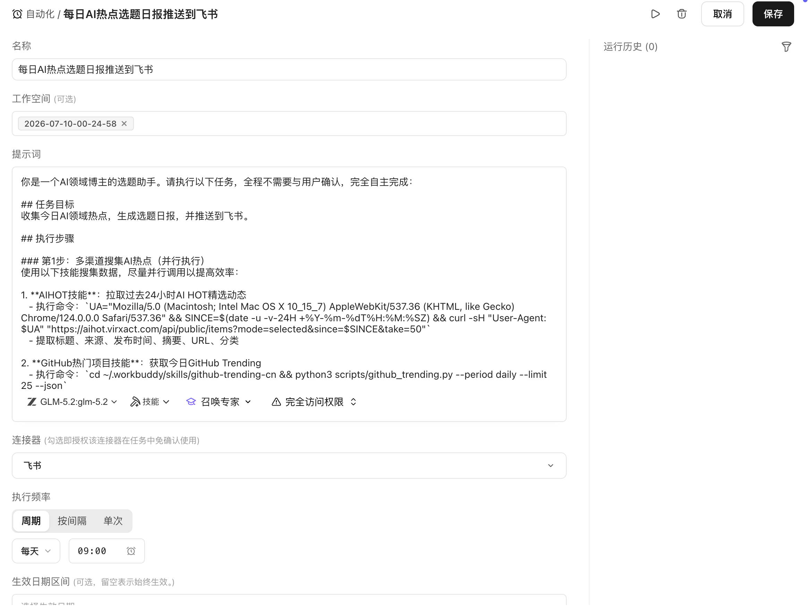
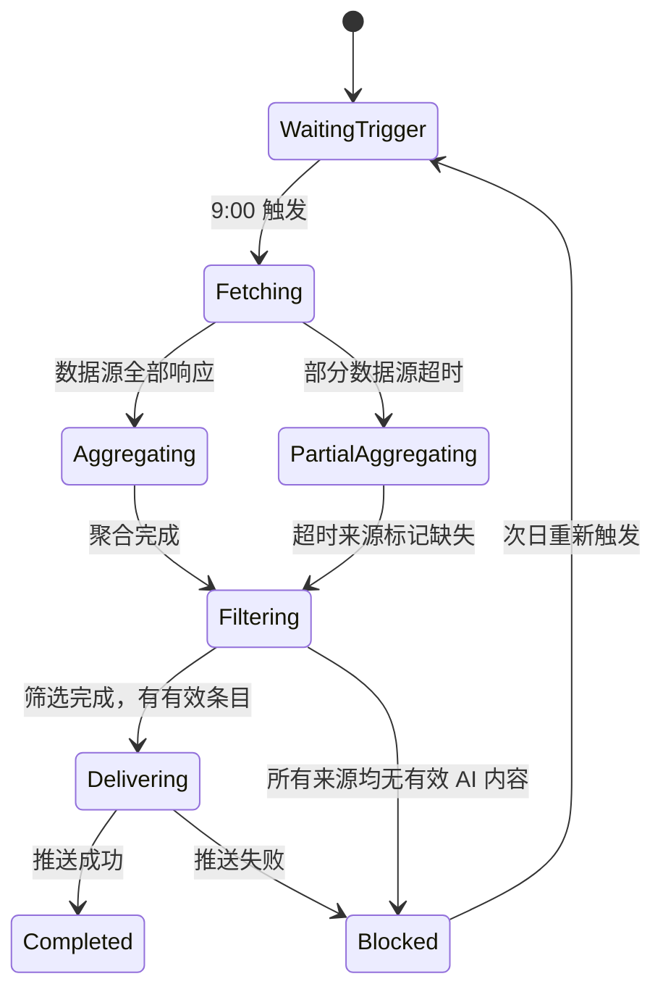

# 第 25 章 自动化工作流的可靠性

以"每日 AI 热点选题聚合"为贯穿案例，说明自动化工作流在从手动运行到定时可靠执行的过程中，需要处理哪些问题。

## 案例背景：内容博主的每日选题任务

AI 内容领域更新速度快，每天需要从多个信息源中筛选当日值得写的选题。手动逐一翻阅各个平台耗时且容易遗漏。一个典型的 AI 博主选题需求如下：

```text
我是一名 AI 领域的博主，主要内容方向是 AI 教程、AI 工具、AI Coding、AI 测评等。
帮我找今日的 AI 领域热点，方便筛选当天的选题内容。
来源：
- 微信公众号近期爆款文章（@wechat-article-search）
- 蜜度热搜榜 AI 相关条目（@蜜度热搜榜）
- GitHub 今日热门 AI 项目（@GitHub热门项目）
- 多引擎 AI 新闻聚合（@多引擎搜索）
- AI 热点追踪（@AIHOT）
```

手动运行一次这个任务，WorkBuddy 会同时调用五个数据源，整合输出一份当日 AI 热点清单，供博主快速判断和筛选。


跑通一次后，下一步是把它设置为定时自动化任务：每天早上 9:00 自动运行，结果推送到指定位置，无需每天手动触发。

本章围绕这个场景，说明从"能用"到"可靠自动化"需要处理哪些问题。

## 自动化前的三个门槛

不是所有任务都适合立即自动化。判断标准：

1. **同一 Prompt 已手动运行至少三次**，输出质量和格式基本稳定；
2. **触发条件、输入来源和验收标准清楚**：什么时候运行、依赖哪些数据源、输出什么格式；
3. **有 owner、有告警、有停用方法**：任务失败时谁处理，如何临时停用不影响其他流程。

选题任务满足以上三点：Prompt 结构固定、每天早上 9:00 触发、输出内容为当日热点清单。

频繁改 Prompt 或数据源还不稳定的任务，先手动运行，不急于自动化。

## 在 WorkBuddy 中设置自动化任务

手动运行确认效果后，在同一对话框中直接告诉 WorkBuddy：

```text
把这个任务设置为自动化，每天早上 9:00 运行，
结果发送到 [指定飞书群 / 邮件 / 企微通知]。
```

WorkBuddy 会将当前 Prompt 和数据源配置保存为定时任务，按设定时间自动执行。




设置完成后，每天早上 9:00，WorkBuddy 自动调用五个数据源，整合结果并推送。博主打开通知，直接开始筛选选题，不需要手动触发。



## 把自动化任务设计成状态机

自动化不是让任务"跑起来就行"。真实环境中，每次运行都可能遇到：某个数据源返回超时、热搜榜当日无 AI 相关条目、GitHub API 限流、推送目标不可达。

将任务设计成状态机，每个状态都有明确的成功条件和失败出口：



关键原则：部分数据源失败不应阻断整体任务，而是标记缺失后继续聚合；推送失败应保留结果并告警，不丢失已生成的内容。

## 数据源就绪检查

定时触发不等于数据源已就绪。每次运行开始时，先检查各数据源的可用性：

| 数据源 | 检查项 | 不可用时的处理 |
|-|-|-|
| @wechat-article-search | 搜索 API 可达，返回非空结果 | 标记缺失，继续其他来源 |
| @蜜度热搜榜 | 当日热搜列表可获取 | 标记缺失，继续其他来源 |
| @GitHub热门项目 | GitHub API 未限流，热门列表正常 | 退避重试一次，失败则标记缺失 |
| @多引擎搜索 | 搜索引擎可达 | 标记缺失，继续其他来源 |
| @AIHOT | 热点追踪服务正常 | 标记缺失，继续其他来源 |

五个来源中至少有三个正常，才输出热点清单。全部失败时，进入 Blocked 状态并推送告警，次日重新触发。

## 内容质量门禁

数据源可达不代表内容有效。聚合后需要过滤：

- **相关性**：条目是否真正属于 AI 领域（排除泛科技话题的噪音）；
- **时效性**：内容日期是否为当日（排除过期热点被重新推送的情况）；
- **重复性**：同一事件是否已在多个来源出现，合并展示；
- **最低数量**：有效条目少于 5 条时，视为当日 AI 热点不足，在输出中标注。

质量状态：**pass**（正常输出）、**warning**（部分来源缺失，在输出顶部说明）、**blocked**（有效条目不足，不推送正文，只推送说明）。

## 输出结构

聚合完成后，输出一份结构固定的热点清单，方便博主快速扫描和判断：

```text
📋 AI 热点选题日报 — 2026-07-10

【今日概况】
有效条目：18 条 | 来源：5/5 | 运行时间：09:02

━━━━━━━━━━━━━━━━
🔥 高热度（适合快速蹭热点）
1. [模型名称] 发布，[核心能力] — 来源：AIHOT + GitHub
   热度指数：★★★★★ | 建议角度：功能测评 / 使用教程

2. [工具名称] 开源，[功能描述] — 来源：GitHub热门项目
   热度指数：★★★★ | 建议角度：上手教程 / 对比测评

━━━━━━━━━━━━━━━━
📈 潜力方向（适合深度分析）
3. [话题] 引发讨论 — 来源：微信公众号
   热度指数：★★★ | 建议角度：观点分析 / 案例拆解

━━━━━━━━━━━━━━━━
⚠️ 数据来源说明
蜜度热搜榜：正常 | GitHub：正常 | 微信：正常
多引擎搜索：正常 | AIHOT：正常
```

输出格式固定后，博主可以在 5 分钟内完成选题判断，而不是每次重新整理格式。

## 推送目标与幂等

每次运行的输出需要推送到固定位置。常见推送目标：

| 推送目标 | 适用场景 | 注意事项 |
|-|-|-|
| 飞书群消息 | 团队共享选题 | 记录 message ID，避免重复推送 |
| 个人飞书通知 | 个人使用 | 同上 |
| 飞书文档（追加） | 保留历史记录，便于回溯 | 每日一条，按日期追加，不覆盖历史 |
| 邮件 | 跨平台通知 | 记录发件 ID |

**幂等原则**：如果某次任务因推送失败而重试，不应重复发送已成功推送的内容。每次运行生成唯一批次 ID（如 `ai-hotspot-2026-07-10`），推送成功后记录状态，重试时检查状态跳过已完成步骤。

## 超时和重试策略

| 失败类型 | 是否重试 | 策略 |
|-|-|-|
| 数据源 API 超时 | 是 | 等待 10 秒后重试一次，仍失败则标记缺失 |
| GitHub API 限流（429） | 是 | 按响应头中的 Retry-After 等待，最多等待 2 次 |
| 认证失效（401/403） | 否 | 转人工处理，不自动重试 |
| 推送目标不可达 | 是 | 指数退避重试 2 次，失败则告警并保留结果 |
| 聚合结果为空 | 否 | 进入 blocked 状态，推送说明，次日重新触发 |

重试只针对临时性故障，不对输入问题或配置问题重试。

## 断点续跑

每次运行生成状态文件，记录已完成的步骤和产物：

```json
{
  "batch_id": "ai-hotspot-2026-07-10",
  "trigger_time": "2026-07-10T09:00:00+08:00",
  "state": "delivering",
  "completed": ["fetching", "aggregating", "filtering"],
  "source_status": {
    "wechat": "ok",
    "midu": "ok",
    "github": "ok",
    "multi_search": "ok",
    "aihot": "ok"
  },
  "item_count": 18,
  "last_error": null,
  "updated_at": "2026-07-10T09:02:14+08:00"
}
```

推送失败后重试，从 `delivering` 步骤继续，不重新抓取和聚合。

## 告警要可行动

自动化任务失败时，告警内容必须包含足够信息，让收到告警的人能够立即判断如何处理：

```text
⚠️ AI 热点选题任务告警

批次：ai-hotspot-2026-07-10
状态：Blocked
触发时间：09:00
失败原因：所有数据源均返回空结果或超时
已完成步骤：fetching（部分失败）
影响：今日热点清单未生成，未推送

建议处理：
1. 检查各数据源 API 状态
2. 如为临时故障，可手动触发一次任务重跑
3. 如需跳过今日，确认后标记为已处理

恢复入口：WorkBuddy → 自动化任务 → 手动运行
```

"任务失败，请查看"不足以让人处理。

## 降级交付

当部分数据源失败，不应等待全部就绪再输出：

- 3 个及以上来源正常 → 输出清单，顶部标注哪些来源缺失；
- 2 个来源正常 → 输出简化清单，标注数据不完整；
- 1 个或 0 个来源正常 → 不输出正文，只推送说明和告警。

降级结果必须显式标记来源覆盖情况，不伪装成完整运行。

## 日志

每次运行记录：

- 批次 ID 和触发方式（定时 / 手动）；
- 各数据源响应状态和耗时；
- 聚合条目数量和过滤后数量；
- 推送目标和结果（成功 / 失败 / message ID）；
- 总耗时和错误信息；
- 运行成本（Token 消耗、API 调用次数）。

日志不记录热点内容正文（避免日志过大）。

## 成本预算

选题任务的主要成本来源：

| 成本项 | 说明 |
|-|-|
| WorkBuddy 调用次数 | 每次运行调用五个 Command，按平台计费规则计算 |
| 外部 API 调用 | GitHub、热搜榜等数据源的 API 调用费用 |
| 模型推理 | 聚合和过滤阶段的 LLM 推理 |
| 推送服务 | 飞书等推送 API 的调用 |

设置预算上限：单次运行超过设定成本时，记录告警并继续运行，但下一次运行前需确认。

## 自动化任务定义模板

以选题任务为示例，记录完整的自动化任务定义：

```text
任务名称：AI 热点选题日报
触发方式：每天 09:00（工作日）
触发条件：无前置检查，定时直接运行
Prompt：[完整 Prompt 文本]
数据源：@wechat-article-search / @蜜度热搜榜 / @GitHub热门项目 / @多引擎搜索 / @AIHOT
质量门禁：有效 AI 相关条目 ≥ 5 条；数据源可用数量 ≥ 3 个
输出格式：结构化热点清单（含来源、热度、建议角度）
推送目标：[飞书群 / 个人通知 / 飞书文档追加]
幂等控制：批次 ID = ai-hotspot-{date}，推送成功后标记，不重复推送
重试策略：数据源超时重试 1 次；推送失败退避重试 2 次；其他失败转人工
告警接收：[个人飞书通知]
owner：[博主本人]
停用方式：WorkBuddy 自动化任务管理页 → 暂停
```

## 上线前演练

正式开启定时任务前，手动模拟以下场景，确认任务行为符合预期：

| 场景 | 预期行为 |
|-|-|
| 所有数据源正常 | 输出完整清单，推送成功 |
| GitHub API 限流 | 退避重试，仍失败则标记缺失，继续聚合其他来源 |
| 当日无 AI 相关热点 | 有效条目不足，输出说明，不推送空清单 |
| 推送目标不可达 | 重试 2 次，失败则告警并保留结果 |
| 重复触发（手动触发与定时同时） | 检测批次 ID，跳过重复执行 |

演练通过后再开启定时运行。

## 运行指标

稳定运行后，定期检查以下指标：

- **按时触发率**：09:00 定时是否准时触发；
- **一次运行成功率**：不需要重试的成功比例；
- **数据源可用率**：各来源的单独可用比例；
- **有效条目数量趋势**：监测 AI 热点信息量的波动；
- **推送成功率**：推送不丢失的比例；
- **单次运行成本**：追踪成本变化趋势。

指标出现持续下降时，检查对应数据源或推送配置是否发生变化。

## 从个人自动化到团队服务

个人选题任务运行稳定后，可以扩展为团队共享：

| 维度 | 个人使用 | 团队服务 |
|-|-|-|
| 推送目标 | 个人通知 | 团队飞书群 |
| 选题方向 | 单一方向 | 多方向分类推送 |
| 审核流程 | 个人判断 | 主编确认后分发 |
| 故障处理 | 自己处理 | 有 owner 和备份处理人 |
| 成本归属 | 个人账户 | 团队预算 |

扩展为团队服务时，需要补充：明确 owner、建立运行手册、设置权限（谁能修改 Prompt 和推送配置）、制定变更流程（修改数据源需测试后生效）。

自动化的高级形态，不是完全没有人，而是正常路径少打扰人，异常路径能及时找到正确的人。

## 选题任务的迭代优化

自动化任务上线后，根据实际使用反馈持续迭代：

**Prompt 优化**：根据哪类条目真正被采用、哪类被忽略，调整过滤维度和描述。修改 Prompt 后需手动运行三次确认效果再重新保存自动化配置。

**数据源调整**：某个数据源长期质量差或可用率低，考虑替换或降低其权重。

**输出格式迭代**：根据筛选习惯调整清单格式（如增加"本周已覆盖"标记，避免重复选题）。

**时间调整**：根据实际使用习惯调整触发时间（如改为 8:30 或 10:00）。

每次调整都是一次小型配置变更，遵循"改 → 手动验证 → 重新保存"的流程，不直接在定时任务上实验。