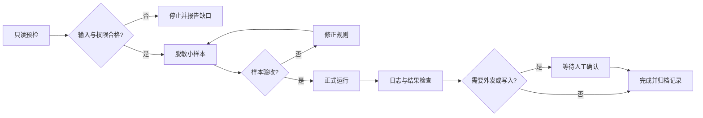

# 第 25 章 可靠自动化：预检、确认、日志与回退

自动化不是“定时运行成功”就可靠。真正可靠的工作流知道输入是否准备好、同类任务是否已在运行、何时需要人工确认、失败后如何停止和恢复。

## 适用场景

- 定期汇总公开信息或指定目录中的材料。
- 批量生成索引、报告、数据质量清单。
- 定期检查文件、任务状态和异常。
- 把稳定的手工流程转成可重复执行任务。

## 上线前七项检查

1. 输入来源是否稳定、完整并获得授权。
2. 是否存在仍在运行的同类任务，避免重复启动。
3. 工作目录和输出目录是否正确。
4. 重复运行是否会覆盖、重复写入或产生冲突。
5. 哪些动作必须等待明确人工确认。
6. 失败后如何停止、重试和回退。
7. 日志、责任人和验收结果存放在哪里。

## 可靠流程



## 合成示例

每周检查一个练习目录中的新增文件，生成索引和异常清单。流程只读源文件；若发现已有同类批次运行、源目录不存在或输出冲突，则停止并报告，不重复启动。

### 可复制任务模板

```text
请设计一项可停止、可重试、可回退的自动化任务。

触发方式：{时间或事件}
输入来源：{来源}
工作目录：{目录}
输出物：{文件或记录}
验收标准：{标准}
人工确认点：{外发/写入/覆盖/审批前}
禁止动作：{动作}

每次运行前检查输入、权限、输出冲突和同类任务状态；
先用脱敏小样本运行；
为每一步记录开始、完成、跳过、失败和原因；
错误达到停止条件时立即停止，不无限重试；
没有明确确认，不执行外发、删除、覆盖和业务写入。
```

## 人工确认点

- 首次上线、规则变化和输入结构变化。
- 样本扩大为批量运行之前。
- 外发、覆盖、删除、审批和正式写入之前。
- 连续失败、结果异常或恢复运行之前。

## 输出物与验收标准

- 运行说明包含触发、输入、输出、权限和责任人。
- 日志能区分未运行、运行中、成功、部分成功和失败。
- 重复执行不会产生重复结果或覆盖原件。
- 停止、重试和回退经过合成样本测试。

## 常见弯路与安全边界

- 任务安静不代表失败，应检查进程、日志和输出状态。
- 用定时轮询代替人的明确确认，会误触发后续动作。
- 只记录成功日志，失败时无法复盘。日志必须覆盖所有状态。
- 不让自动化承担审批、专业判断和不可逆操作。
