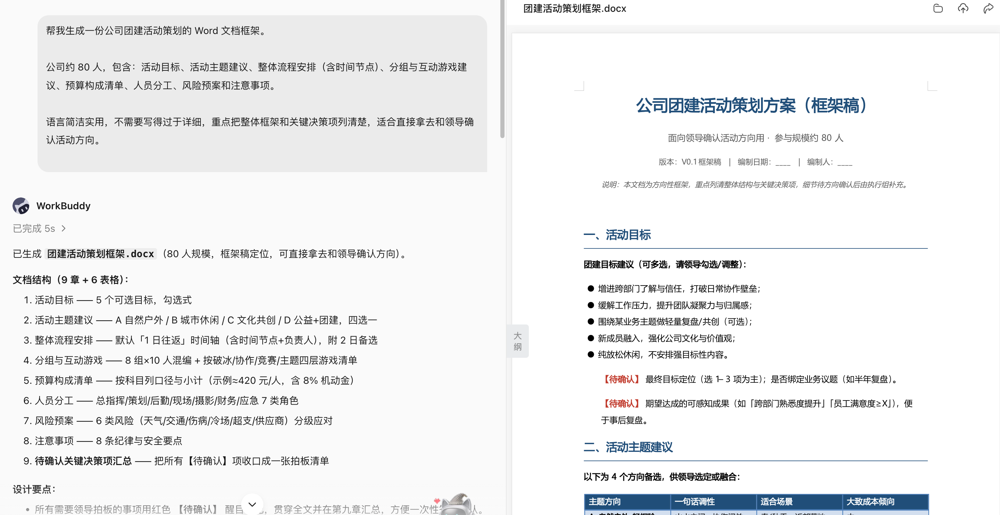
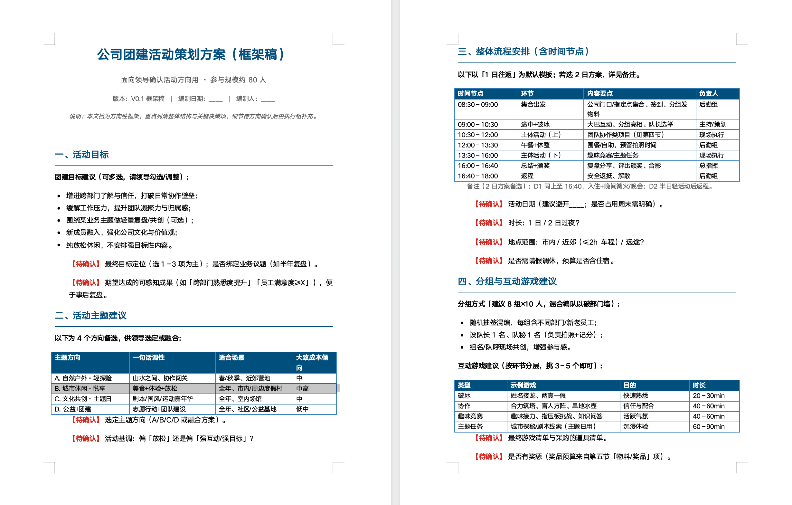
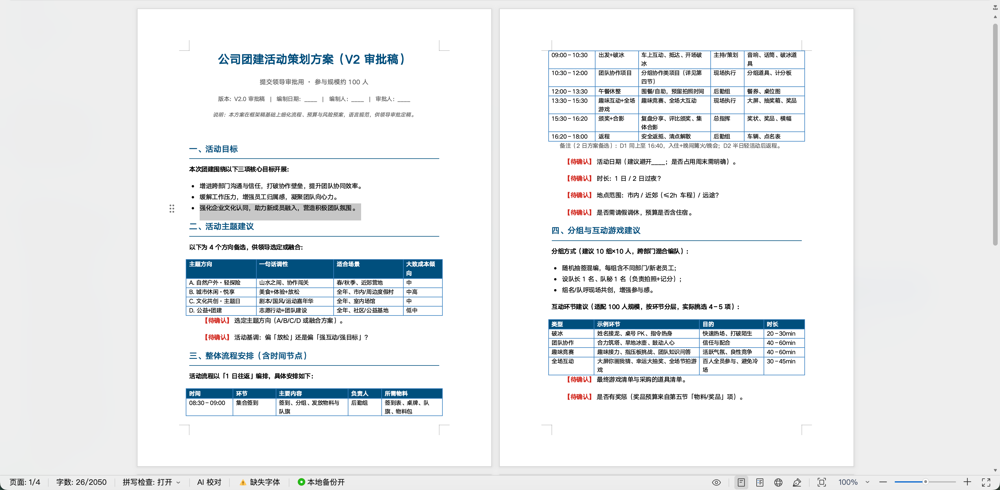
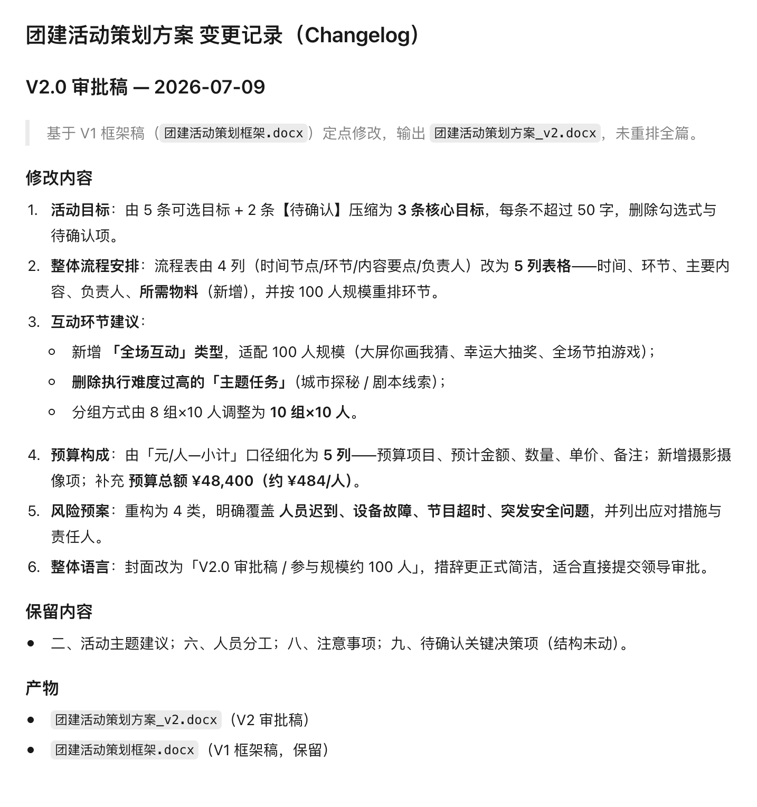
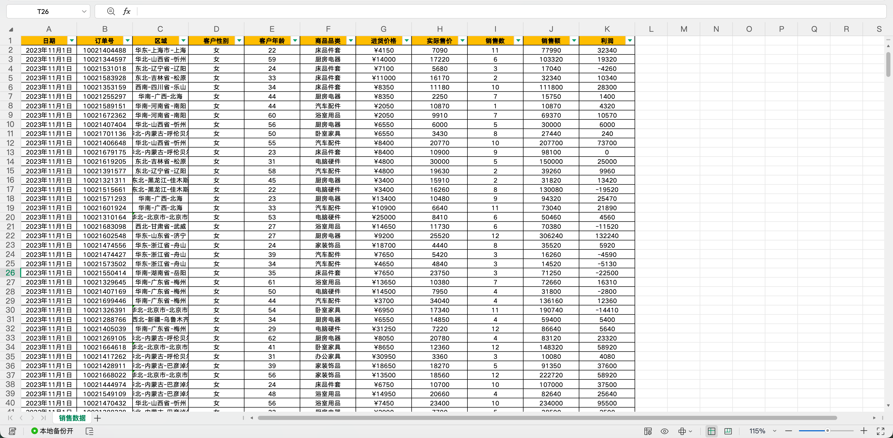
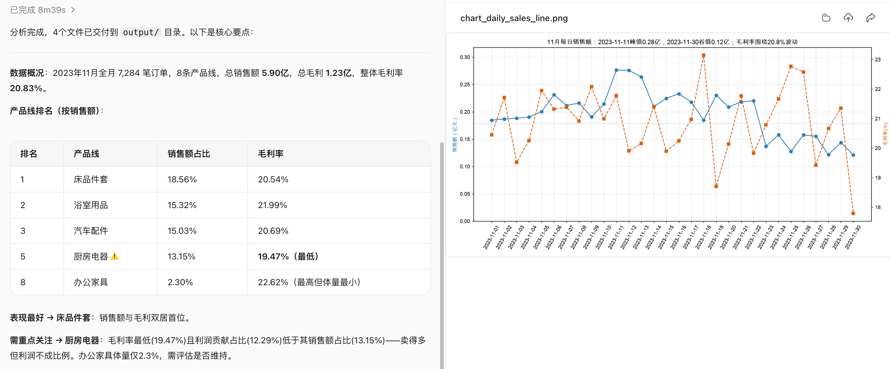
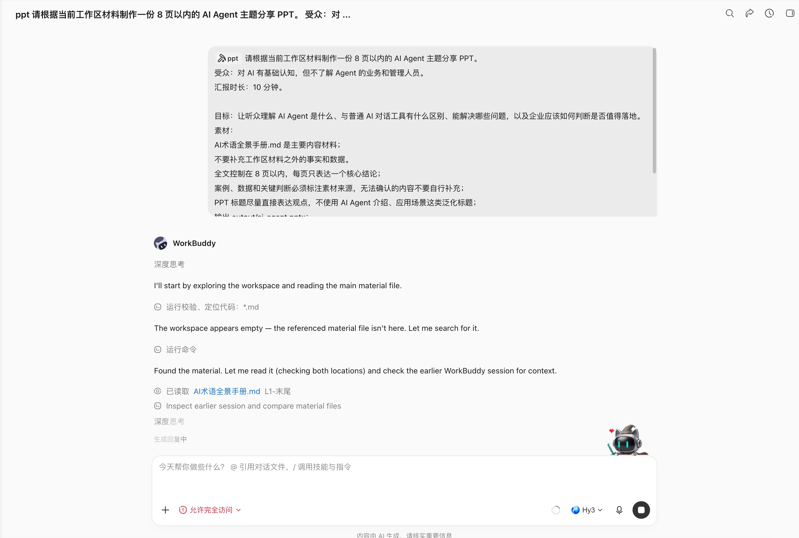

# 第 11 章 办公三件套：Word、Excel、PPT

办公三件套是多数人第一次感受到 WorkBuddy 价值的地方。

该章节聚焦三类最常见的办公产物：Word 文档、Excel 表格和 PPT 汇报。


## 办公三件套的共同工作流

无论文档类型是什么，都建议先把任务拆成五个问题。很多“AI 做得不好”的办公任务，根源不是模型不会写，而是人没有把交付标准说清楚。

| 问题 | 要说清什么 | 示例 |
|-|-|-|
| 目标 | 这份材料要帮助谁做什么决定 | 给部门负责人看，用于判断项目是否继续投入。 |
| 受众 | 阅读者是谁，懂不懂背景 | 管理层只看结论；项目组需要过程和责任人。 |
| 材料 | 哪些文件是事实来源，哪些只是参考 | `data.xlsx` 是唯一数据口径，旧版 PPT 只参考结构。 |
| 格式 | 要 Word、Excel、PPT，还是三者联动 | 输出一份项目复盘 Word、一张风险台账 Excel、一份 8 页汇报 PPT。 |
| 验收 | 怎么判断结果可用 | 数字能回到源文件，表格公式可刷新，PPT 投屏不溢出。 |


## 先选对 Skill：办公任务的推荐组合

SkillHub上有很多办公效率、文档处理、表格处理、PPT 生成和会议纪要相关技能。

| Skill 名称 | 适合处理 | 本章怎么用 | 注意点 |
|-|-|-|-|
| Word / DOCX | Word 文档 | 创建、检查、编辑 DOCX，处理标题、编号、表格、修订记录。 | 适合本地 docx 文件。 |
| Excel / XLSX | Excel 表格 | 读取、清洗、写入工作簿，处理公式、日期、格式和模板保留。 | 先确认数据口径。 |
| Powerpoint / PPTX | PPT 文件 | 创建、编辑、检查 PPTX，处理版式、占位符、备注、图表和视觉质检。 | 适合需要可编辑 PPTX 的场景。 |
| Office Document Specialist Suite | Word / Excel / PPT | 综合处理 Office 文件，适合自动化报告和多文件联动任务。 | 复杂任务建议分步验收。 |
| wps | WPS 三件套 | 面向中国用户的 WPS Office 工作流，覆盖文字、表格、演示。 | 适合 WPS 生态用户。 |
| 腾讯文档 TENCENT DOCS | 在线文档协作 | 创建、读取、编辑、搜索腾讯文档，覆盖在线 Word、Excel、幻灯片。 | 通常需要 API Key 或授权。 |
| kdocs skill | 金山文档 / WPS 云文档 | 处理 WPS 云文档、智能文档、表格、PPT、PDF、知识库。 | 通常需要 API Key。 |
| Markdown Converter | 材料解析 | 把 PDF、Word、PPT、Excel 转成 Markdown，方便模型先理解内容。 | 适合读材料，不等于最终排版。 |
| PPT Generator / PPT Workflow | PPT 生成 | 从主题、讲稿或材料自动生成演示稿，适合初稿和结构化汇报。 | 生成后仍要人工审稿。 |
| PowerPoint Automation | PPT 批改与导出 | 读取大纲、导出 PDF/图片、替换文字、统一字体和主题。 | 更适合 Windows + PowerPoint/WPS。 |
| Excel公式生成 | 公式问题 | 把自然语言转换为 Excel/WPS/Google Sheets 公式，并解释防错版本。 | 公式要在样例数据上验证。 |
| 腾讯会议 | 会议到文档 | 预约会议、获取转写、获取 AI 纪要，再转成 Word 纪要、Excel 待办、PPT 汇报。 | 需要会议平台授权。 |

一个实用的搭配思路是：本地文件优先用 **Word / DOCX、Excel / XLSX、Powerpoint / PPTX**；在线协作优先用 **腾讯文档** 或 **kdocs skill**；材料很多时先用 **Markdown Converter** 抽取结构；会议类办公流再叠加 **腾讯会议** 或会议纪要类 Skill。


## Word：从空白页到正式文档

### 这个场景的痛点

Word 看起来只是写字，但真实办公里的难点通常有四个：不知道该按什么结构写、语气不够正式、标题和编号混乱、内容没有证据来源。

尤其是方案、通知、报告、会议纪要、制度、申请、PRD 这类文档，如果开头就让 AI 自由发挥，结果往往像“万能模板”，读起来完整，却很难直接提交。

WorkBuddy 适合解决的不是“替你拍脑袋”，是把已有材料变成结构稳定、语气一致、可以继续修改的文档初稿。

要把文档目标、提交对象、语气和结构要求一次说清楚；生成后再用差异化反馈继续修改，而不是每次从头生成。

### 适合交给 Word 的任务

- **正式方案**：活动策划、项目方案、营销方案、培训方案。
- **管理文档**：制度、通知、申请、会议纪要、复盘报告、周报月报。
- **产品材料**：PRD、需求说明、竞品分析、用户访谈总结。

### 推荐流程

| 步骤 | WorkBuddy 做什么 | 人要确认什么 |
|-|-|-|
| 1 | 读取材料，列出可用信息和缺失项。 | 哪些材料是事实来源，哪些只是参考。 |
| 2 | 生成文档大纲和写作口径。 | 读者是谁，文档是汇报、审批还是执行。 |
| 3 | 按大纲生成 Word 初稿。 | 标题层级、章节顺序、关键信息是否完整。 |
| 4 | 根据反馈润色、补充、删减。 | 哪些内容可以定稿，哪些必须标“待确认”。 |
| 5 | 输出可编辑 docx 和修改说明。 | 是否能直接发给同事审阅。 |

### 提示词示例：生成一份团建活动策划 Word

```text
帮我生成一份公司团建活动策划的 Word 文档框架。
公司约 80 人，包含：活动目标、活动主题建议、整体流程安排（含时间节点）、分组与互动游戏建议、预算构成清单、人员分工、风险预案和注意事项。
语言简洁实用，不需要写得过于详细，重点把整体框架和关键决策项列清楚，适合直接拿去和领导确认活动方向。
```






### 二次修改不要重写，要说差异

```text
请在上一版公司团建活动策划 Word 文档基础上进行修改，不要重新生成整篇。
修改要求：
将活动目标压缩为 3 条，每条不超过 50 字；
将流程安排改成表格，列为：时间、环节、主要内容、负责人、所需物料；
在节目类型建议中增加适合 100 人规模公司的互动环节，并删除执行难度过高的方案；
将预算构成进一步细化，增加：预算项目、预计金额、数量、单价、备注，并补充预算总额；
新增风险预案部分，覆盖人员迟到、设备故障、节目超时和突发安全问题；
整体语言更加正式、简洁，适合直接提交给领导审批。
输出修改后的 v2 版 Word 文档，并在 changelog.md 中列出本次修改内容。
```






### 进阶实战：比较两版制度、合同或方案

```text
比较 policy-v3.docx 与 policy-v4.docx。
输出新增、删除、修改和仅格式变化四类差异，附章节和原文定位。
重点标记金额、日期、责任主体、审批条件、例外和否定表达。
生成影响清单和待确认问题，不给法律结论，不修改原文件。
```


文档对比适合发现变化，不替代法务、财务或制度责任人的最终判断。

## Excel：把表格变成能回答问题的分析

### 这个场景的痛点

Excel 的问题通常不在“会不会做图”，而在“这个表到底能回答什么问题”。

很多表格混着日期、文本、空值、合并单元格、多个口径和临时备注，直接让 AI 分析，很容易得到一份看似专业、其实没有业务价值的图表。

建议先导入 Excel 或 CSV，再一次说明分析指标、图表类型、统计维度、时间范围和是否需要报告。这个顺序很重要：先定义业务问题，再决定图表，而不是先生成漂亮图。


### 适合交给 Excel 的任务

- **数据清洗**：去重、补空值、统一日期格式、拆分字段、合并多个表。
- **经营分析**：销售额、利润率、转化率、客单价、续费率、库存周转。
- **报表生成**：周报、月报、预算执行、考勤汇总、项目进度台账。
- **公式辅助**：生成或解释复杂公式，排查 `#N/A`、`#VALUE!`、循环引用。
- **可视化**：柱状图、折线图、饼图、透视表、仪表盘、异常点提示。

### 推荐流程

| 阶段 | 提示重点 | 输出 |
|-|-|-|
| 读表 | 先描述工作簿结构、字段含义、样例行和明显脏数据。 | 数据字典、问题清单。 |
| 定指标 | 说明要回答的业务问题，而不是只说“分析一下”。 | 指标口径表。 |
| 清洗 | 说明空值、重复值、异常值如何处理。 | 清洗后的 xlsx / csv。 |
| 计算 | 生成公式、透视表或统计表，并保留可刷新结构。 | 汇总表、公式说明。 |
| 可视化 | 根据业务问题选择图表，避免图表堆砌。 | 图表、分析结论。 |

### 提示词示例：销售数据分析

```Plain Text
请读取 电商销售数据.xlsx，先不要修改原文件。
业务问题：分析本月各产品线的销售表现和盈利能力，判断哪些产品线贡献高、哪些利润表现较弱，并识别本月销售过程中的异常波动。
请输出：
说明数据字段含义，并检查缺失值、重复记录、异常值和字段格式问题；
按产品线统计销售额、毛利、毛利率、销售额占比和毛利贡献占比，并进行排名；
按日汇总销售额和毛利率，分析本月销售表现的日度变化；如果数据跨度和完整性允许，再补充按周统计；
生成柱状图对比各产品线销售额和毛利，生成折线图展示本月每日销售额变化；
识别销售额、毛利率或单笔订单金额明显异常的日期或记录，并结合数据说明异常表现，不要在缺少依据时推测业务原因；
总结本月表现最好的产品线、需要重点关注的产品线，以及 3 条可直接用于业务复盘的结论。
输出 output/sales-analysis.xlsx 和 output/summary.md。
要求：保留原始数据，统计过程和公式可追溯；图表标题直接表达主要结论；无法从数据中确认的原因明确标注为待核实，不要自行编造。
```






### 进阶实战：多表合并、对账与异常清单

基础办公中最有价值的不是“做个图表”，而是把数据口径和异常暴露出来：

```text
合并 input/sales 中 6 个区域的周销售表。
先检查列名、数据类型、日期范围、币种和主键，不一致时停止并列差异。
按订单号去重，但保留重复来源；汇总前输出总行数、空值、异常值和重复数。
生成 clean-sales.xlsx、exception-list.xlsx 和 reconciliation.md。
金额汇总必须与各源表合计对账，差异不为 0 时不生成管理结论。
```


**验收**：输入总量、清洗变化和输出总量守恒；公式可重算；异常没有被静默删除；图表使用的字段和汇总表一致。


## PPT：不是套模板，而是把材料变成叙事

### 这个场景的痛点

PPT 最容易被误用。

很多人把任务写成“帮我做一份高级感 PPT”，结果 AI 只能猜风格，生成一堆好看的空话。真正可用的 PPT 必须先回答三个问题：这次汇报给谁看、对方听完要做什么决定、你有多少时间讲。

PPT 生成强调同时提供素材、页数要求、受众对象和风格偏好。对 WorkBuddy 来说，PPT Skill 可以负责页面生成，但故事线必须先确认。否则页面越漂亮，越容易掩盖逻辑问题。

### 适合交给 PPT 的任务

- **项目汇报**：项目进展、阶段复盘、里程碑计划、风险与资源请求。
- **经营汇报**：月度经营分析、销售复盘、预算执行、用户增长复盘。
- **培训课件**：新人培训、产品培训、客户培训、内部分享。
- **方案展示**：客户方案、竞标材料、商业计划、产品发布。

### 推荐流程

| 步骤 | WorkBuddy 做什么 | 人要确认什么 |
|-|-|-|
| 1 | 把 Word、Excel、图片、旧 PPT 转成材料摘要。 | 哪些内容必须保留，哪些可以删。 |
| 2 | 生成 6-10 页故事线和每页标题。 | 汇报对象、时长、决策目标。 |
| 3 | 根据确认后的大纲制作 PPT。 | 每页是否只有一个核心观点。 |
| 4 | 补图表、备注、来源映射和导出版本。 | 关键数字是否来自 Excel。 |
| 5 | 做版式检查：文字溢出、图片缺失、字号、颜色。 | 投屏后是否能读，是否适合现场讲。 |

### 提示词示例：从材料包制作汇报 PPT

```text
请根据当前工作区材料制作一份 8 页以内的 AI Agent 主题分享 PPT。
受众：对 AI 有基础认知，但不了解 Agent 的业务和管理人员。
汇报时长：10 分钟。

目标：让听众理解 AI Agent 是什么、与普通 AI 对话工具有什么区别、能解决哪些问题，以及企业应该如何判断是否值得落地。
素材：
AI术语全景手册.md 是主要内容材料；
不要补充工作区材料之外的事实和数据。
全文控制在 8 页以内，每页只表达一个核心结论；
案例、数据和关键判断必须标注素材来源，无法确认的内容不要自行补充；
PPT 标题尽量直接表达观点，不使用 AI Agent 介绍、应用场景这类泛化标题；
输出 output/ai-agent.pptx；
生成后检查文字溢出、页面留白、图表口径、图片缺失、字体一致性和页码。

整体风格：专业、简洁、有科技感，但不要过度使用渐变、发光和装饰性元素，适合正式分享和内部汇报。
```




## 三件套联动案例：会议之后自动形成交付包

很多办公任务不是单文件，而是“会议之后要有东西”。

比如开完一次产品评审会，会议里有用户反馈、功能决策、待办事项和下个版本计划。手工做法通常是：先整理纪要，再补 PRD，再做任务表，最后做汇报 PPT。

WorkBuddy 的价值就在于把这些交付物串成同一条事实链。

### 场景痛点

- 会议讨论是口语化的，决议、分歧和待办混在一起。
- PRD 需要结构化，但会议纪要里没有标准格式。
- Excel 任务表需要负责人、截止日期和状态字段，不能只是一段总结。
- PPT 汇报需要给老板看，不能把会议全文搬进去。

### 可用 Skill 组合

| 环节 | 推荐 Skill | 作用 |
|-|-|-|
| 获取会议内容 | 腾讯会议 / 智能会议纪要类 Skill | 获取转写、AI 纪要、决议、行动项。 |
| 生成 PRD | Word / DOCX、腾讯文档、kdocs skill | 把会议内容改写成产品需求文档。 |
| 生成任务表 | Excel / XLSX、Excel/WPS 表格自动化工具 | 输出负责人、截止日期、优先级、状态和验收标准。 |
| 生成汇报 | Powerpoint / PPTX、PPT Workflow、PPT Generator | 把 PRD 和任务进度转成管理层汇报。 |

### 提示词示例：会议到 PRD、任务表、汇报

```text
请读取本次产品评审会议的转写和 AI 纪要，生成一个办公交付包。
目标：把会议内容转成可以推进研发的材料。
请输出：
1. Word：output/feature-prd.docx，包含背景、目标用户、核心问题、需求列表、流程说明、验收标准、风险和待确认问题；
2. Excel：output/action-items.xlsx，字段包含事项、负责人、优先级、截止日期、依赖、状态、验收标准；
3. PPT：output/review-summary.pptx，6 页以内，面向管理层，突出本次会议决议、资源请求和风险。
约束：
- 会议中没有明确确认的内容，不要写成既定结论；
- 人名、日期、功能范围必须保留来源；
- 如果缺少负责人或时间，请标为待确认；
- 先输出大纲和任务表字段预览，等我确认后再生成文件。
```


## 常见错误与修正方式

| 常见错误 | 为什么会发生 | 更好的写法 |
|-|-|-|
| “帮我做个 PPT，要高级一点” | 没有受众、目标和材料约束。 | 说明受众、汇报时长、页数、决策目标、参考模板和必须保留的数据。 |
| “分析一下这个 Excel” | 没有业务问题，模型只能泛泛总结。 | 说明要回答什么问题、统计哪些指标、按什么维度比较。 |
| “写一份报告” | 没有文档类型和语气要求。 | 说明是方案、总结、申请、纪要还是 PRD，并指定读者。 |
| “全部自动完成，不用问我” | 关键口径没确认，风险会被放大。 | 先让 WorkBuddy 输出材料清单、风险清单和大纲，确认后再生成。 |
| “把这堆材料合成一个文件” | 没有区分事实、参考和待确认。 | 指定唯一数据源、参考文件和不能编造的字段。 |
