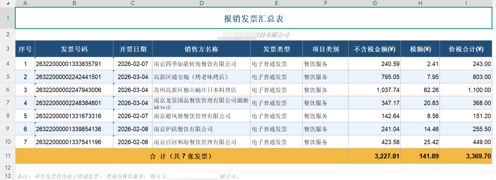

# 第 12 章 从整理桌面文件这些小事做起

## 整理桌面发票，不再回电脑前翻文件

桌面发票是典型的“电脑在替人承受混乱”的场景：电子发票、截图、PDF、微信下载文件、邮件附件混在一起，命名方式各不相同。人不在电脑前时，最烦的不是不知道怎么报销，而是不知道哪几张发票已经在电脑里、哪些字段还缺、哪些文件可能重复。

### 场景痛点

- 发票散落在桌面、下载目录、微信文件目录，格式可能是 PDF、JPG、PNG。
- 文件名经常只叫“发票.pdf”“image.png”“微信图片_2026xxxx.jpg”。
- 报销真正需要的是结构化字段：抬头、税号、金额、开票日期、发票号码、销售方。
- 远程批量整理最怕误删、覆盖、移动原件，导致后面找不回来。


```text
请帮我整理电脑里的发票，但不要删除、移动或覆盖原文件。
扫描范围只包括桌面、Downloads 和微信文件接收目录，时间范围为最近 30 天。
候选条件：文件名包含“发票”“电子发票”“invoice”，或内容识别为发票的 PDF、JPG、PNG。
第一步先返回候选清单和数量。
第二步识别抬头、税号、金额、开票日期、发票号码、销售方、文件路径。
第三步生成 invoice-ledger.xlsx，并列出“重复发票”和“无法识别字段”的人工确认清单。
```

执行后仅新增台账文件，桌面原发票不移动、不改名、不删除



## 合成示例

> 质量门禁补录：一个虚构专题目录中有 32 个文件，其中同名 4 个、状态不明 3 个。WorkBuddy 应先生成清单与建议目录，不能仅凭“final/最终”等文件名直接删除其他版本。

### 可复制任务模板

```text
请只读检查当前工作目录，暂时不要移动、删除、覆盖或重命名任何文件。

目标：{整理/交接/归档/迁移}
分类规则：{规则或“请先建议”}
正式成果判断依据：{审批、签署、盖章、确认记录等}

先输出：1) 文件清单与异常；2) 可能的重复与版本关系；3) 建议目录；4) 拟操作预览与冲突处理；5) 无法判断、需人工确认的文件。未经我确认，不执行写入操作。
```

## 输出物与验收标准

- 文件清单完整，异常有标记。
- 每项写操作都有预览与确认记录。
- 原件未被覆盖，失败可回退。
- 归档后数量、路径与抽样内容核对一致。

## 常见弯路与安全边界

- 只按修改时间认定终稿，会忽略审批与签署依据。
- 一上来批量重命名，容易破坏外部引用。
- 删除、覆盖与外部归档必须人工确认；可复用资产包括文件清单、目录模板、变更预览与处理日志。
