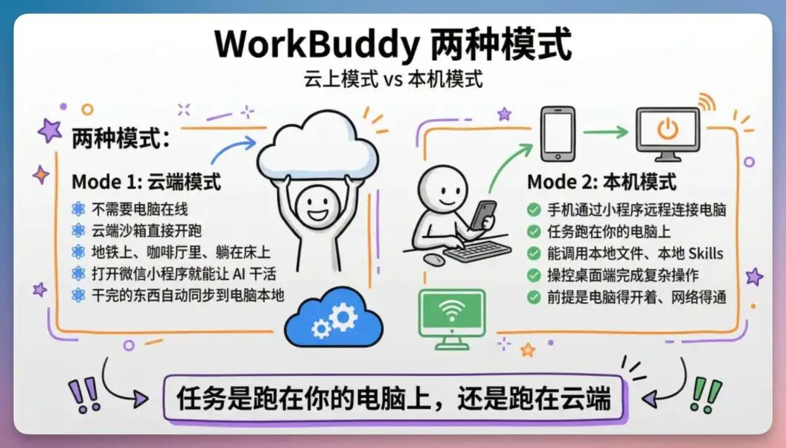
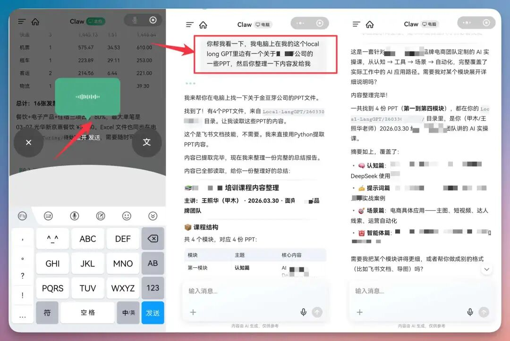
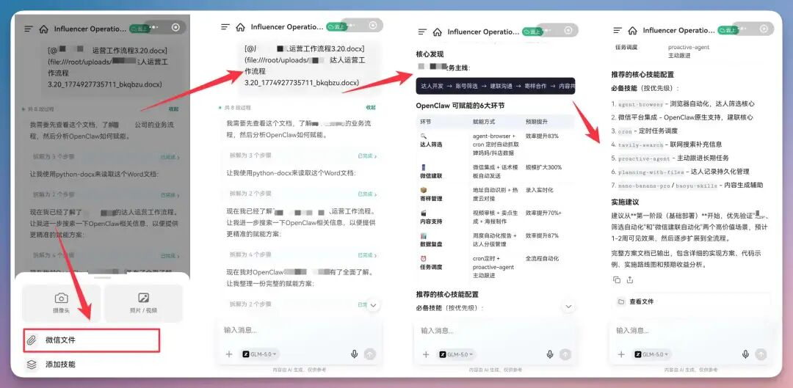
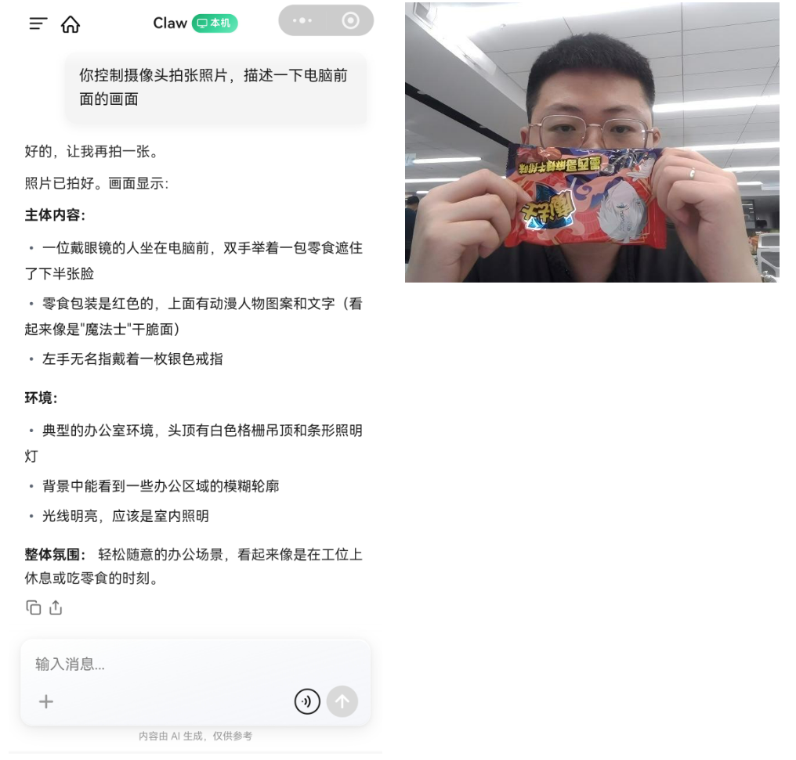

# 第 13 章 远程控制你的电脑，不用发愁不在电脑前

你人不在电脑前，WorkBuddy 小程序可以成为远程任务入口，把指令发回正在运行的电脑端，让电脑继续查文件、读资料、整理发票、处理微信文件，甚至持续汇报一个长任务的进展。

## 小程序远程控制电脑


传统远程办公通常有两种方式：一种是把电脑屏幕投到手机上，自己点鼠标；另一种是把文件先传到云端，再在手机上处理。

WorkBuddy 的远程方式介于二者之间：用户不直接操控鼠标，而是把任务说清楚；电脑端 WorkBuddy 根据授权范围读取本地文件、调用 Skill 或本地工具，把中间结果和最终产物回传到手机端。

| 能力层 | 解决什么问题 | 使用时要确认什么 |
|-|-|-|
| **手机端入口** | 在路上、会议间隙、客户现场也能发起任务 | 账号已登录，消息能送达，语音转文字没有关键错误 |
| **电脑端执行** | 读取本机目录、调用本地软件、处理私有资料 | 电脑在线，WorkBuddy 正在运行，目录权限已授权 |
| **任务回传** | 把候选文件、摘要、表格、截图、压缩包返回给手机 | 输出路径明确，不覆盖原文件，敏感信息先脱敏 |
| **人工确认** | 避免远程状态下误删、误发、误改重要资料 | 高风险动作必须暂停确认，不把“执行完”当成“验收完” |


## 先分清：云端模式还是本机模式

移动端适合在通勤、出差、跨设备办公时继续推进任务。但在使用前，必须先判断任务究竟应该跑在云端，还是跑在本机。

这个判断会直接影响它能否读取电脑文件、是否需要电脑在线，以及数据是否适合进入云端环境。



| 判断问题 | 云端模式 | 本机模式 |
|-|-|-|
| 是否需要电脑在线 | 通常不需要 | 需要电脑在线，并且 WorkBuddy 处于可响应状态 |
| 能否读取电脑目录 | 不能直接读取 | 可以读取已授权范围内的本地目录 |
| 适合任务 | 公开资料调研、写提纲、生成轻量文本 | 查找本机文件、读取私有资料、调用本地 Skill 或软件 |
| 主要风险 | 资料是否适合进入云端 | 目录权限、误操作、电脑离线、结果未验收 |


## 人在外面，临时要电脑里的文件

这是最容易让用户第一次感受到远程控制价值的场景。合作方突然问培训课件、项目汇报、合同版本、报价单、活动海报源文件在哪里，而资料都在办公室电脑里。过去只能回复“我回去找一下”，现在可以在小程序里语音发起任务，让电脑端 WorkBuddy 在指定目录中查找候选文件，读取内容并整理摘要。

### 场景痛点

- 文件名不一定记得完整，只记得“培训”“项目汇报”“某客户”等关键词。
- 电脑里可能有多个版本，远程状态下不能凭感觉直接发。
- 临时需求往往只需要先给对方一个摘要或确认口径，不一定马上发送原文件。

### 推荐流程

1. 先限定目录，比如桌面、Downloads、项目资料、training 文件夹。
2. 让 WorkBuddy 只读扫描，列出候选文件、修改时间、文件大小和可能匹配原因。
3. 确认目标文件后，再读取内容并生成手机端可转发的摘要。
4. 需要发送文件时，先整理到一个单独输出目录，不直接移动原文件。

```text
你帮我看一下，我电脑上在我这个local long GPT里边有一个关于xx公司的一些PPT，然后你整理一下内容发给我。
```




## 微信文件直接处理，不必先搬来搬去

很多任务不是从电脑文件夹开始，而是从微信聊天里突然冒出来：客户发来一个合同 PDF，朋友发来一张票据照片，同事丢来一个 Excel，供应商转来一个压缩包。传统流程是先下载到手机，再传电脑，再找目录，再打开软件。小程序更适合把“微信上下文里的文件”直接变成 WorkBuddy 的输入。




## 远程监控长任务，让手机成为任务看板

远程控制还有一个更进阶的用法：不是让 WorkBuddy 做一个几秒钟的小任务，而是让它持续推进一个需要等待、分阶段处理或容易失败的任务。比如批量转换文件、整理大目录、生成网站、处理会议录音、运行代码测试、下载资料、爬取公开网页、自动化检查系统状态。

### 远程监控适合什么

- 任务耗时超过 3 分钟，需要阶段汇报。
- 任务中间可能遇到失败项，需要记录并继续处理其他文件。
- 任务结果需要先看预览，再决定是否批量执行下一步。
- 任务过程中可能触发登录、付款、发送消息、覆盖文件等高风险动作。


```text
请启动这个批量处理任务，并把手机端当作进度看板。
```


```Plain Text
你控制摄像头拍张照片，描述一下电脑前面的画面
```

