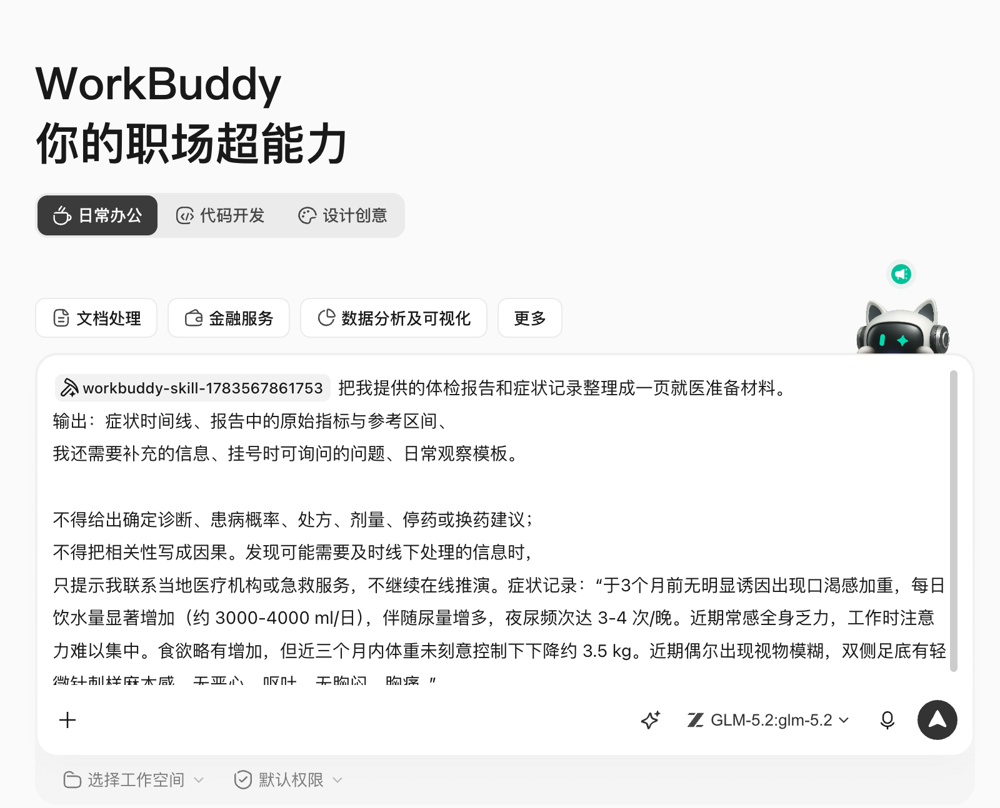
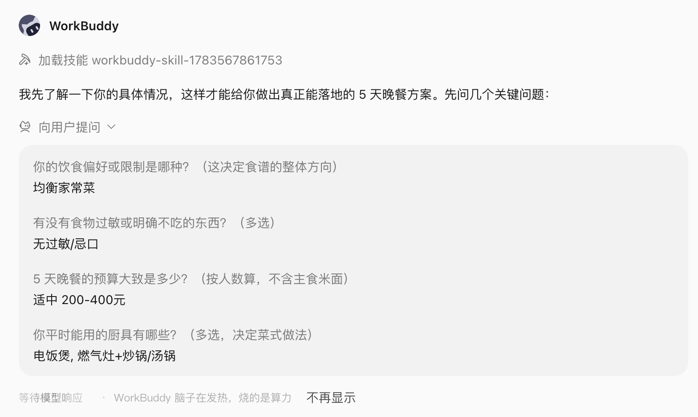
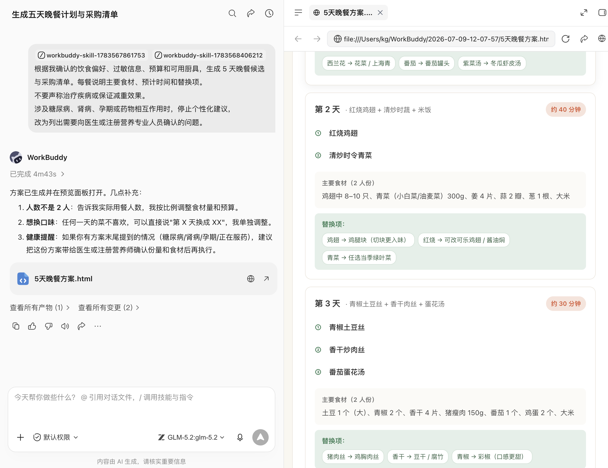
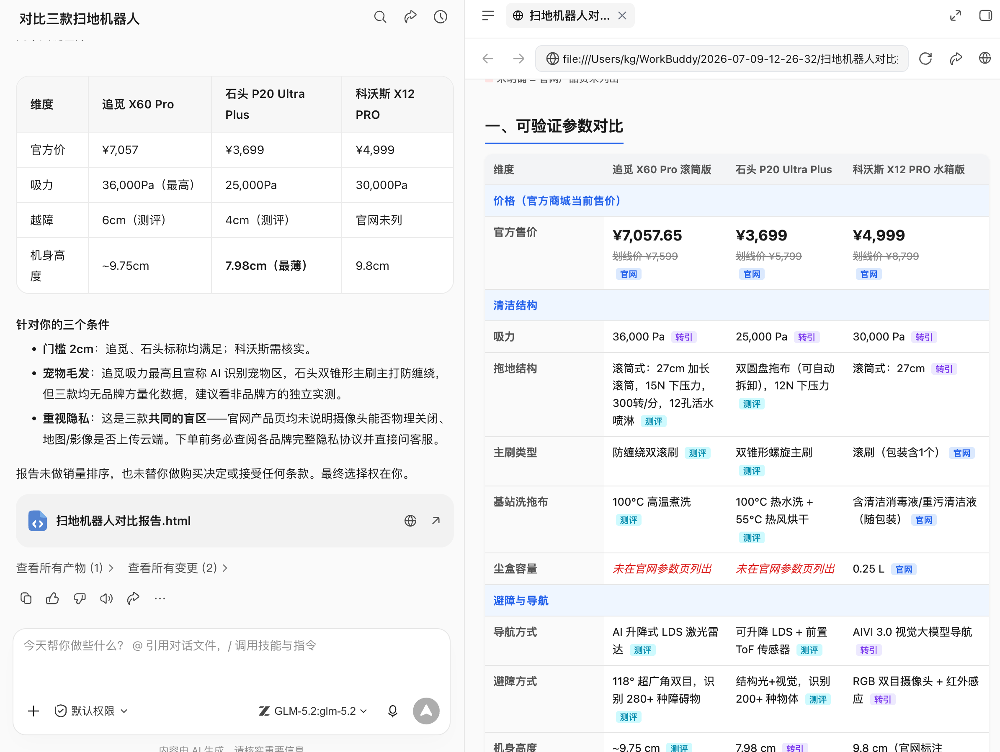

# 第 14 章 生活助手的价值，是减少琐碎

## 生活问题比办公问题更模糊

“帮我规划旅行”“看看体检报告”“今天吃什么”“给我算算运势”，看起来都只需一句话，背后却混合了偏好、实时数据、隐私和风险。办公文件做错还可以返工，医疗、付款、签证和重大决定做错，代价可能完全不同。

因此生活场景先分三类：

| 类型 | WorkBuddy 可以做什么 | 人必须做什么 |
|-|-|-|
| 信息整理型 | 收集偏好、比较候选、生成清单 | 确认事实与最终选择 |
| 实时决策型 | 查询天气、路线、库存和规则，标注时间 | 回到官方或服务商页面核验并操作 |
| 高风险或娱乐型 | 整理就医问题、提供娱乐性解读 | 医疗交给专业人员，命理不作为决策依据 |

## 场景一：三天旅行，不想打开二十个 App

攻略、地图、天气、酒店、交通、预算和同行人偏好都存在于不同应用中。普通 AI 规划的行程看起来完整，却可能把相距很远的地点排在一起，有的会引用过期营业时间，甚至虚构餐厅。

- [旅游助手](https://skillhub.cn/skills/travelassistant)：行程、目的地、住宿、美食和行李清单；
- [腾讯地图地图助手](https://skillhub.cn/skills/tencentmap-map-assistant)：POI、路线、距离、天气与地图；
- [旅游行李清单](https://skillhub.cn/skills/smart-packing-list-new)：按天气、天数和人群生成打包清单；
- [旅游天气风险](https://skillhub.cn/skills/weather-8tour)：需要精细天气风险时补充。

### 第一步：先收集约束

```text
先不要排行程，用不超过 8 个问题收集旅行约束：
出发地、日期、同行人、预算、交通偏好、每日步行上限、兴趣、
饮食禁忌、必须去和明确不去的地点。
已经提供的信息不要重复询问。
```

### 第二步：候选路线与实时核验

```text
为 2 名成人规划 7 月 18-20 日上海到泉州的 3 天自由行。
预算 5000 元，偏好人文与本地小吃，每天步行不超过 15000 步。
先给两个路线方向并解释取舍，我确认后再生成逐日计划。

使用地图能力核对地点顺序、路程和预计交通时间；
把票价、开放时间、预约、天气和交通班次标注查询时间与来源。
无法实时核验的内容写“待确认”，不要补造。
输出雨天替代方案、预算区间和行李清单。
不要登录、预订、付款或代替我接受退改条款。
```


WorkBuddy 在执行过程中并不是一来就直接帮你做决定，而是尽可能详尽的再向你询问一些问题，确保真的像个专属导游那样帮你规划行程。


### 执行链与交付物

偏好问卷 → 两个路线草案 → 人工选方向 → 地图优化 → 天气与开放信息核验 → 预算与行李 → 可分享行程页。真正可用的交付物应包含了地图行程规划、合理的游玩和交通时间规划、数据来源与真实的车次，而不只是一张漂亮日程表。

预订前由人再次确认库存、价格、签证、证件、保险和退改政策。涉及老人、儿童、孕妇、慢性病或无障碍需求时，要把限制明确写入任务，不能由模型自行推断。


## 场景二：旅行结束后，把照片和账单变成可复用记录

WorkBuddy 还可以在旅行后完成照片按日期地点整理、票据分类、预算复盘和攻略草稿，但不要默认读取整本相册或删除原图。

```text
只读取 trip-quanzhou/import 中的照片和票据副本。
按拍摄时间生成每日时间线，识别失败的文件列入人工确认。
票据按交通、住宿、餐饮、门票分类，金额汇总后与预算对比。
根据我确认的地点和感受生成一份私人旅行记录，
人物照片、定位和订单号在公开版本中全部脱敏。
不移动、不删除原文件。
```

这个场景最终可以反哺自媒体章：私人记录确认后，再选择哪些信息适合做小红书攻略或公众号长文。


## 场景三：体检报告看不懂，先准备一次更有效的就医

体检指标和症状记录很多，用户容易在网上搜索后自行诊断；部分健康 Skill 甚至宣称可以给出患病概率。蓝皮书不采用这种写法。

- [健康管理顾问](https://skillhub.cn/skills/health-coach-pro)：强调生活方式、体检数据理解和就医准备，不诊断、不处方；
- 腾讯健康相关临床 Skill 只应在符合资质、授权和实际医疗工作流时使用；普通用户不能把输出当诊断结论；
- 用药安全问题应优先咨询医生或药师，不让通用 Agent 决定停药、换药和剂量。

世界卫生组织在 AI 健康治理中强调，应把伦理、人权和问责置于技术设计与使用中心。对个人用户而言，最实用的边界是：AI 帮助整理信息和准备问题，不代替临床判断。[参考：WHO《Ethics and governance of artificial intelligence for health》](https://www.who.int/publications/i/item/9789240029200)

### 安全指令

```text
把我提供的体检报告和症状记录整理成一页就医准备材料。
输出：症状时间线、报告中的原始指标与参考区间、
我还需要补充的信息、挂号时可询问的问题、日常观察模板。

不得给出确定诊断、患病概率、处方、剂量、停药或换药建议；
不得把相关性写成因果。发现可能需要及时线下处理的信息时，
只提示我联系当地医疗机构或急救服务，不继续在线推演。
```



以上是我从网上找的一份就诊记录，当我把这份不太详尽的就诊记录同步给WorkBuddy，他会帮我分析并生成就医材料。


## 场景四：健康习惯与饮食计划，可以做得更日常

低风险健康管理更适合 WorkBuddy：饮水、睡眠、运动、膳食记录和复诊提醒。可选 [营养健康](https://skillhub.cn/skills/nutrition-and-health)、[健康食谱推荐](https://skillhub.cn/skills/healthy-recipe-recommender)等 Skill，但仍需声明过敏、疾病、用药、孕期和专业限制。

```text
根据我确认的饮食偏好、过敏信息、预算和可用厨具，
生成 5 天晚餐候选与采购清单。每餐说明主要食材、预计时间和替换项。
不要声称治疗疾病或保证减重效果。
涉及糖尿病、肾病、孕期或药物相互作用时，停止个性化建议，
改为列出需要向医生或注册营养专业人员确认的问题。
```




同样的在执行过程中会仔细询问我的饮食结构和目前厨房里可用的厨具，给出真正的属于我自己的晚餐计划，而不是一份看似精确但对我个人并不适配的医疗饮食方案。




## 场景五：算命、星盘与卜卦，怎样写得有趣又不越界

传统文化和娱乐测试是很多普通用户接触 Agent 的入口，可以用于传统文化体验、社交互动、写作灵感和自我提问。

不过出生时间、地点和家庭信息属于个人信息；解释结果容易被写成确定预言；用户也可能据此做医疗、投资、招聘、婚恋或职业决定。

更稳妥的指令

```text
使用传统文化娱乐方式，根据我主动提供的信息生成一份八字文化解读。
开头明确“仅供娱乐与文化体验，不预测确定未来”。
区分排盘计算、传统说法和现代反思问题，不把传统解释写成事实。
不提供医疗、投资、法律、婚恋或职业决策建议。
结尾把每个结论改写成可验证的自我提问，并提供至少一个反例角度。
不要长期保存出生时间和地点，任务结束后提醒我清理输入。
```


## 场景六：穿搭、家庭清单和消费比较

生活助手还有很多低风险、但非常实用的场景：


使用天气查询和 [每日穿搭灵感](https://skillhub.cn/skills/daily-outfit-inspiration)，输入城市、场合、已有衣物和不喜欢的风格。结果应优先使用衣柜现有单品，不要默认推荐购买。


把证件、药品、充电设备、儿童用品和宠物安排做成按人分组的清单，明确负责人和完成状态。自动化负责提醒，不负责确认药品是否适合某个家庭成员。


让 WorkBuddy 建立参数、价格、售后、隐私和长期成本表，再由人查看官方页面和真实合同。广告软文、联盟链接和商家评分要单独标记，不能混入事实列。

```text
比较 3 款扫地机器人，只使用厂商官网、说明书和我提供的报价。
表格列出清洁结构、避障、耗材、隐私、保修、价格和不确定项。
把营销表述与可验证参数分开，不根据销量自动推荐。
最后根据“家中有宠物、门槛 2cm、重视隐私”给条件性建议，
不要代替我下单或接受服务条款。
```




## 场景七：情绪记录与现实支持

WorkBuddy 可以帮助记录情绪触发点、睡眠、事件和应对方式，生成复盘问题或与咨询师沟通的摘要。它不会冒充心理医生，也不会让用户只依赖 Agent。

```text
把我本周的情绪记录按“事件、想法、感受、身体反应、采取行动”整理。
只总结重复模式，不诊断、不贴人格标签。
生成 5 个我可以与可信赖的人或专业人员讨论的问题。
如果内容出现自伤、他伤或即时危险信号，停止普通复盘，
提示我立即联系当地紧急服务、专业机构或身边可信赖的人。
```


## 生活 Skill 安装前的四项检查

1. **实时性**：天气、价格、库存、政策和营业时间从哪里来，查询日期是什么；
2. **隐私**：出生信息、位置、健康数据和家庭资料发送到哪里，能否只在本地处理；
3. **动作权限**：是否会登录、预订、付款、发送消息或修改日历，能否在动作前暂停；
4. **专业边界**：是否把娱乐写成事实，把健康建议写成诊断，把推荐写成保证。