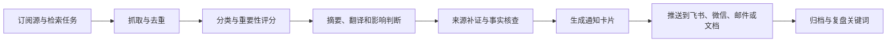
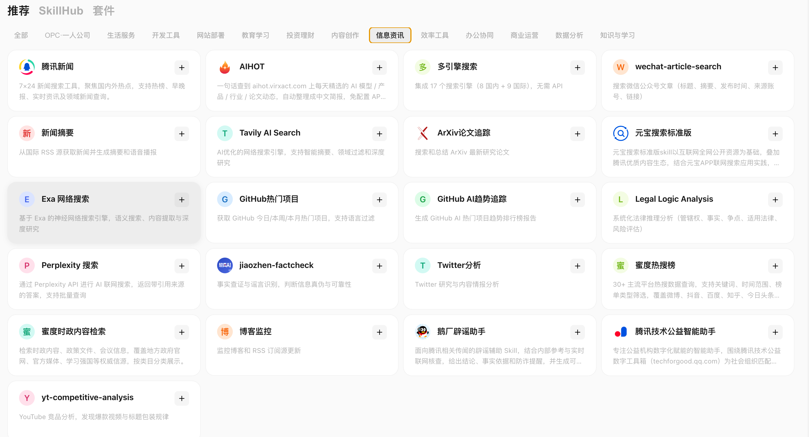

# 第 15 章 资讯整合：把信息流变成每日通知

资讯整合最怕两件事：一是信息太多，真正重要的内容被淹没；二是通知太吵，最后所有人都把它当背景噪音。

WorkBuddy 把多个信息源变成可筛选、可解释、可追踪的通知系统。比如，GitHub 热点项目每日通知、AIHOT 行业日报、论文与技术趋势追踪、公众号和博客监控、新闻与热榜舆情、事实核查与来源补证。

让用户每天少错过真正值得看的东西。

## 资讯通知的共同工作流

无论是 GitHub 项目、AI 新闻、论文、政策还是热榜，稳定的资讯通知都可以拆成同一条链路：先收集，再去重，再筛选，再摘要，最后按人群和场景推送。



| 环节 | 要解决什么 | 常见输出 |
|-|-|-|
| 收集 | 从新闻、热榜、GitHub、arXiv、RSS、公众号、搜索引擎拉取候选内容。 | 候选列表、原始链接、发布时间、来源。 |
| 去重 | 同一事件可能被多个来源重复报道。 | 合并同源事件，保留首发和权威来源。 |
| 筛选 | 不是所有新内容都值得推送。 | 重要性评分、相关性评分、风险等级。 |
| 摘要 | 把长文章、论文、项目 README 转成可读摘要。 | 三句话摘要、影响判断、适用人群。 |
| 核查 | 避免把传闻、营销稿、错误信息当事实。 | 证据表、可信度、待确认项。 |
| 通知 | 用固定格式推送给对应人群。 | 飞书卡片、微信群消息、日报文档、邮件摘要。 |

## 可用的资讯类 Skill



大致可以分成六类：新闻、AI 行业、开发者趋势、科研论文、内容监控、事实核查与搜索补证。

| Skill / 工具 | 适合通知什么 | 本章怎么用 |
|-|-|-|
| 腾讯新闻 | 国内外热点、早晚报、实时资讯、领域新闻。 | 适合做管理层早报、行业新闻通知、突发事件提醒。 |
| AIHOT | AI 模型、产品、行业、论文动态。 | 适合做 AI 行业日报和团队技术雷达。 |
| GitHub 热门项目 | 今日、本周、本月热门项目，支持语言过滤。 | 适合给研发团队做每日开源项目推荐。 |
| GitHub AI 趋势追踪 | GitHub AI 热门项目趋势报告。 | 适合做 AI 工程团队每周趋势简报。 |
| ArXiv 论文追踪 | 最新研究论文搜索与总结。 | 适合研究、算法和产品策略团队跟踪论文动向。 |
| 新闻摘要 | 从 RSS 源获取新闻并生成摘要和语音播报。 | 适合固定源日报、行业资讯语音简报。 |
| 博客监控 | 监控博客和 RSS 订阅源更新。 | 适合关注竞品博客、官方 changelog、技术团队博客。 |
| wechat-article-search | 搜索公众号文章标题、摘要、发布时间、来源账号和链接。 | 适合监控行业 KOL、竞品公众号和爆款选题。 |
| 蜜度热搜榜 | 30+ 主流平台热搜数据，支持关键词、时间范围和榜单类型筛选。 | 适合做舆情预警、内容选题触发器。 |
| Twitter 分析 | Twitter 研究与内容情报分析。 | 适合跟踪海外 AI、开源、投资和产品讨论。 |
| 多引擎搜索 / Tavily / Exa / Perplexity / 元宝搜索标准版 | 多源搜索、深度研究、引用来源补证。 | 适合给重要新闻、论文、项目做二次验证。 |
| jiaozhen-factcheck / 鹅厂辟谣助手 | 事实查证、谣言识别、腾讯相关辟谣辅助。 | 适合在通知前给争议信息加可信度判断。 |


## GitHub 热点项目每日通知

比如：每天 9 点抓取 GitHub Trending 和 AI 热门项目。按语言、主题、star 增长、最近提交、license 过滤。只推送 Top 5-10 个，并给出“是否值得试用”的判断。


```text
 定时每天早上7点返回gthub热门项目，并输出项目大概简介
```


## AIHOT 生成 AI 行业日报

AI 行业信息更新快，AIHOT 可以作为一个现成的信息源。它面向 AI 动态提供精选内容，覆盖模型、产品、行业和论文等方向，并支持 Agent 使用。


比如：每天固定时间从 AIHOT 拉取 AI 动态。按模型、产品、行业、论文、开源项目、商业化分组。对每条内容做“影响范围、可信度、与本团队相关性”评分。只推送 5-8 条重点，其余进入文档归档。对高影响内容追加二次检索，补充原始链接或官方来源。


安装aihot skill，

```Plain Text
帮我安装这个 skill：https://aihot.virxact.com/aihot-skill/
```


```text
请看一下最近 OpenAI 发布了什么新东西
```


```Plain Text
总结今日热点新闻，值关注AI大模型方向
```


| 日报模块 | 写什么 | 通知对象 |
|-|-|-|
| 今日三件大事 | 最值得打扰所有人的变化。 | 全员或管理层。 |
| 模型与产品 | 新模型、新功能、新 API、新价格。 | 产品、研发、运营。 |
| 开源项目 | 可试用工具、框架、Agent 项目。 | 研发团队。 |
| 论文研究 | 可能影响技术路线的新方法。 | 算法、技术负责人。 |
| 机会与风险 | 竞品动作、替代方案、合规变化。 | 业务负责人。 |