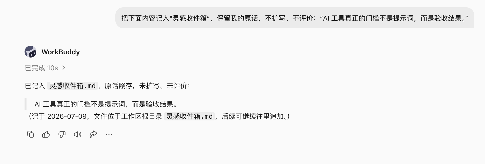
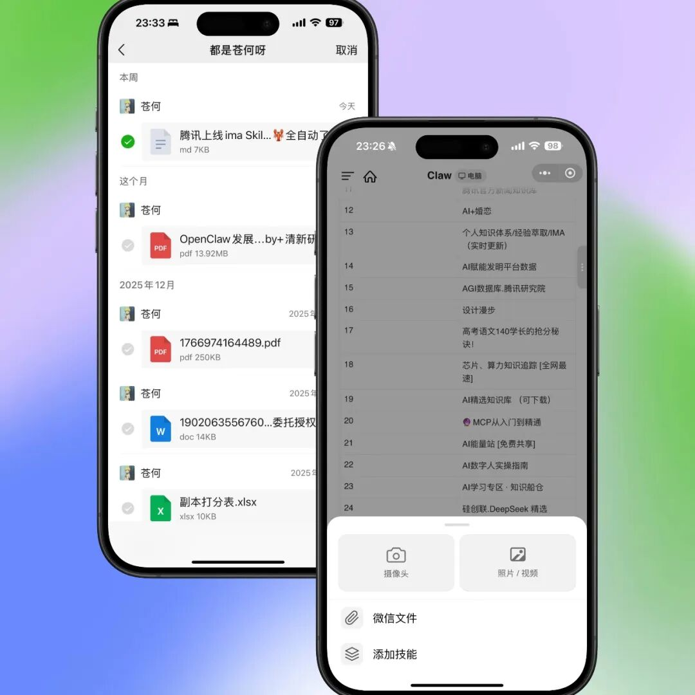
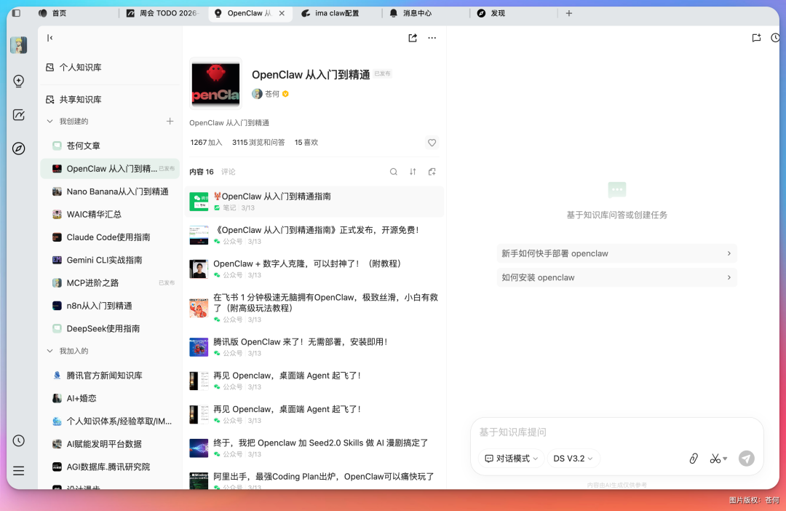

# 第 16 章 收藏不是知识管理，能再次用起来才是

## 工具都装了，知识还是散的

继续向前一步：如果一个人同时使用 WPS、ima、Obsidian、微信收藏、会议记录和本地文件，怎样分工才能避免“每个地方都有一份，但没有一份可信”。

## 先决定主版本，再连接工具

一个稳健的个人知识系统可以有多个入口，但只能有清楚的主版本：

| 系统 | 推荐角色 | 不建议承担 |
|-|-|-|
| WPS / Kdocs | 工作文档、表格、协作笔记和团队知识 | 同时充当所有私人原始资料的唯一备份 |
| ima | 微信生态收集、移动问答和知识库检索 | 保存没有来源的二手结论 |
| Obsidian | 本地 Markdown、双链、专题 Wiki 和长期迁移 | 未备份情况下让自动化批量移动或重命名 |
| 微信收藏 / 灵感工具 | 低摩擦入口和临时收件箱 | 永久归档与结构化检索 |
| 飞书 / 腾讯文档 | 团队协作、评论和发布副本 | 默认扩大私人资料可见范围 |

## 场景一：灵感来了，只记下一句话

灵感最怕两种处理：一种是没来得及记，另一种是 AI 立刻把一句话扩写成一篇看似完整、却已经偏离原意的文章。

- [灵感捕手](https://skillhub.cn/skills/inspiration-hunter-skill)：自动分类并写入 Markdown 收件箱；
- [ima-skills](https://skillhub.cn/skills/ima-skills)或 [ima](https://skillhub.cn/skills/ima-pro)：移动端记录、知识库读写与检索；
- Obsidian 本地目录作为长期主版本时，可接入后文的 Wiki Skill。


```text
把下面内容记入“灵感收件箱”，保留我的原话，不扩写、不评价：“AI 工具真正的门槛不是提示词，而是验收结果。”
```




## 场景二：微信收藏很多，真正写作时还是搜不到

- [微信收藏知识库](https://skillhub.cn/skills/wechat-favorite)：导出、分类，并可选择进入 ima、Obsidian 或 Notion；
- [URL to Obsidian](https://skillhub.cn/skills/url-to-obsidian)：抓取网页、总结并保存到 Vault；
- [公众号内容提取](https://skillhub.cn/skills/wxpublic-fetch)：将公众号文章保存为本地 Markdown。

```text
处理本周微信收藏，只读，不删除原收藏。
```




## 场景三：ima 作为移动知识入口

ima 的优势不是“问答更聪明”，而是手机收集、知识库读写和微信上下文衔接。使用 [ima-skills](https://skillhub.cn/skills/ima-skills) 时，先明确目标知识库和写入规则。

```text
将我刚选择的 3 份文件放入 ima“WorkBuddy 案例库”的收件箱。
```



## 场景四：Obsidian 不是文件夹，而是可维护的 Wiki

- [Obsidian 资料整理](https://skillhub.cn/skills/obsidian-core-notes)：维护核心笔记、专题综合和目录链接；
- [agent + Obsidian 长期记忆](https://skillhub.cn/skills/obsidian-memory)：在明确项目边界后读写长期记忆。

```text
把一篇公众号文章交给 WorkBuddy 解析，再要求放进指定的 Obsidian 素材目录。
```

WorkBuddy 能识别文章正文和作者，并生成 Markdown 条目。

