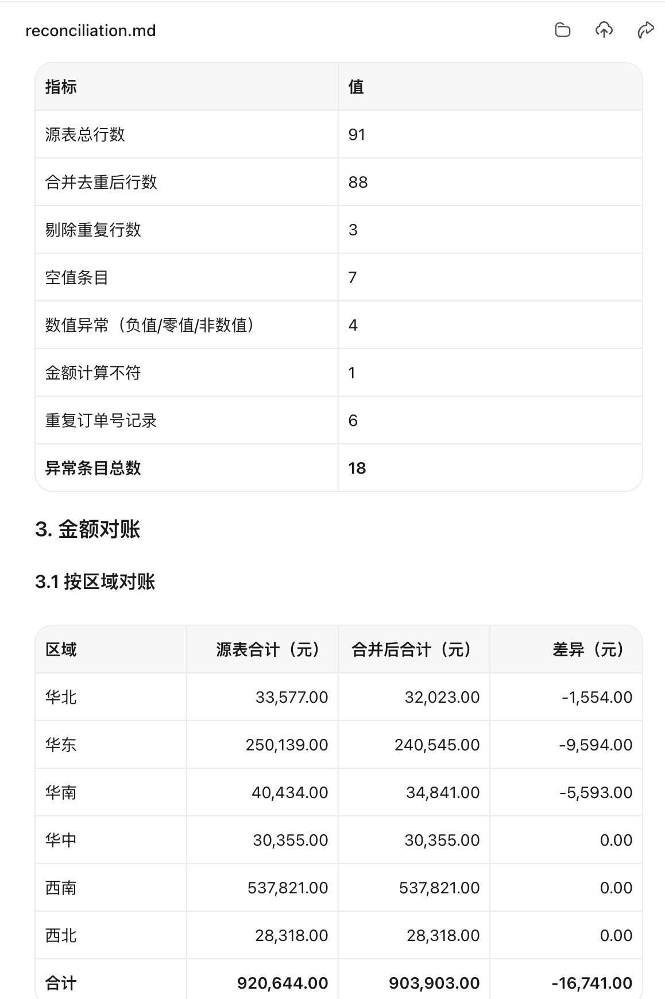

# 第 17 章 结构化数据分析与可视化表达

这一章只解决一个问题：**手里有一堆乱数据，怎样让 WorkBuddy 帮你整理成能检查、能计算、能交付的结果。**

不需要先学公式。跟着下面三个示例操作一次，就能掌握文本转表、单表清洗和多表对账。

下面的练习样例均为合成数据，提示词均以可复制文本框呈现。

::: warning 先记住一条
不要把原文件直接交给 AI 覆盖。先复制一份，再让 WorkBuddy 生成新文件。真实工作中涉及个人信息、经营数据或财务口径时，还要先确认材料是否允许使用。
:::

## 30 秒看懂本章

| 你遇到的问题 | 跟做哪个示例 | 最后会得到什么 |
|---|---|---|
| 群接龙格式乱、顺序乱 | 示例一 | 一张字段统一的报名表 |
| 日期、金额和渠道写法不统一 | 示例二 | 清洗后的表格、异常清单和核对说明 |
| 订单表与退款表需要合并 | 示例三 | 对账表、未匹配清单和净销售额 |

第一次练习只要完成六步：


## 开始前只做三件事

1. 新建一个文件夹，例如 `第17章-数据清洗练习`。
2. 把本章提供的样例下载到这个文件夹；练习自己的材料时，也只放副本。
3. 打开 WorkBuddy，选择数据分析类任务，并把这个文件夹设为工作空间。产品入口可能随版本变化，以当前客户端为准。

::: tip 文本框怎么用
下面深色文本框右上角有“复制”按钮。点击后粘贴到 WorkBuddy；文件名与实际文件不同时，只改文件名，不要删掉检查和验收要求。
:::

## 示例一：把群接龙整理成报名表

### 1. 下载或复制样例

[下载群接龙样例文本](/downloads/chapter-17/example-1-group-signup.txt)

原始内容故意混用了空格、逗号、句号、勾选符号和不同字段顺序：

```text
1. 陈晨 运营 √ 不带 138****0001
2. 林晓，产品，参加，带1人，139****0002
3. 周宁。不到。研发。×。137****0003
4. 宋安 行政 136****0004 到 无
```

### 2. 复制提示词

**复制提示词 1：群接龙转表**

```text
请读取工作目录中的 example-1-group-signup.txt，把群接龙整理成 Excel 表格。

固定列名和顺序：姓名、部门、联系电话、是否参加、是否带家属。

统一规则：
1. “参加、去、到、√”统一为“参加”；
2. “不到、不参加、×”统一为“不参加”；
3. “不带、无、×”统一为“不带家属”；
4. “带、带1人”保留为“带1人”；
5. 联系电话只整理空格和连接符，不猜测缺失数字；
6. 无法判断的字段填写“待确认”，并另建“待确认清单”。

请生成 signup-clean.xlsx，不要修改原文本。
同时报告：总记录数、成功转换数、待确认数和采用的转换规则。
```

### 3. 对照预期结果

| 姓名 | 部门 | 联系电话 | 是否参加 | 是否带家属 |
|---|---|---|---|---|
| 陈晨 | 运营 | 138****0001 | 参加 | 不带家属 |
| 林晓 | 产品 | 139****0002 | 参加 | 带1人 |
| 周宁 | 研发 | 137****0003 | 不参加 | 不带家属 |
| 宋安 | 行政 | 136****0004 | 参加 | 不带家属 |

::: tip 验收只看三点
1. 四条原文都进入结果表；2. 姓名、部门和电话没有串列；3. “是否参加”与“是否带家属”只出现规定值。
:::

如果有一行判断错了，不要手工改完就算。把错误告诉 WorkBuddy，让它按修正后的规则重新生成：

**复制提示词 2：发现错误后修正**

```text
请不要直接改一个单元格后结束。

先说明第 {行号} 行为什么判断错误；
把修正规则补充到规则清单；
再重新生成 signup-clean-v2.xlsx；
最后重新报告总记录数、成功转换数和待确认数。
```

## 示例二：清洗日期、金额和渠道名称

### 1. 下载样例表

[下载业绩表清洗样例](/downloads/chapter-17/example-2-sales-dirty.csv)

原始数据中包含四种常见问题：日期格式不同、金额带单位、空行、渠道名称不统一。

| 区域 | 原始日期 | 原始渠道 | 原始金额 |
|---|---|---|---|
| 华北 | 2026/7/1 | 微信小店 | 1280元 |
| 华东 | Jul-2 | WeChat | 980 元 |
| 华南 | 2026-07-03 | 微店 | 1,560元 |
| 华中 | 2026.07.04 | 小程序 | 760 |

### 2. 先检查，不直接开洗

**复制提示词 3：先做数据体检**

```text
请只读检查 example-2-sales-dirty.csv，先不要生成清洗结果。

请报告：
1. 字段名、记录数和空行数；
2. 日期、金额和渠道列分别有哪些写法；
3. 哪些值可以按规则转换，哪些值存在歧义；
4. 拟采用的清洗规则；
5. 处理后准备生成哪些文件。

已知条件：本表全部记录都属于 2026 年 7 月。
等我确认规则后再执行。
```

看到规则没有问题后，回复第二段：

**复制提示词 4：确认规则并生成结果**

```text
确认按以下规则执行：
1. 日期统一为 YYYY-MM-DD；
2. 金额去掉“元”和千位分隔符，转成可计算的数值；
3. 删除完全空白的行，但不删除含部分空值的记录；
4. “微店、微信小店、WeChat”统一为“微店”；
5. 其他渠道名称保持原值；
6. 无法可靠转换的记录放进异常清单，不要猜测。

请生成：
- clean-sales.csv：清洗后的数据；
- exception-list.csv：异常与待确认记录；
- reconciliation.md：处理前后行数、金额合计和分类数量核对。

不要覆盖原文件。
```

### 3. 对照预期结果

| 区域 | 日期 | 渠道 | 金额 |
|---|---|---|---:|
| 华北 | 2026-07-01 | 微店 | 1280 |
| 华东 | 2026-07-02 | 微店 | 980 |
| 华南 | 2026-07-03 | 微店 | 1560 |
| 华中 | 2026-07-04 | 小程序 | 760 |


*图 17-1　合成演示：结果不应只有一张“干净表”，还应同时保留异常清单和核对报告。*

::: tip 验收只看四点
1. 日期都能按日期排序；2. 金额列可以直接求和；3. 渠道只保留“微店”和“小程序”；4. 原文件仍然存在且没有被覆盖。
:::

## 示例三：合并订单表与退款表

### 1. 下载两张样例表

- [下载订单表示例](/downloads/chapter-17/example-3-orders.csv)
- [下载退款表示例](/downloads/chapter-17/example-3-refunds.csv)

这组数据故意放入三个坑：重复订单号、订单表中的负数冲正、退款表中的未匹配订单。

**订单表**

| 订单号 | 销售额 | 状态 |
|---|---:|---|
| ORD-001 | 1000 | 已完成 |
| ORD-002 | 800 | 已完成 |
| ORD-003 | 500 | 已完成 |
| ORD-003 | -500 | 退货冲正 |

**退款表**

| 退款单号 | 订单号 | 退款额 | 状态 |
|---|---|---:|---|
| RF-001 | ORD-003 | 500 | 已退款 |
| RF-002 | ORD-004 | 120 | 未匹配示例 |

### 2. 第一轮只找风险

**复制提示词 5：检查合并关系和重复扣减风险**

```text
请只读检查 example-3-orders.csv 和 example-3-refunds.csv，先不要生成最终对账表。

请回答：
1. 两表分别有多少行，订单号是否唯一；
2. 哪些订单是一对一、一对多或未匹配；
3. 订单表中是否存在负数冲正；
4. 同一订单是否同时出现负数冲正和退款记录；
5. 如果直接使用“销售额 - 退款额”，哪些订单可能被重复扣减；
6. 需要我确认哪些业务规则。

不要自行决定负数冲正和退款记录的优先级。
```

WorkBuddy 应指出：`ORD-003` 同时有 `-500` 冲正和 `500` 退款，直接再减一次退款会重复扣减；`ORD-004` 在订单表中找不到，应进入未匹配清单。

### 3. 第二轮确认本练习口径

真实工作必须由业务人员确认规则。本练习统一采用：订单表中的负数冲正已经代表退款；金额一致的退款记录只作为核对证据，不再减一次。

**复制提示词 6：按确认口径生成对账结果**

```text
按以下已确认规则生成结果：
1. 订单表中的负数冲正已经计入退款影响；
2. 同一订单在退款表出现相同金额时，只标记“已核对”，不重复扣减；
3. 退款表中找不到原订单的记录进入“未匹配退款清单”；
4. 净销售额按订单表的正数销售额与负数冲正合计；
5. 不删除重复记录，保留来源并说明合并关系。

请生成：
- order-refund-reconciliation.xlsx：逐订单对账明细；
- unmatched-refunds.xlsx：未匹配退款；
- reconciliation.md：行数、匹配关系、异常数量和金额核对。

确认金额差异可以解释后，再给出结论。不要覆盖两张原表。
```

### 4. 对照预期结果

| 订单号 | 正数销售额 | 负数冲正 | 退款记录 | 处理结果 | 净销售额 |
|---|---:|---:|---:|---|---:|
| ORD-001 | 1000 | 0 | 0 | 正常 | 1000 |
| ORD-002 | 800 | 0 | 0 | 正常 | 800 |
| ORD-003 | 500 | -500 | 500 | 退款已核对，不重复扣减 | 0 |
| ORD-004 | 0 | 0 | 120 | 未匹配，待确认 | - |



*图 17-2　合成演示：核对报告应同时展示源表行数、异常数量、处理后行数和金额差异。图中使用区域业绩合并演示报告形式。*

::: tip 验收只看四点
1. `ORD-003` 没有被扣两次；2. `ORD-004` 没有被偷偷删除；3. 每条结果能回到订单表或退款表；4. 净销售额公式写进核对说明。
:::

## 最后一步：数字确认后再画图

只有明细、行数和金额已经核对，才复制下面的提示词生成图表。

**复制提示词 7：生成汇总和图表**

```text
请基于已经确认无误的处理结果生成汇总表和图表。

先输出汇总表供我复核，再生成图表：
1. 记录数与异常数对比；
2. 分类或渠道构成；
3. 金额或数量趋势；
4. 未匹配、重复和待确认记录数量。

每张图必须写明标题、单位、时间范围、样本量和数据更新时间。
每条结论必须引用具体汇总指标，并说明缺失值和限制。
不得根据相关性推断因果，不得隐藏异常或小样本。
```

## 换成自己的文件时，只改这几处

| 占位内容 | 改成什么 |
|---|---|
| `example-*.csv` | 你的实际文件名 |
| 固定列名 | 你希望输出的字段和顺序 |
| 同义词规则 | 你的分类名称对照 |
| 唯一键或合并键 | 订单号、编号等已确认字段 |
| 计算规则 | 经业务人员确认的公式和口径 |
| 输出文件名 | 你希望交付的文件名 |

不要删除这些句子：

- 先检查，等我确认后再执行。
- 不要覆盖原文件。
- 无法判断的内容标记“待确认”。
- 输出处理前后的行数和金额核对。

## 常见弯路：结果不对时怎么处理

### WorkBuddy 直接开始生成，没有等确认

```text
请停止生成结果，回到只读检查阶段。
先输出字段、行数、空值、重复值、异常和拟采用规则；等我回复“确认”后再生成新文件。
```

### 结果看起来整齐，但不知道数字对不对

```text
请补充处理前后核对报告：原始行数、结果行数、删除数、去重数、异常数、未匹配数、关键金额合计和差异原因。无法解释的差异标记为“待确认”。
```

### 模型擅自猜了日期、类别或负责人

```text
请撤销所有没有明确来源的推断。把无法从原始材料确认的值改为“待确认”，单独输出记录位置、原值、缺失字段和需要人工回答的问题。
```

## 人工确认点

- 输入材料是否合法、完整并允许用于本次处理。
- 字段含义、分类映射、唯一键和去重条件是否正确。
- 负数、冲正、退款、跨期和未匹配记录如何处理。
- 处理前后的行数、金额和分类数量能否解释。
- 结果是否可能泄露个人信息或未公开经营数据。

## 安全边界

- 不向未批准的外部服务上传敏感表格、个人信息和未公开经营数据。
- 不把模型推断当作业务事实、财务结论或管理决定。
- 不自动删除原始记录、覆盖源文件、外发结果或提交审批。
- 对小样本、自由文本和联系方式做脱敏或限制访问。
- 产品入口、界面和能力可能随版本变化，以当前客户端和官方说明为准。
