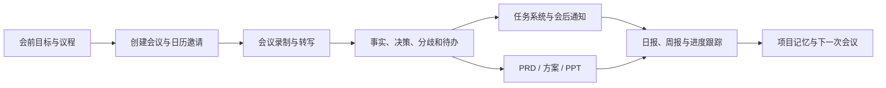
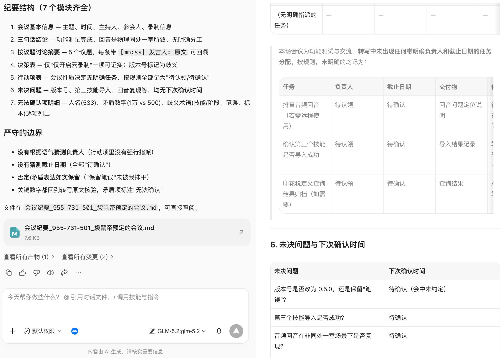
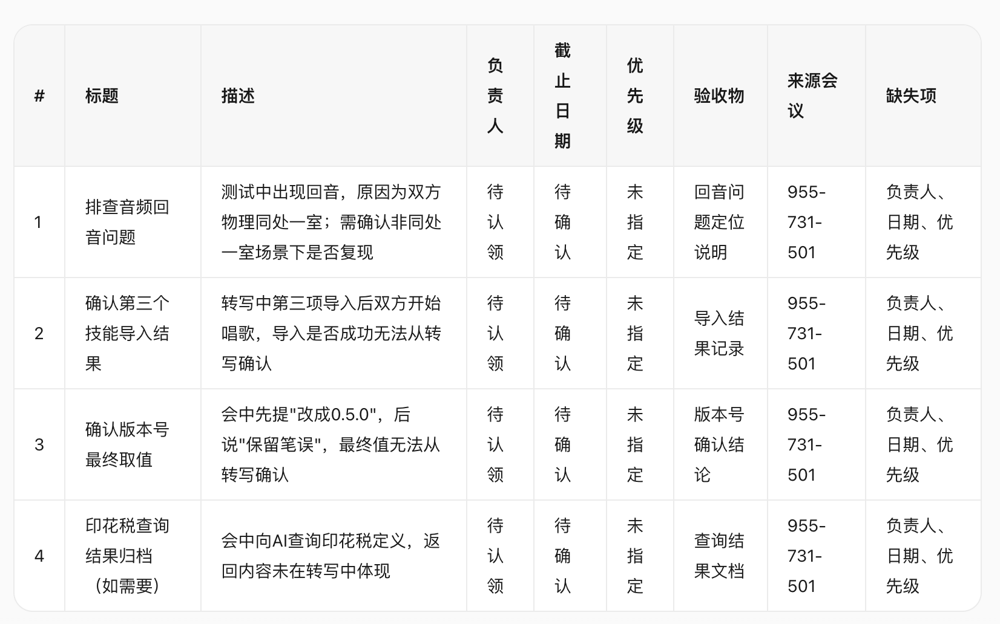
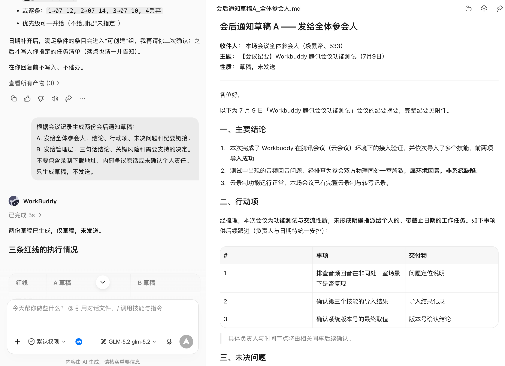
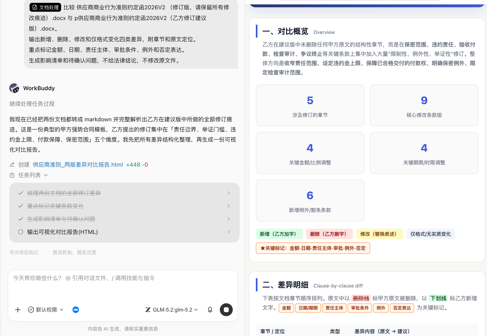
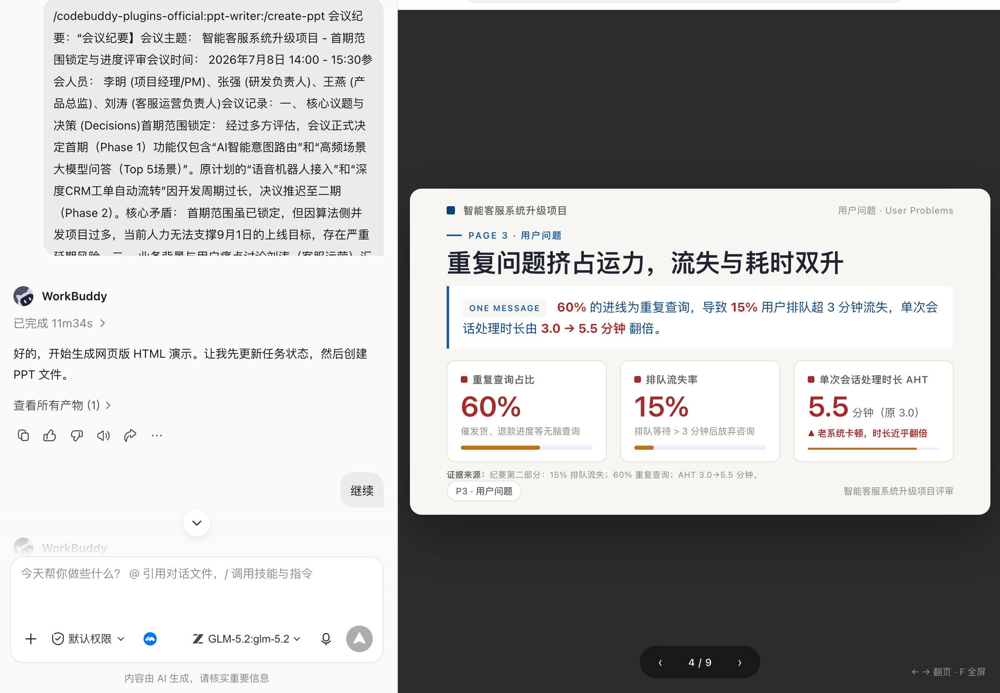

# 第 17 章 会议结束不是终点，工作才刚刚开始

## 日常办公为什么总在重复搬运

很多办公室的一天由同一组动作组成：约会议、找材料、开会、记笔记、发纪要、建待办、追进度、写周报、做汇报。每个动作看似不难，真正消耗精力的是信息不断从聊天、会议、邮件、文档和表格之间流转，而且每流转一次都可能丢掉上下文。



## 主案例：一次产品评审会，怎样真正推动项目

场景设定：产品团队要评审“会议纪要自动生成待办”功能。过去会后由产品经理回听录音、整理纪要，再把行动项逐个录入任务系统，通常要半天，而且参会人对“谁答应了什么”经常理解不同。

这条协同链不追求无人值守。它在创建会议、读取录制、创建待办和确认 PRD 四处保留人工检查点。

### 第一步：会前先定义要做出什么决定

没有议程的会议，转写再完整也只是大量对话。会前最重要的不是发链接，而是明确会议类型、要回答的问题和期望产物。

```text
为“会议纪要自动生成待办”产品评审准备 45 分钟议程。
参会角色：产品、研发、设计、测试、运营。
本次必须形成三个决定：首期范围、待办字段、上线验收指标。

读取 project/meeting-to-task 中的需求草案和上次决策记录，
输出：会议目标、会前材料、按分钟议程、每个议题的主持人、
需要当场决定的问题、可以会后异步处理的问题。
事实与建议分开；缺少的信息列入会前补充，不自行补造。
```

### 第二步：创建腾讯会议，并同步日历

[腾讯会议 Skill](https://skillhub.cn/skills/tencent-meeting-skill)用于会议全生命周期：创建、修改、取消、查询会议，查看参会成员，并在权限允许时获取录制、转写和智能纪要。官方说明要求通过环境变量保存 Token，并提醒使用者遵守企业数据和隐私要求。

腾讯会议 Skill 不等于通用日历。正确顺序是：先创建会议得到会议号和链接，再通过日历或办公协作连接器创建日程、邀请参会人和预定会议室。

创建前必须确认的字段

| 字段 | 示例 | 为什么要确认 |
|-|-|-|
| 主题 | 会议纪要自动生成待办 - 首期评审 | 避免会议列表中无法识别 |
| 开始与结束 | 7 月 8 日 14:00-14:45 | 相对时间容易理解错 |
| 时区 | Asia/Shanghai | 跨地区协作必须明确 |
| 参会人 | 产品、研发、设计、测试、运营 | 会议权限和责任边界 |
| 周期规则 | 单次 | 周期会议取消影响更大 |
| 入会与等候室 | 企业内可直接入会 | 涉及外部人员时需调整 |
| 录制与转写 | 会中由主持人确认 | 涉及告知、权限和隐私 |

```text
使用腾讯会议 Skill 创建一场会议。
主题：会议纪要自动生成待办 - 首期评审
时间：2026-07-08 14:00-14:45，时区 Asia/Shanghai，单次会议。
先返回拟创建信息让我确认；确认后创建会议。

创建成功后，把会议号、链接、开始结束时间写入 meeting-brief.md。
再生成日历邀请草稿，包含议程和会前材料链接；
不要自行添加参会人、发送邀请或预定会议室，等待我确认名单。
```

创建、修改和取消是不同风险等级。取消会议、修改周期规则、扩大参会范围前要展示目标会议和影响范围，不能只凭一句“把下午的会取消”。

ps：以上提示词可以根据自己的会议修改。

### 第三步：会后获取录制、转写和会议内容

会议结束后，最容易犯的错误是把“有录音”当成“已经有可用信息”。录制可能没有开启，转写可能尚未生成，调用人也可能没有查看权限。

```text
查询会议号 123 456 789 对应的已结束会议。
先返回主题、时间和主持人，确认是目标会议后，再查询录制列表。
如果有权限，获取转写全文、分段信息和智能纪要；
如果无权限，停止读取并返回所需授权，不尝试绕过。
下载或保存前说明文件类型、大小、目标目录和保留期限。
```


在这个过程中需要连接腾讯会议连接器，按照提示在连接管理器中找到“腾讯会议”，并授权连接就行。


腾讯会议能力通常需要先把 9 位会议号转换成内部 `meeting_id`，再查询详情、录制和转写。这个过程由 Skill 完成，不需手工转换，但保留会议号、会议 ID、录制 ID、查询时间和权限状态，方便排错。


录制与转写的边界

- 会前或会中明确告知录制和转写安排；
- 不把录制链接转发给没有权限的人；
- 不因获取失败而把聊天截图或未经同意的录音当替代来源；
- 转写是机器识别结果，专有名词、数字、责任人和否定句必须回听核对；
- 企业会议遵守所在组织的保留期限、数据分类和合规要求。

### 第四步：从转写生成可执行会议纪要

一份纪要，包含五类信息

| 类型 | 例子 | 处理方式 |
|-|-|-|
| 背景事实 | 当前纪要平均需 40 分钟整理 | 附来源或发言时间 |
| 已确认决定 | 首期只支持会后生成待办草稿 | 记录决定人和时间 |
| 行动项 | 产品补充字段映射表 | 负责人、截止日期、验收物 |
| 未决问题 | 是否支持跨项目复制待办 | 进入下次决策，不伪装成结论 |
| 讨论建议 | 研发提出先做异步队列 | 标记为建议，不写成承诺 |

```text
生成会议纪要，不得只依赖平台智能摘要；关键数字、责任人和否定表达回到转写核验。

输出：
1. 会议基本信息；
2. 三句话结论；
3. 按议题整理的讨论摘要；
4. 决策表：决定、理由、决定人、时间戳；
5. 行动项表：任务、负责人、截止日期、交付物、依赖；
6. 未决问题与下次确认时间；
7. 转写中无法确认的人名、数字和术语。

没有明确负责人的任务写“待认领”，没有明确日期写“待确认”，
不得根据语气猜测负责人或截止时间。
```




### 第五步：纪要里的待办，不能直接静默写入任务系统

为什么要两步确认

会中发言和正式任务不是同一件事。把“可以看看”直接变成分派给某人的任务，会制造额外管理成本。

```text
读取 minutes-approved.md 中的行动项，只生成待办导入预览。
每条显示：标题、描述、负责人、截止日期、优先级、验收物、来源会议。
负责人或日期缺失的条目进入“待补充”，不要创建。
先按负责人分组让我确认；确认后再写入指定任务清单。
写入完成后返回成功、失败、跳过和重复四个清单，不发送催办消息。
```



这里由于我这次的会议主要是为了演示用，所以待办项的相关责任人都是待确认状态。

稳定流程是：纪要草稿 → 参会人确认 → 待办预览 → 人工补齐责任与日期 → 写入任务系统 → 返回任务链接。重复运行时使用“会议 ID + 行动项序号”作为幂等键，避免创建重复任务。

### 第六步：会后通知和跟踪

会议后可以生成邮件或群消息草稿，但发送前必须确认对象和可见范围：

```text
根据会议记录生成两份会后通知草稿：
A. 发给全体参会人：结论、行动项、未决问题和纪要链接；
B. 发给管理层：三句话结论、关键风险和需要支持的决定。
不要包含录制下载地址、内部争议原话或未确认个人责任。
只生成草稿，不发送。
```



批量重命名要保留映射表；同名冲突不覆盖；合同、财务和人事文件按组织规则处理，不能只按文件名猜分类。

## 高频场景一：Excel 合并、核对和异常清单

基础办公中最有价值的不是“做个图表”，而是把数据口径和异常暴露出来：

```text
合并 input/sales 中 6 个区域的周销售表。
先检查列名、数据类型、日期范围、币种和主键，不一致时停止并列差异。
按订单号去重，但保留重复来源；汇总前输出总行数、空值、异常值和重复数。
生成 clean-sales.xlsx、exception-list.xlsx 和 reconciliation.md。
金额汇总必须与各源表合计对账，差异不为 0 时不生成管理结论。
```


**验收**：输入总量、清洗变化和输出总量守恒；公式可重算；异常没有被静默删除；图表使用的字段和汇总表一致。

## 高频场景二：两版制度、合同或方案到底改了什么

```text
比较 policy-v3.docx 与 policy-v4.docx。
输出新增、删除、修改和仅格式变化四类差异，附章节和原文定位。
重点标记金额、日期、责任主体、审批条件、例外和否定表达。
生成影响清单和待确认问题，不给法律结论，不修改原文件。
```




文档对比适合发现变化，不替代法务、财务或制度责任人的最终判断。

## 高频场景三：把会议纪要变成汇报 PPT

先确定汇报对象和结论，再设计页面：

```text
根据会议纪要生成 8 页项目汇报 PPT。
受众是管理层，目标是确认首期范围和资源缺口。
页面：结论、背景、用户问题、已确认范围、进度、风险、资源请求、下一步。
每页只表达一个结论；数字来自状态表，决定来自纪要；
不使用无法解释的装饰图表。先返回页级大纲和证据映射，确认后再生成 PPT。
```



## 一套基础办公 Skill 栈

| 任务层 | 可选能力 | 默认安全动作 |
|-|-|-|
| 会议 | 腾讯会议 Skill、日历连接器 | 创建前预览，取消前二次确认 |
| 内容 | 录制、转写、会议纪要模板 | 保留来源和时间戳 |
| 协作 | 任务、邮件、IM、腾讯文档/WPS | 先生成草稿或导入预览 |
| 产品 | PRD 模板、自定义产品经理 Skill | 只使用确认需求，保留未决问题 |
| 文件 | DOCX、PDF、OCR、文件整理 | 复制优先，不覆盖、不删除 |
| 数据 | Excel、公式、图表、数据分析 | 先对账，再分析 |
| 汇报 | PPT、图表和品牌模板 | 先页级大纲和证据映射 |
| 自动化 | 日报、周报、提醒和归档 | 小范围试运行，失败可接管 |

不要一开始安装十几个 Skill。先选择一个每周都会发生、输入稳定、结果容易验收的任务，例如会议纪要到待办；连续跑通后，再把 PRD、周报和汇报接到同一条链上。