# 第 18 章 把投资分析变成你的日常

投资本身就是一件**高度信息密集、强结构化、又极度依赖判断**的事：读不完的财报、理不清的行业、吵不停的多空。而整理碎片信息、拆解复杂材料、把思考过程摆到台面上，恰好是 AI 擅长的。

**在一次完整的股票研究里，AI 到底能替你做掉哪些低质量的重复劳动，把精力还给判断本身。**

## 先想清楚：AI 在投资里该干什么

多数人对「AI 炒股」的想象是让它预测涨跌。但从真实的高频用法看，绝大多数有价值的提示词其实只集中在四类事上：

- 读不完的财报，帮我总结；
- 行业太复杂，帮我把逻辑理一遍；
- 市场吵得太凶，帮我把多空观点放进一张表；
- 我怕自己自嗨，帮我找反证。

这四类都不是「预测涨跌」，而是**减少低质量思考的时间**。AI 在投资里最合理的位置，是一个不知疲倦、不带情绪、随叫随到的研究助理——它负责把事实底座打牢，把判断留给你。

和办公三件套一样，动手前先用五个问题给这次研究定标。很多「AI 分析得不好」，根源不是模型不会分析，而是人没把研究目标说清楚。

| 问题 | 要说清什么 | 示例 |
|-|-|-|
| 目标 | 这次研究要支撑什么决定 | 判断是否把某只票纳入观察池，还是决定当下加减仓。 |
| 标的 | 具体是哪家公司、哪个行业 | 天孚通信（300394），光通信 / CPO 板块。 |
| 材料 | 哪些是事实来源，哪些只是参考 | 年报、三季报、券商研报是事实来源；股吧观点只作情绪参考。 |
| 深度 | 只要事实梳理，还是要到估值和多空推演 | 先做事实底座（Prompt 1-3），再上尽调级 DeepResearch（Prompt 8）。 |
| 验收 | 怎么判断结果可用 | 每个判断都能追到数据来源，事实与观点分开标注。 |

## 先选对工具：金融场景的 Skill 组合

在进入提示词之前，先认识本章会用到的几个 Skill。它们分工不同，可以单用，也可以像流水线一样串起来。

| Skill 名称 | 适合处理 | 本章怎么用 | 注意点 |
|-|-|-|-|
| `stock-advisor` | 单只股票的端到端分析 | 上传截图或给出代码，自动跑完技术面、基本面、交叉验证、私董会、排版 | 本章主线，第三、四节详解 |
| `a-share-analyst` | A 股日常行情与选股 | 实时行情、技术指标、量化选股、每日报告 | 偏日常盯盘与批量筛选 |
| `financial-expert` | 金融数据查询与筛选 | 选股、基金筛选、财务指标、宏观 / 行业时序、券商研报检索 | 依赖数据源 MCP，需先配置 |
| `peers-advisory-group` | 多视角决策讨论 | 四位「幕僚」围绕一个议题交叉辩论 | 被 `stock-advisor` 作为决策模块调用 |

一个实用的搭配思路是：**日常盯盘和批量选股用 `a-share-analyst` 与 `financial-expert`；要对一只票下深功夫、出一份完整报告，用 `stock-advisor`；需要跳出单一视角、逼自己看反面时，叫上 `peers-advisory-group`。**

## 从查资料到下判断：一套可复用的研究提示词链路

这一节是纯提示词。它们按「**最简单 → 相对复杂**」排列，覆盖了从「查资料」到「下判断」的完整链路。你不必每条都用——先用前三条建立事实底座，需要深挖时再往后走。第 8 条是把前面所有环节压进一个框架的「全家桶」，也是日常在 ChatGPT、Gemini、豆包、千问的 DeepResearch 里最常用的一条。

> 每条提示词的用法统一是：把方括号 `【】` 里的占位换成你的标的，粘贴运行即可。

### Prompt 1｜最基础：给公司建一个「事实底座」

**解决的场景**：刚接触一家公司，先别急着判断，先搞清楚它到底是干什么的。很多错误判断，从第一步认错了业务就开始了——你以为它靠 A 赚钱，结果利润主要来自 B。这一步的价值，是**压缩你「搞清楚事实」的时间成本**。

```markdown
请帮我系统梳理【XXX 公司】的基础情况，输出结构化总结，包括：
1）核心业务与主要产品线
2）收入与利润来源构成
3）主要客户与应用场景
4）公司在产业链中的位置
5）近几年最重要的战略变化

## 要求：
- 只使用可核实的信息
- 每一部分用 3–5 条要点说明
- 不做投资建议，只做事实整理
```

### Prompt 2｜行业视角：这是不是一个「好行业」

**解决的场景**：股票研究里一个常被低估的问题——你选的往往不是公司，而是行业。AI 很适合做行业的「第一性梳理」。但行业拐点、价格见底这种问题，别指望它给答案。

```markdown
请从行业研究的角度，分析【<XXX公司>】所在的【<XXX行业>】：
1）行业所处的周期阶段（复苏/扩张/衰退/萧条）
2）供需关系与主要驱动因素
 - 产能、开工率、库存、订单/交付周期
3）价格变化机制与历史波动
 - 产品价格指数/价差/成本传导
 - 资本开支：Capex趋势、扩产项目、行业新增产能
4）行业集中度与竞争格局
5）影响行业的关键外部变量（政策、技术、宏观）
 - 政策与外部变量：利率、汇率、监管、补贴、贸易限制
请明确指出：哪些是长期结构性因素，哪些是短期波动因素。输出周期阶段判断 + 关键证据图表清单 + 领先指标(3个)与滞后指标(3个)。
```

### Prompt 3｜业务拆解：钱到底是怎么赚来的

**解决的场景**：从「看公司」到「看生意」的关键一步。很多「看起来很美」的公司，核心利润来源其实很脆弱。**混杂型公司**（主业 A、利润却来自 B）尤其适合让 AI 帮你看清楚。

```markdown
请你以【价值投资 / 基本面研究】视角，对【XXX 公司】进行"业务拆解"，目标是回答一个核心问题：
👉 这家公司【真正、长期】是靠什么赚钱的？

## 要求
- 仅基于可验证信息（年报、招股书、定期公告、投资者交流纪要、权威行业报告等）
- 明确区分【事实】与【判断】，所有判断必须给出证据或逻辑链
- 输出为 Markdown 结构化报告

## 必答结构
一、公司"赚钱方式"的一句话结论
- 用不超过 50 字，概括公司最核心的赚钱逻辑（卖什么 → 卖给谁 → 为什么能赚钱）

二、业务结构全拆解（必须量化）
1. 业务板块拆分
   - 列出所有核心业务 / 产品线 / 服务线
   - 对每一块给出：收入占比、毛利率、增长趋势（近 3–5 年）
2. 利润来源判断
   - 哪些业务"贡献了大部分利润"
   - 哪些业务"收入大但不赚钱 / 甚至亏钱"
   - 是否存在【主业≠利润核心】的情况？（如：主业A，利润来自B）

三、赚钱机制拆解（Business Engine）
对核心业务逐条回答：
- 钱是怎么收进来的？（一次性/订阅/持续复购/项目制）
- 成本主要花在哪？（原材料、人力、渠道、研发、营销）
- 毛利率由什么决定？是结构性优势还是周期红利？
- 是否具备规模效应？规模扩大后，哪一项成本会被摊薄？

四、客户、渠道与定价权
- 核心客户是谁？是否集中？（Top5/Top10 客户占比）
- 销售渠道结构（直销 / 经销 / 平台 / 政府 / 大客户）
- 是否具备定价权？历史是否成功提价？证据是什么？
- 客户更换供应商的成本高不高？为什么？

五、子公司 / 联营公司 / 非经常性业务
- 列出重要子公司、联营公司及其业务性质
- 明确哪些利润来自：
  - 可持续经营
  - 周期波动
  - 投资收益 / 政策补贴 / 资产处置
- 判断这些"非主营利润"对长期估值逻辑的影响（正面 / 负面 / 干扰）

六、商业模式的"稳定性与脆弱点"
- 哪些假设一旦被破坏，赚钱逻辑就会失效？
- 最容易被竞争 / 技术 / 政策冲击的环节在哪里？
- 用 3–5 条"关键监控指标"总结如何持续验证这门生意是否还成立

## 最终输出
- 一句话商业本质总结
- 业务结构表（收入 / 利润 / 毛利率）
- 赚钱机制逻辑链（文字 + 列点）
- 对长期投资者最重要的 3 个判断结论
```

### Prompt 4｜财务质量：这家公司赚的钱干不干净

**解决的场景**：财务调研指标很多，这里给一个通用格式。核心是强制做「利润 vs 现金流」的交叉验证——账面利润漂亮，现金流跟不上，往往是第一个预警信号。

```markdown
请分析【<公司>】近几年的财务质量：
1）收入、利润与经营现金流的匹配情况
2）应收账款、存货、合同资产变化
3）非经常性损益对利润的影响
4）是否存在一次性项目或会计口径变化
5）可能需要重点关注的财务风险点

## 研究原则
- 不预测股价，只判断财务"质量"
- 强制进行"利润 vs 现金流"的交叉验证
- 对所有异常必须给出解释假设与验证路径

请重点指出：哪些指标值得持续跟踪。
```

### Prompt 5｜股权与治理：老板和你是不是一条船上的

**解决的场景**：生意好 + 治理差 = 高波动风险资产。股权质押、减持、关联交易、激励条款，这些「筹码面」的信息很分散，适合让 AI 一次性梳理成时间表和风险雷达。

```markdown
1、梳理【<公司>】股权结构与关键股东：
- 实控人、控股股东、董事会结构
- 股权质押比例与变化、减持计划、潜在控制权变更风险
- 关联交易、同业竞争、资金占用风险
输出：治理结构图（文字版即可）+ 风险雷达(高/中/低) + 需要跟踪的公告清单。

2、请建立【<公司>】未来<12个月>的"筹码事件时间表"：限售解禁、员工持股解锁、定增/配股、回购进度。
对每个事件给出：潜在抛压/承接能力判断、对估值中枢的影响路径、历史上类似事件的股价反应统计（如能找到）。

3、分析【<公司>】管理层薪酬与股权激励：
- 激励指标是否容易"做账达成"？（收入/利润/现金流/ROIC）
- 目标难度与行业对比
- 是否存在短期行为激励（冲收入、降研发等）
输出：同向性结论 + 关键条款摘录 + 改进建议。
```

### Prompt 6｜市场分歧：多空到底在吵什么

**解决的场景**：多空双方的观点最有信息量。这一步不是告诉你该信谁，而是帮你把分歧摊平，看清楚**未来该盯哪些数据来验证**。

```markdown
请整理市场对【XXX 公司】的主要分歧点：
1）多方核心逻辑
2）空方核心逻辑
3）各自最重要的论据
4）哪些分歧可以被未来数据验证
5）关键验证节点是什么

## 分析要求
- 不得站队
- 不给投资建议
- 不使用情绪化或立场性语言
- 所有判断必须可被未来数据或事件验证
```

### Prompt 7｜估值与护城河：市场在押什么假设

**解决的场景**：护城河和估值，是价值投资绕不开的两块。下面两条一条评护城河强度，一条搭 DCF 反推市场隐含预期。

```markdown
以价值投资视角分析【<公司>】的护城河，必须引用公司披露/权威来源。
1) 定价权：过去<5-10年>毛利率/提价能力/成本转嫁证据？
2) 转换成本：客户更换供应商的成本是什么（系统、流程、合规、生态）？
3) 网络效应/规模效应：规模如何降低单位成本或提升体验？
4) 无形资产：品牌、专利、牌照、数据、渠道壁垒的可验证证据？
5) 竞争反应：主要对手如何攻击，公司如何防守（历史战役）？
输出：护城河强度评分(0-5)+证据表+最可能被侵蚀的点与监控指标。
```

```markdown
请为【<公司>】构建 DCF 估值（允许使用公开财务数据，必须引用来源）：
- 明确WACC/折现率假设与依据
- 预测5-10年自由现金流：收入、利润率、再投资率
- 给出敏感性分析表（折现率×永续增长率 或 折现率×利润率）
- 反推：当前市值隐含的收入增速/利润率路径
输出：估值区间 + 关键假设清单 + 最容易错的2个假设及验证方案。
```

### Prompt 8｜全家桶：一份尽调级 DeepResearch

**解决的场景**：这是把前七步的逻辑压进同一个框架的「投资者尽职调查报告」。它强制区分事实与判断、强制交叉验证、强制推演空方逻辑与黑天鹅——用来对抗人最容易犯的「确认偏误」。这条在各家 AI 的 DeepResearch 模式里都很好用。

```markdown
我需要你帮我完成一份投资者尽职调查报告。目标是对标的 `<股票名称/代码>` 进行全方位的商业模式、财务质量、行业周期及估值逻辑推演。
请严格按照以下逻辑框架进行推演。

## Constraints & Standards (研究原则)
1. 数据时效性与跨度：财务数据需涵盖**过去 3-5 年**的趋势（CAGR），估值分位需回溯**过去 5-10 年**的历史区间。
2. 事实底座优先：区分【事实 Fact】与【判断 Opinion】。所有判断必须基于可验证的数据（年报、招股书、监管问询函）。
3. 双重验证：必须进行"利润 vs 现金流"的交叉验证，以及"公司 vs 同行"的对比验证。
4. 反直觉思考：必须包含"空方逻辑"与"黑天鹅风险"推演，避免确认偏误。

## Research Context (用户输入)
- **研究标的**：[在此输入股票名称/代码]
- **投资风格**：[如：价值投资 / 成长接力 / 困境反转]
- **持有周期**：[如：中长线 1-3 年]

## Workflow
### Phase 1: 商业模式与护城河拆解 (Business Engine & Moat)
> 核心任务：搞清楚它真正靠什么赚钱，剔除噪音，看清本质。
1. 业务透视与提纯：
    - **拆解营收/利润结构**：核心业务是什么？是否存在"主业赚吆喝，副业（投资/补贴）赚利润"的现象？
    - **子公司/联营公司穿透**：深挖主要子公司和联营公司的实际贡献，**剔除噪音**，明确指出哪些业务是拖累，哪些是隐形金矿。
2. 护城河判定：
    - **定价权**：是否有提价能力？（证据：毛利率是否随成本波动？还是能转嫁成本？）
    - **核心壁垒**：是品牌溢价、极高的转换成本、网络效应，还是单纯的低成本优势？
    - **行业天花板**：该行业 TAM 有多大？当前市场份额分布如何？公司是否触及增长天花板？

### Phase 2: 行业周期与供需格局 (Industry Context)
> 核心任务：判断是顺风还是逆风，是红海还是蓝海。
1. 周期定位：行业目前处于哪个阶段（复苏/过热/滞胀/衰退/萧条）？请引用库存水平、开工率、Capex（资本开支）趋势作为证据。
2. 供需剪刀差：寻找"领先指标"与"滞后指标"。未来 1-2 年行业是否有大规模新增产能投放？
3. 竞争格局变化：行业集中度（CR5）是在提升还是分散？主要竞争对手近期有什么大动作（价格战/技术突破）？

### Phase 3: 财务健康度与质量扫雷 (Financial Health)
> 核心任务：这笔钱赚得干不干净？增长是否有质量？
1. 核心指标趋势：
    - 计算过去 3-5 年的 **营收 CAGR** 和 **净利润 CAGR**，判断增长的持续性。
    - 分析 **ROE（净资产收益率）** 的驱动因素（杜邦分析：是靠加杠杆，还是靠周转快，还是利润高？）。
    - 绘制 **毛利率与净利率** 趋势图，判断盈利能力的稳定性。
2. 异常排查（扫雷）：
    - 周转率警报：存货周转率、应收账款周转天数是否有恶化（变长）趋势？
    - 含金量测试：经营性现金流净额 / 净利润是否匹配？（长期 <1 则为危险信号）。
    - 非经常性损益：剔除一次性收益后，扣非净利润是否依然健康？

### Phase 4: 治理结构与资本配置 (Governance & Allocation)
> 核心任务：管理层是股东的伙伴，还是收割者？
1. 资本运作回顾：
    - 盘点近 2 年的增发、回购、股权激励或重大并购。这些动作对中小股东是**增厚 EPS** 还是**稀释权益**？
2. 股权与筹码：
    - 实控人持股比例？是否有**高比例质押**风险？是否有重要股东（大基金/高管）持续减持？
3. 管理层画像：
    - 他们的言行是否一致？
    - **资本配置能力**：历史上赚到的钱投向了哪里（瞎投资/扩产/分红/回购）？回报率（ROIC）如何？

### Phase 5: 估值逻辑与风险反脆弱 (Valuation & Risk)
> 核心任务：价格是否包含了过高的预期？
1. 相对估值（纵向+横向）：
    - **历史分位**：当前 PE/PB/PS 处于历史（过去 5-10 年）的什么分位点？
    - **同行对比**：与同行业主要竞争对手相比，估值是溢价还是折价？理由充分吗？
2. 绝对估值（反向思维）：
    - 不仅仅做预测，请进行**反向 DCF 推演**：当前股价隐含了未来 3-5 年多少的净利润增速？这个隐含预期是否过于乐观？
3. 风险与空方逻辑：
    - **空方视角**：全网搜索看空该股票的核心理由（做空报告/负面舆情）。
    - **黑天鹅**：政策监管风险、技术路径被颠覆风险、地缘政治风险。

## Output Format (输出结构)
请以结构化输出，并在文末附上【引用来源清单】：
1. 投资结论摘要
    - 信号灯评级：🟢买入 / 🟡观望 / 🔴卖出
    - 核心逻辑总结（One-liner）
2. 关键财务数据表（含 CAGR, ROE, 现金流匹配度）
3. 深度分析正文（按上述 5 个 Phase 展开，每个结论需附带数据支持）
4. 估值仪表盘（历史分位 + 隐含预期 + 同行对比）
5. 未来监控清单
    - 只有当 [事件A] 发生时，才强化买入逻辑。
    - 一旦 [数据B] 恶化（如毛利率跌破X%），逻辑证伪，立即退出。
```

到这里，一套从「查资料」到「下判断」的提示词链路就齐了。但你可能已经发现一个问题——**它们是散装的**。每换一只票，你都要一条条重新粘贴、手动把上一步的结论喂给下一步、最后还要自己整理成报告。下一节，我们把这套链路装进一个 Skill。

## 从提示词到 Skill：`stock-advisor` 是怎么长出来的

### 这个场景的痛点

上一节的提示词单独看都好用，但真要完整研究一只票，痛点很明确：

- **要手动串**：技术面、基本面、多空、估值，八条提示词得一条条跑，还要人肉把中间结论搬来搬去；
- **换标的重来**：每分析一只新股票，整个流程从头走一遍；
- **数据靠眼睛**：截图里的数字全靠人核对，容易看错；
- **决策容易自嗨**：一个人分析，很难跳出自己的立场；
- **交付靠手工**：最后整理成一份像样的报告，又是一轮体力活。

`stock-advisor` 要解决的，就是把这条链路**从「一堆提示词」变成「一条按一次就跑完的流水线」**。


### 创作原理：编排，而不是重写

`stock-advisor` 的设计核心是一个词——**编排（Orchestration）**。它没有把所有能力重新造一遍，而是把「已经好用的部件」按顺序接成一条流水线：

```
用户输入（截图 / 股票代码）
        │
        ▼
  ① 技术面分析 → ② 基本面分析 → ③ 多维交叉验证 → ④ 私董会讨论 → ⑤ 排版输出
```

五个模块各司其职：

| 模块 | 做什么 | 关键设计 |
|-|-|-|
| ① 技术面分析 | 从 K 线图识别形态、均线、MACD 等，并用行情数据交叉验证 | 图像识别 + 数据双轨，**冲突时以数据为准并标注差异** |
| ② 基本面分析 | 识别财报关键指标，补充估值与行业对比，给综合评级 | 技术 / 基本 / 资金三面各自打分，再合成评级 |
| ③ 多维交叉验证 | 联网检索研报、行业动态、重大新闻、政策 | 出现矛盾信号（如技术看涨但研报看空）**必须明确标注分歧** |
| ④ 私董会讨论 | 调用 `peers-advisory-group`，四位幕僚就这只票交叉辩论 | 复用现成 Skill，把「找反证」制度化 |
| ⑤ 排版输出 | 整理成结构化报告，转杂志风 HTML / PDF，可上传飞书 | 复用 `magazine-layout` 与 `lark-doc` |

这里藏着 Skill 创作最值得学的一点：**复用而非重写**。`stock-advisor` 的依赖清单里，技术指标脚本复用了 `a-share-analyst`，决策讨论复用了 `peers-advisory-group`，排版复用了 `magazine-layout`，上传复用了 `lark-doc`。它自己新写的，只有「基本面分析」「HTML 转 PDF」等少数几块。

> 换句话说，做一个复杂 Skill，不一定要从零写一个庞然大物。**先把已有的能力当积木，缺哪块补哪块，再用一条主线把它们编排起来**——这就是 `stock-advisor` 的创作方法论，也是把个人经验沉淀成工具的通用思路。

它还有两个体现「产品化」意识的小设计：

- **首次使用建档**：第一次跑会问你 3-4 个问题（风险偏好、投资周期、关注行业、仓位上限），存进记忆，之后的建议会按你的风格调权重；
- **两种入口同一条流水线**：上传截图走「图像识别 + 数据验证」，直接给代码走「纯数据驱动」，差异只在取数方式，后面完全一致。

### 它到底解决了什么问题

一句话：**把「一次严肃的股票研究」从半天的手工活，压缩成一次对话。** 你提供截图或代码，它自动完成取数、多面分析、交叉验证、多视角辩论和报告排版。人要做的，从「搬运和拼接」变成了「拍板和质疑」——这正是第一节说的，把精力还给判断。

> 
>
> 在 WorkBuddy 里触发 `stock-advisor` Skill 的界面（技能被识别、开始执行的那一刻）。

---

## 实战案例：用 `stock-advisor` 跑一遍天孚通信（300394）

光讲原理不够，下面是一次真实的完整对话。标的是**天孚通信（300394）**，光通信 / CPO 板块。整个过程分三步递进：先看图、再看财报、最后开一场私董会。

### 第一步：上传 K 线图，先要一份技术面速读

我上传了这只票的 K 线日线图和 MACD 指标图，让它先做技术分析。用的提示词就是第二节思路的实操版：

```text
我上传了一只 A 股的 K 线日线图和技术指标图（MACD）。请你作为一位专业的技术分析师，完成以下任务：
1. 识别股票信息：这是哪只股票？当前股价大约是多少？
2. K 线形态分析：近期呈现什么形态？近 5 日 K 线的具体表现？
3. 均线系统分析：MA5/MA10/MA20 的排列状态，最近是否出现金叉或死叉
4. MACD 分析：DIF 和 DEA 的位置关系，柱状图趋势，是否出现背离
请以表格 + 文字结合的方式输出技术面速读报告。
```

> 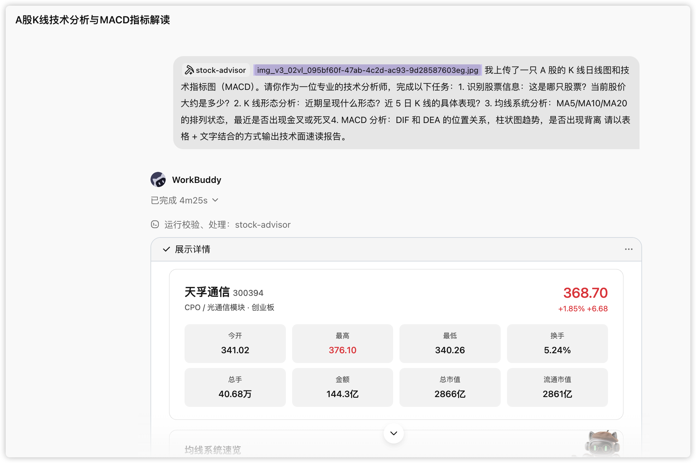
>
> 上传 K 线图 + 输入上述提示词的对话界面。

WorkBuddy 先从图里识别出这是**天孚通信（300394）**，当前股价约 368.70 元，然后给出了结构化的技术面速读。核心结论：

- **趋势**：MA5 > MA10 > MA20，标准多头排列，未见死叉，仍在主升浪；
- **风险信号**：当日一根长上影线（最高冲 376.10 回落到 368.70），MACD 红柱开始缩短，乖离率偏大；
- **关键位**：支撑看 MA5（347）/ MA10（319），压力看当日高点 376。

> 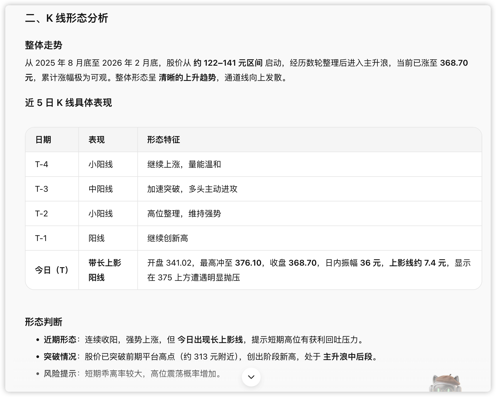
>
> 技术面速读报告的完整输出（含 K 线形态、均线、MACD 四张小表）
>
> 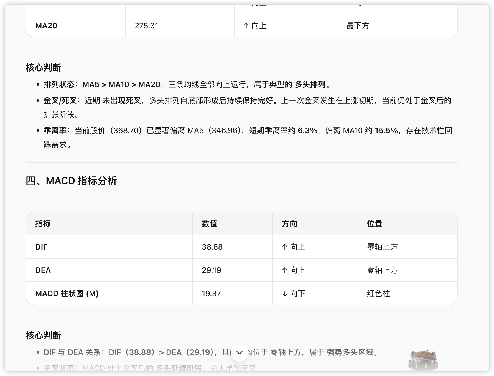

一句话点评：这一步它没有猜涨跌，而是把「图里能读到的事实」结构化了——形态、均线、指标、支撑压力，一目了然。


### 第二步：补上财报截图，做一次全面分析

接着我又上传了 2025 年三季报和全年预增公告的截图，让它把基本面接进来，做一次完整评级：

```text
我又上传了这只股票的 2025 年三季度报数据和 2025 年全年预增数据。
现在请你：
1. 先识别截图中的所有财务指标数据
2. 然后结合第一轮的技术面分析，帮我做一次全面的 A 股分析：
   - 技术面总评（综合 K 线、均线、MACD、KDJ 给出方向判断）
   - 基本面总评（营收增速、盈利能力、估值水平）
   - 资金面观察（成交量变化趋势）
   - 综合评级：强烈推荐 / 推荐 / 中性 / 谨慎 / 回避
3. 给出短期（1-2 周）、中期（1-3 月）的操作建议
4. 明确标注关键支撑位和压力位，请按照专业研报的格式输出。
```

> 
>
> 上传财报截图 + 输入上述提示词的对话界面。

这一轮它先把截图里的财务指标逐条识别出来（营收 39.18 亿、同比 +63.63%，归母净利 14.65 亿、ROE 31.30%、毛利率 51.87%，PE 146.70……），然后合成了一张综合评级表：

| 维度 | 评分 | 权重 | 加权得分 |
|-|-|-|-|
| 技术面 | 4.0 / 5.0 | 25% | 1.00 |
| 基本面 | 4.5 / 5.0 | 30% | 1.35 |
| 估值水平 | 2.0 / 5.0 | 25% | 0.50 |
| 资金面 | 4.0 / 5.0 | 20% | 0.80 |
| **综合评分** | — | — | **3.65 / 5.0** |

**最终评级：推荐。** 核心结论是一句很克制的话：**中期趋势向好（CPO 高景气 + 高成长），但短期估值透支、涨幅过大，不宜追高，等回调再择机。** 它还给了分投资者类型的仓位建议、四档支撑位和三档压力位。

> 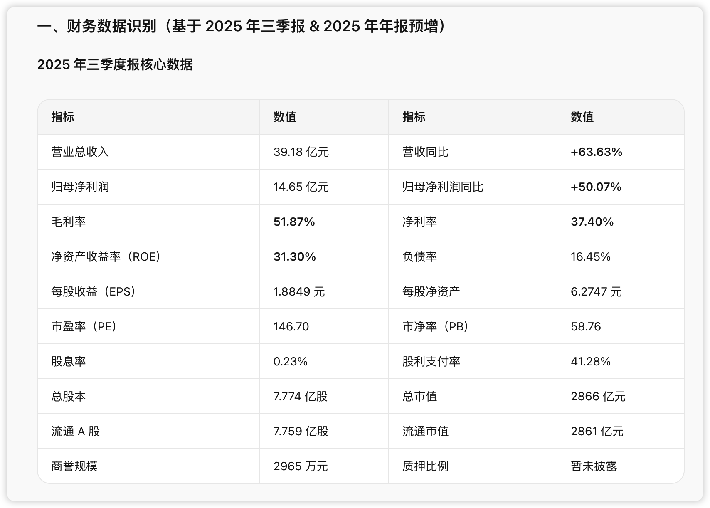
>
> 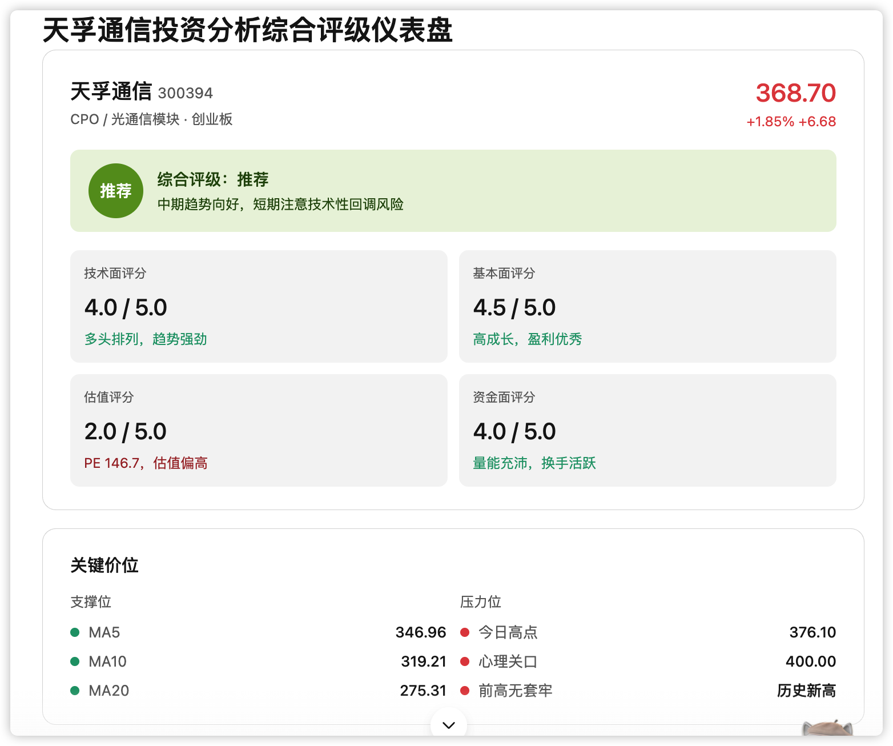
>
> 全面分析报告的完整输出（财务识别表 + 综合评级表 + 操作建议 + 支撑压力位）。

值得注意的是，这一步已经体现了模块二的设计：**技术、基本、资金三面分开打分，再加权合成**，估值太贵就在总分里扣回来——不会因为成长性好就无脑看多。

还可以从不同角度去分析，使用\`a-share-analyst\` \`skill去完成。

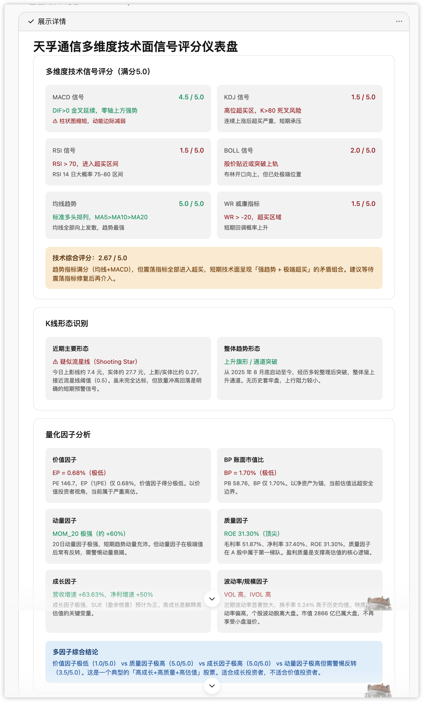

### 第三步：拿不定主意，开一场私董会

评级出来了，但「推荐」不等于「现在就买」。这时候我叫上了第四个模块——**私董会**，请四位风格迥异的幕僚就这只票交叉辩论：

```text
但我对这只股票还是拿不定主意。现在请帮我启动一场私董会，我要请四位幕僚来讨论这只股票是否值得投资：
- 巴菲特：从价值投资的角度（内在价值、护城河、安全边际）
- 马斯克：从科技趋势和颠覆性创新的角度
- 比尔·盖茨：从商业模式和行业格局的角度
- 乔布斯：从产品力和用户体验的角度
讨论要求：
1. 每位幕僚先各自发表 3-5 分钟的独立观点。
2. 然后进入交叉质询环节——幕僚之间互相挑战对方观点。
3. 最后每人用一句话给出"买入/持有/卖出"的最终建议。
4. 你作为私董会主持人，综合四位意见给出最终执行方案。
请基于前两轮的分析数据来展开讨论，让幕僚们"带着数据聊"。
```

> 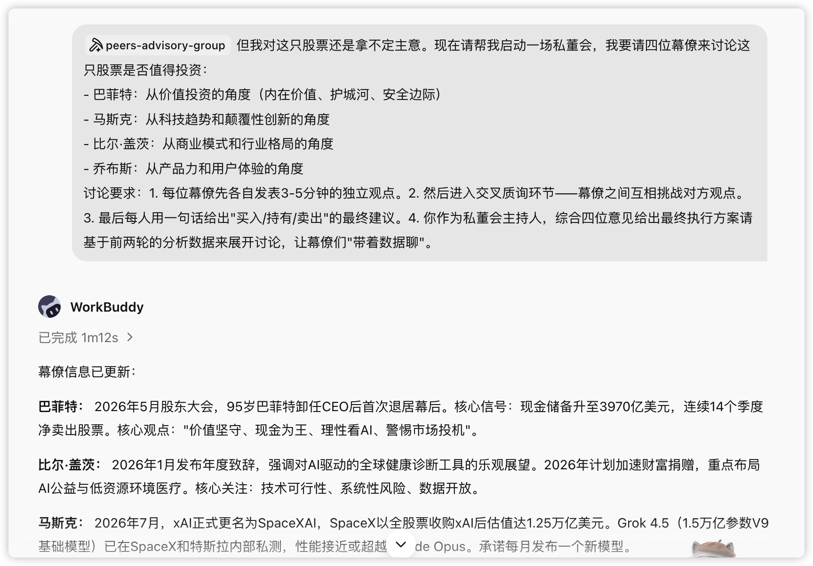
>
> 启动私董会的对话界面。

私董会环节里，系统先联网更新了四位幕僚的近况，还**补检索了更新的数据**（2025 全年营收 51.63 亿、净利 20.17 亿，2026 Q1 环比下滑，以及和中际旭创、新易盛的横向对比）——这正是模块三「多维交叉验证」在起作用，把讨论从截图数据推进到了全网最新事实。

四位幕僚各自独立发言、再互相质询，观点很快分成两派：

> 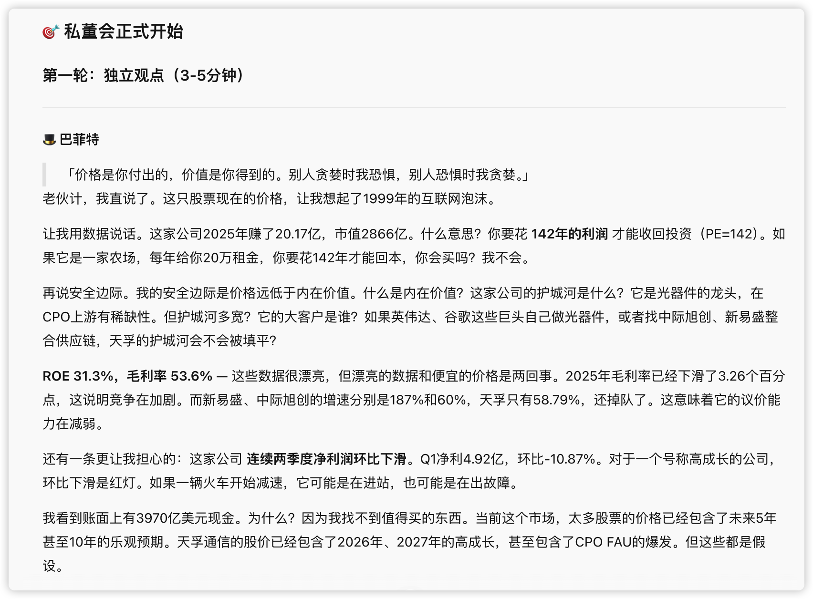
>
> 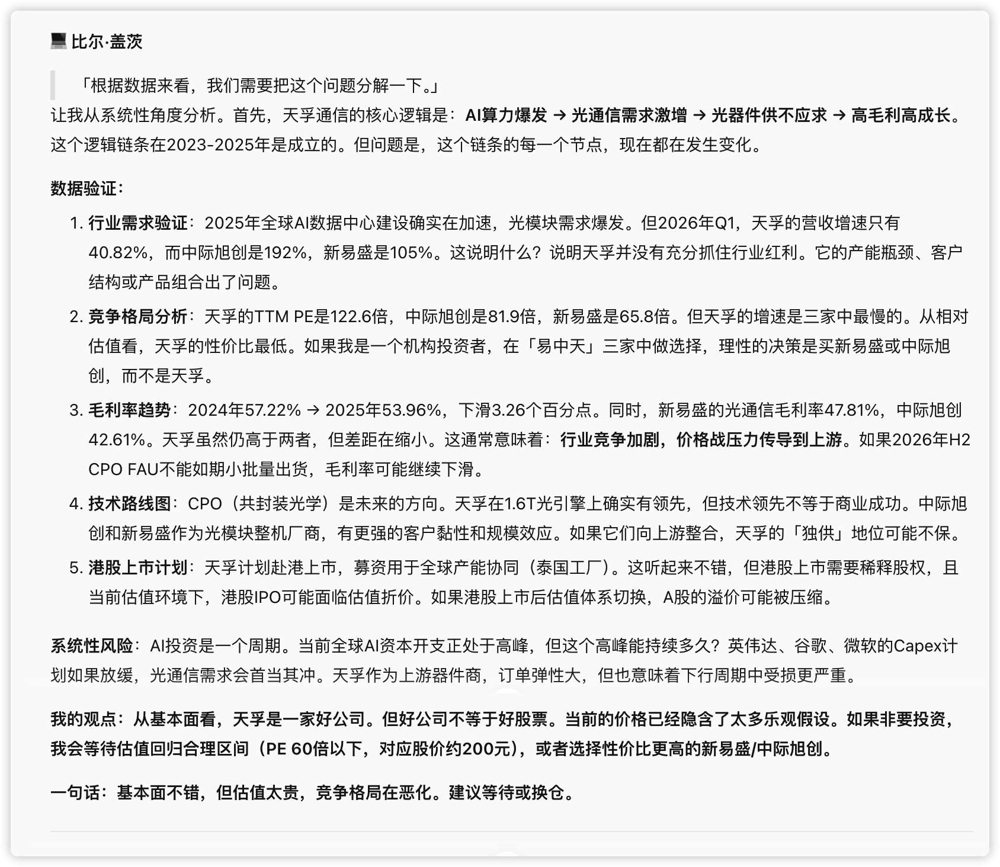
>
> 四位幕僚独立观点 +
>
> 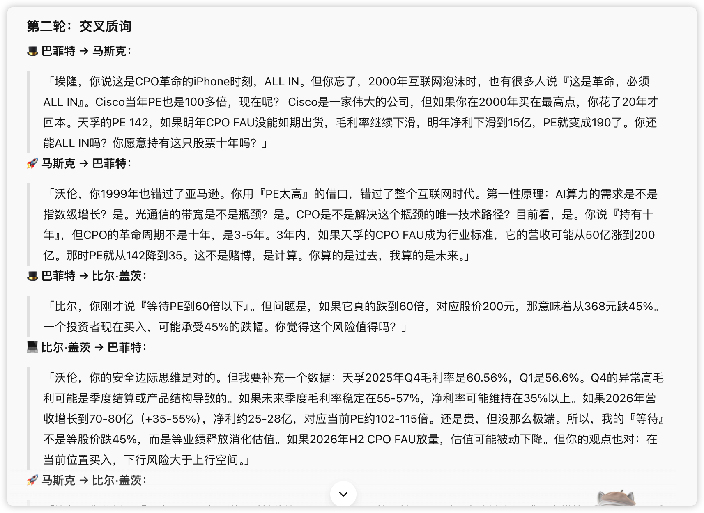
>
> 交叉质询环节（篇幅较长，建议分屏截图）。

最后每人一句话定调，形成了鲜明的「2:2」分裂：

- **巴菲特（回避）**：「PE 142，安全边际为零，护城河在收窄。除非跌到 200 元以下，否则这不是投资，是赌博。」
- **比尔·盖茨（等待 / 换仓）**：「基本面尚可，但估值太贵、竞争格局恶化。建议等 PE 回到 60 倍以下，或换性价比更高的新易盛 / 中际旭创。」
- **马斯克（All in）**：「CPO 是光通信的 iPhone 时刻，天孚是上游的铲子王。超买是最后的上车机会，不是下车理由。」
- **乔布斯（有条件持有）**：「相信 CPO 革命就现在持有，但前提是 CPO FAU 在 2026 H2 如期兑现，否则果断离场。」

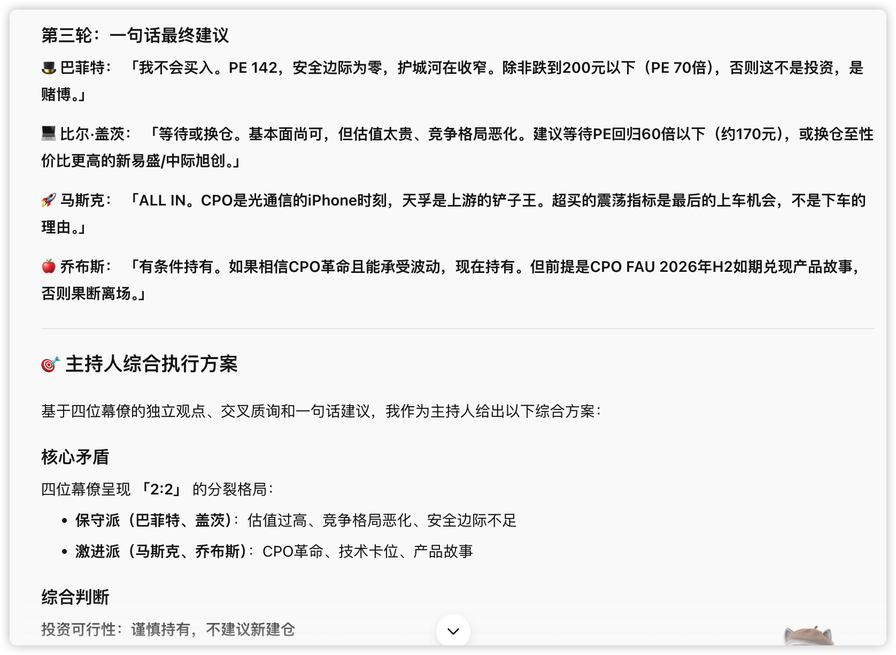

主持人最后综合出一份**分投资者类型的执行方案**，而不是一个笼统的「买或不买」：

| 投资者类型 | 建议 | 执行要点 |
|-|-|-|
| 价值投资者 | 坚决回避 | 等 PE < 40 |
| 成长投资者 | 可持有，需止损 | 保留 3-5 成，跌破 MA5(347) 减仓，跌破 MA10(319) 清仓 |
| 趋势投资者 | 谨慎参与 | 等回调至 MA10 / MA20，KDJ 回落至 50 以下再介入 |
| 激进投资者 | 小仓位试仓 | 最多 3 成，跌破 300 元清仓 |

并且把决策挂到了几个**未来验证节点**上：8 月中报预告看 Q2 是否环比改善，H2 看 CPO FAU 能否放量、毛利率能否回到 55%+，10 月三季报看营收增速。逻辑证伪就退出。

> 
>
> 主持人的综合执行方案（分类型建议表 + 决策节点表 + 替代标的）。

### 最后：一键成稿

对话结束后，让它把整场分析生成一份杂志风格的报告，`stock-advisor` 会调用排版模块出成品，可以本地存 PDF，也可以直接上传飞书云文档。

> 
>
> 杂志风格投资分析报告成品（首屏 / 封面）。

回头看这一个案例，`stock-advisor` 把第二节那八条散装提示词，变成了一次三轮对话就跑完的完整研究：**看图 → 看财报 → 开私董会 → 出报告**。而全程它没有替我做那个最关键的决定——买还是不买。它只是把该看的都看了，把该吵的都吵了，最后把判断权，干干净净地交回到我手里。

---

## 常见错误与使用边界

金融是强监管、强风险的场景，比办公三件套更需要守住边界。下面几条，是把 AI 用在投资上最容易踩的坑。

| 常见错误 | 为什么错 | 正确做法 |
|-|-|-|
| 让 AI 给「买点 / 卖点」 | 它不掌握实时全量信息，也不为你的钱负责 | 只用它做事实梳理和多空推演，买卖由你拍板 |
| 完全相信截图识别的数字 | 图像识别会看错，财报口径也会变 | 关键数字要交叉验证——本案例私董会环节的数据就比前两轮更新 |
| 指望它判断行业拐点、价格见底 | 这类判断依赖前瞻信息和经验，AI 给不了 | 让它梳理「该盯哪些领先指标」，拐点自己盯 |
| 只看多方逻辑，越看越上头 | 确认偏误，AI 会顺着你的语气强化观点 | 用 Prompt 6 和私董会，强制它给空方逻辑和反证 |
| 把 AI 报告直接当投资依据 | 报告是研究辅助，不是投资建议 | 报告结论仅供参考，决策与风险自负 |

> **风险提示：股市有风险，投资需谨慎。** **本章所有提示词、Skill 与案例，均以「辅助研究」为目的，不构成任何投资建议。**AI 只是把事实和分歧摆到你面前的工具，最终的判断和后果，始终在人这一边。据此操作，风险自担。