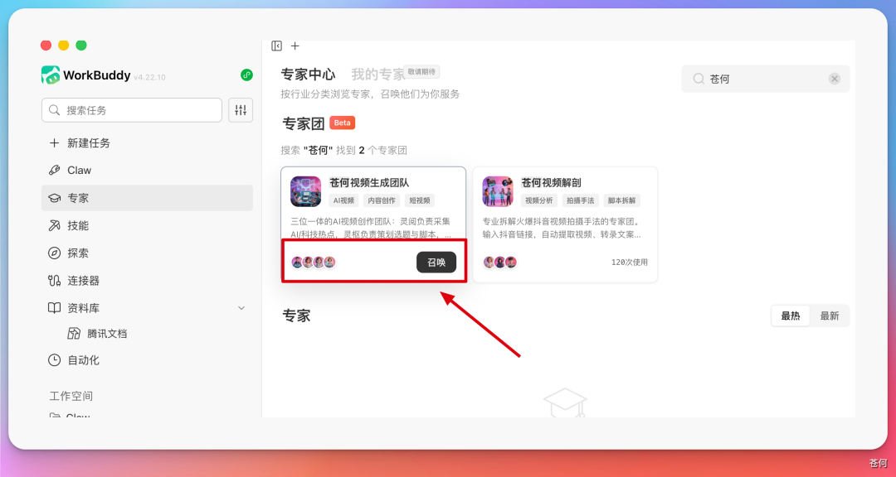
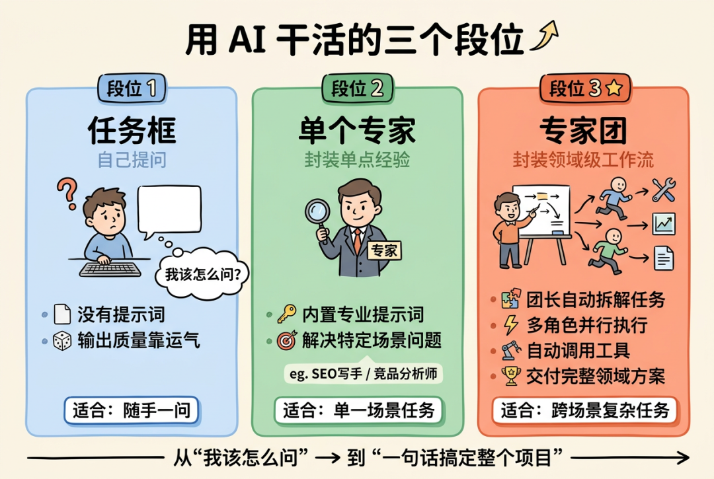
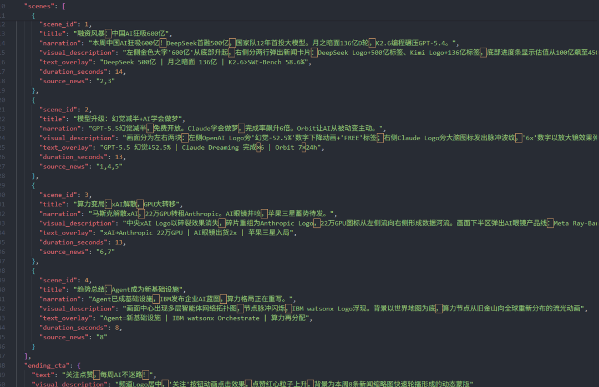
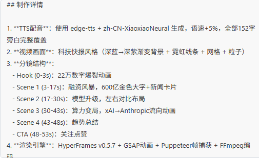
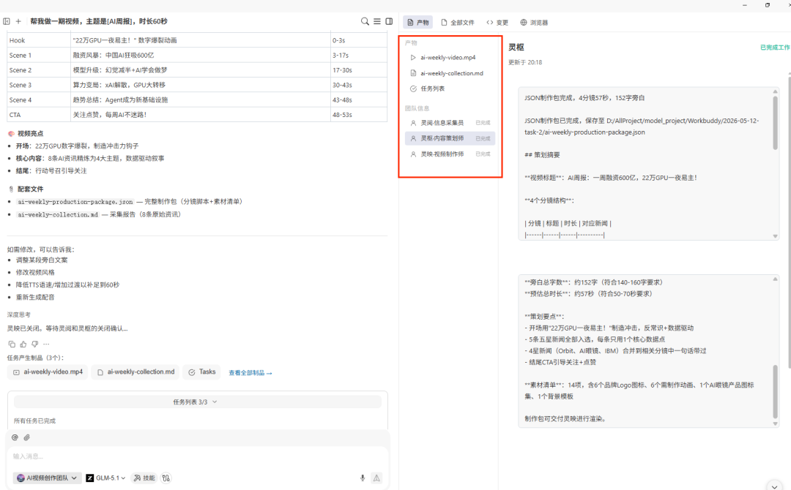
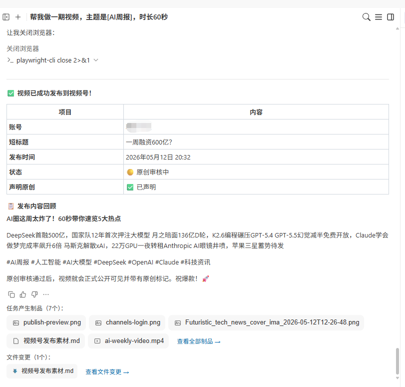
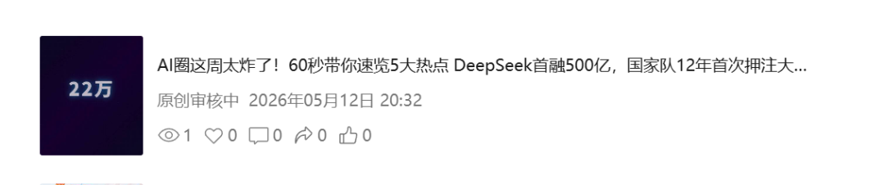
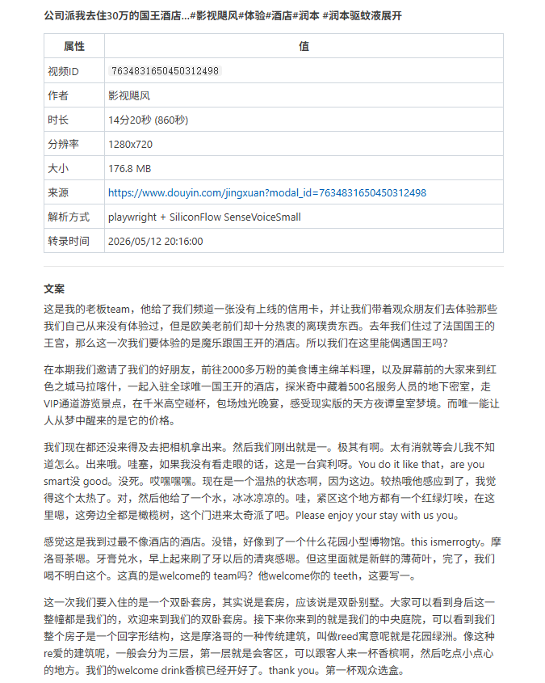
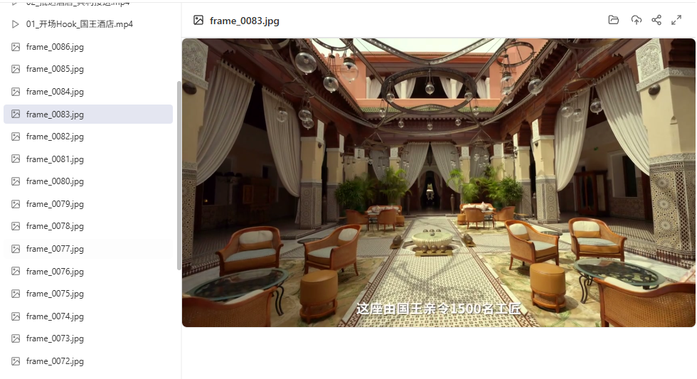
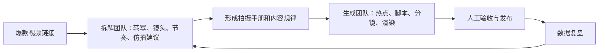

# 第 19 章 一句话召唤 AI 视频团队

在 WorkBuddy 里把短视频工作拆成两支 AI 专家团：一支负责自动生产视频，一支负责拆解爆款视频。


| 团队 | 负责什么 | 适合什么任务 |
|-|-|-|
| **视频生成团队** | 从主题出发，完成热点采集、选题筛选、脚本、分镜、配音、渲染、字幕和发布。 | AI 周报、产品更新、知识科普、行业分析、产品评测。 |
| **爆款视频拆解团队** | 从视频链接出发，下载视频、提取音频、转写文案、分析镜头语言，生成拆解报告和仿拍建议。 | 学习爆款结构、复盘竞品视频、沉淀拍摄手册、给生成团队提供参考。 |

这两个团队并不是互相替代的关系。视频生成团队解决“今天怎么做一条出来”，爆款拆解团队解决“为什么别人那条能火，我能学到什么”。一个负责生产，一个负责学习，组合起来才有持续迭代的可能。


## 如何召唤：从一句话开始，但不要停在一句话



```text
召唤视频生成团队，制作一条 46 秒 AI 周报短视频。
```

## 第一支团队：视频生成团队

视频生成团队里有四个核心角色：视频生成团队主理人凌导、信息采集员灵阅、内容策划师灵枢、视频制作师灵映。它们不是四个换名字的聊天窗口，而是一条有上下游交接关系的视频生产线。


| 角色 | 定位 | 交付物 |
|-|-|-|
| 凌导 | 主理人 / 团长 | 拆解任务、安排并行与串行流程、汇总产物、处理检查点。 |
| 灵阅 | 信息采集员 | 热点池、来源表、去重后的结构化摘要、选题候选。 |
| 灵枢 | 内容策划师 | 选题判断、脚本、分镜、旁白、转场、素材清单、BGM 和字幕节奏。 |
| 灵映 | 视频制作师 | HTML 视频工程、配音、字幕对齐、转场动画、素材拼接、渲染成片。 |

这才是多 Agent 的关键：不是角色越多越好，而是每个角色都有清晰输入和输出。信息采集员不直接写成片脚本，策划师不重新编造热点，制作师不重写事实，团长负责让流程不断档。



### 底层生产引擎：HyperFrames

文章提到，这条视频流水线基于 HyperFrames 搭建。它的核心思路是用 HTML 渲染视频，天然适合 Agent 生成结构化工程，再交给渲染工具输出 MP4。它还带有 CLI 工具链、TTS、字幕、去背景和视频组件模板。


### 生成流程一：信息采集员先让热点有来源

做视频最耗时间的往往不是剪辑，而是“今天到底拍什么”。所以视频生成团队先让信息采集员灵阅抓 RSS、搜新闻、扫社媒、聚合 AI 热点，并去重输出结构化摘要。


这个阶段的产物至少应该包含：标题、来源、发布时间、事件发生时间、原始链接、热度线索、为什么值得关注。热度只能帮助排序，不能替代事实核验。

### 生成流程二：内容策划师把主题变成镜头

选题有了之后，真正费脑子的是“这条视频怎么讲”。内容策划师灵枢负责选题评估、脚本写作、分镜设计、旁白文案、镜头节奏，以及转场建议、素材清单、BGM 节奏、字幕停顿和情绪节点。



这里建议设置第一次人工检查：开头 3 秒是否有钩子，46 秒是否塞入过多信息，旁白是否准确，画面是否真的支撑观点。脚本不过关时，不要进入配音和渲染。

### 生成流程三：视频制作师把分镜变成成片

灵映会把确认后的脚本转成 HTML，再调用 HyperFrames 渲染 MP4。文章里提到，系统会自动完成 Azure TTS 配音、Whisper 字幕对齐、动画与转场生成、素材拼接、字幕叠加和视频渲染。





成片验收不要只看“能不能播放”。至少检查旁白与字幕是否一致、镜头时长是否匹配、文字是否遮挡主体、BGM 是否可用、素材是否有版权风险、画面是否适合目标平台安全区。

### 生成流程四：发布可以自动化，但默认要人工确认

发布 Agent 自动生成标题、自动打标签、自动上传封面，并通过云手机发布到抖音、视频号和 B 站。这是很强的自动化能力，但蓝皮书建议默认不要直接自动发布，除非账号、素材、标题和合规边界都已经过人工确认。





## 第二支团队：爆款视频拆解团队

光会生成还不够。

内容创作者真正需要的是理解“为什么别人能爆”，把一条爆款视频拆成可以参考的操作手册：提取视频、转录文案、分析景别运镜、剪辑节奏、色调风格，并给出仿拍建议。


| 角色 | 职责 | 工具 / 技术 |
|-|-|-|
| 阿爆 | 团长 / 拆解总控 | 任务调度、流程编排、结果汇总。 |
| 小凯 | 音频处理与转录 | ffmpeg、ASR，把视频音频转成完整口播文案。 |
| 小淼 | 视频理解与镜头裁切 | 视频理解 API、ffmpeg，分析镜头语言并裁切片段。 |

### 拆解流程一：视频下载要有降级策略

爆款拆解的第一步是拿到视频。文章里专门提到，最复杂的是视频下载，所以设计了一套三层降级策略：官方 API、Playwright、yt-dlp。只要有一层成功，流程就继续。


这里必须加上边界：视频下载和分析要遵守平台条款、版权授权和合理使用范围。拆解的目的应该是学习结构和方法，不是搬运原视频。

### 拆解流程二：音频提取与文案转写

视频下载完成后，小凯用 ffmpeg 提取音频，把 video.mp4 转成 audio.mp3，再调用语音识别 API 自动转录完整口播文案。以前一句句听、一句句敲的工作，现在可以被稳定自动化。




### 拆解流程三：视频理解与镜头语言分析

接下来是最有意思的一步：视频理解。小淼会分析整条视频的景别、运镜、转场、剪辑节奏、色调、镜头时长。很多看起来“有感觉”的爆款视频，背后其实有稳定的镜头规律。




## 两支团队如何形成闭环

两个专家团可以合作。先用爆款拆解团队学习镜头语言和节奏，再让视频生成团队生产新视频，发布之后继续分析数据，再反过来优化下一版内容。



这就是专家团比单个工具更有意义的地方。它不只是帮你做一条视频，而是让“学习、生产、发布、复盘”变成一个可以重复运转的系统。