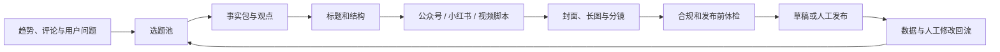
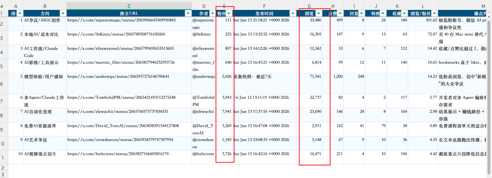
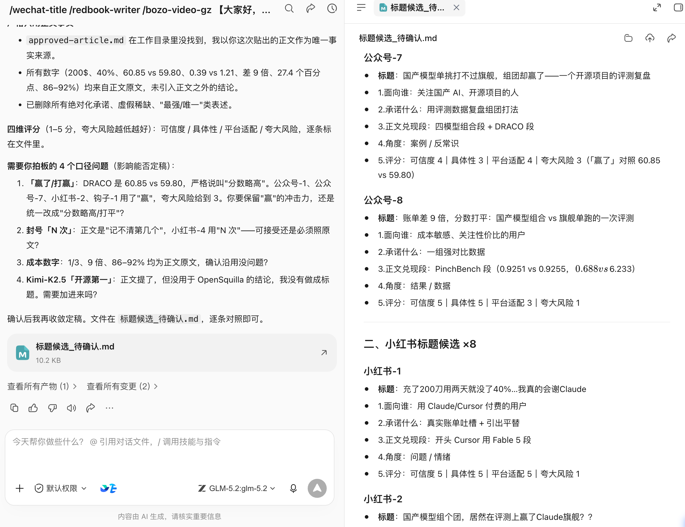
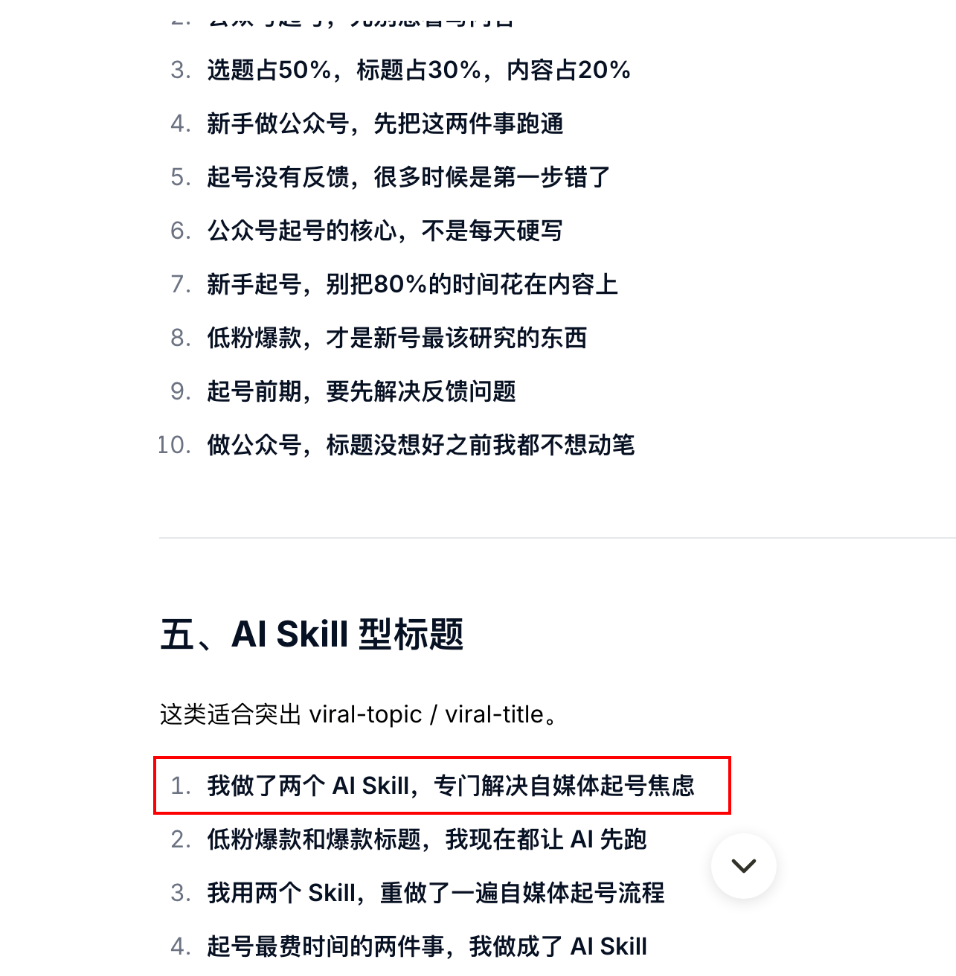
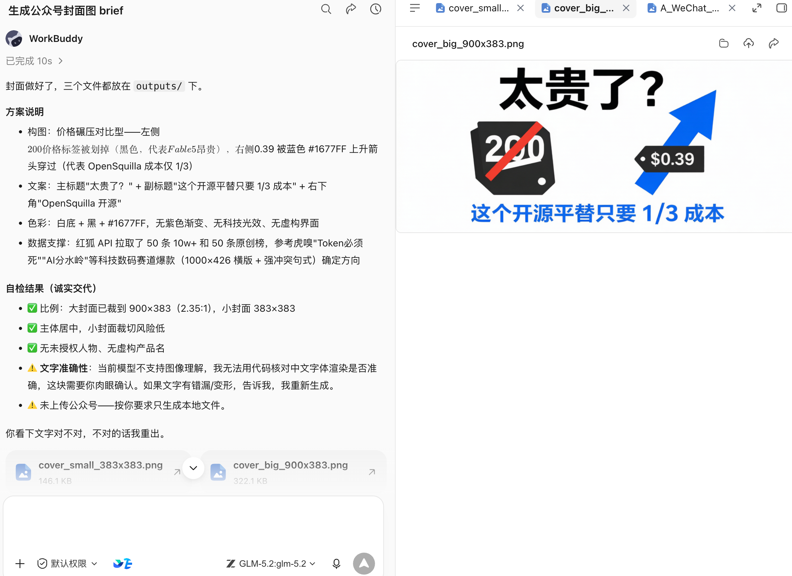
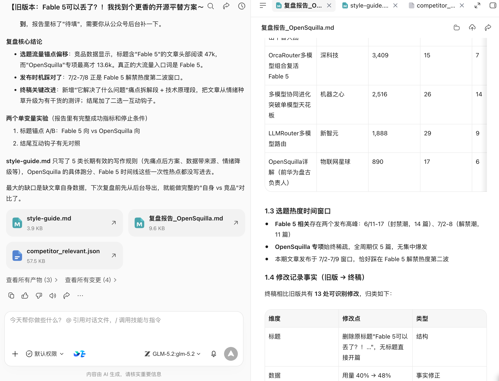

# 第 20 章 自媒体不只是靠努力，而是一条增长闭环

## 内容没人看？往往不是因为你不够努力

一个人做自媒体，做自媒体最浪费时间的事，就是一上来就把内容打磨到满分。

听起来很反常识，但我真踩过这个坑。你写得很深，资料查得很全，结构改了三遍。结果发出去，阅读量个位数。

后来我才意识到，起号前期真正要先解决的，不是“写得够不够好”，而是“有没有人愿意点进来”。


## 工作流



Skill 的作用是补上其中一个环节，不是接管账号判断。下面用八个具体工作现场说明。


## 场景一：每天刷热点，仍然不知道账号该写什么

热榜告诉你“大家正在看什么”，却不告诉你“这个账号为什么值得写”。只跟热点，容易得到同质化内容；只凭感觉，又很难判断用户是否真的关心。

- [公众号热门文章查询](https://skillhub.cn/skills/gzh-explosive-content-detector)：观察同主题热门文章；
- [小红书爆款笔记查询](https://skillhub.cn/skills/xhs-hotnotes)：获取热门笔记和数据线索；
- [小红书评论洞察](https://skillhub.cn/skills/xhs-comment-insights)：从评论中提取问题、反对意见和未满足需求；
- [灵感捕手](https://skillhub.cn/skills/inspiration-hunter-skill)：把临时想到的角度放进统一收件箱。

### 指令怎样写

```text
围绕“AI 办公自动化”建立本周选题池，不直接写文章。
分别收集公众号与小红书近 30 天的高互动内容，记录标题、发布日期、
核心承诺、内容结构、互动信号和原链接。
再从评论中提取：重复问题、反对意见、失败经历和用户原话。

结合我的账号定位：面向非技术职场人，强调真实流程和结果验收。
输出 12 个候选选题，每个包含：目标读者、真实问题、已有内容缺口、
我能提供的新证据、适合平台、制作成本和时效性。
不要把阅读量高直接解释成选题一定适合我。
```


### 执行流程与结果

WorkBuddy 先生成跨平台样本表，再把评论聚成问题簇，最后把“热度、账号匹配、新增价值、证据充足度、制作成本”分别评分。交付物是一张可以人工删选的选题看板。


### **有时候光找热门还不够，我们还需要去找低粉爆款。**

大家应该都听过，**起号要找低粉爆款去抄**，这确实是这样的。

*PS：这里说的抄，是抄选题，不是原封不动的抄内容。*

推荐一个叫[**viral-topic**](https://github.com/kangarooking/kangarooking-skills/tree/main/viral-topic)**的skill**，它可以获取各个平台近期的指定领域的多个低粉爆款内容。

比如获取公众号最近7天的AI领域低粉爆款文章。


筛选X上的低粉爆款



以及YouTube的低粉爆款


## 场景二：想要爆款标题，但不想标题党

“给我 20 个爆款标题”很容易得到数字、悬念和夸张承诺，却没有任何标题能准确兑现正文。标题不是独立文案，它是读者与正文之间的一份承诺。

- [公众号标题生成与评分](https://skillhub.cn/skills/gzh-official-account-title-generator)；
- [小红书爆款笔记自动生成器](https://skillhub.cn/skills/redbook-writer)中的标题与标签模块；
- [短视频钩子方案生成](https://skillhub.cn/skills/bozo-video-gz)。

### 指令怎样写

```text
读取 approved-article.md，只根据正文已经出现的事实生成标题。
分别生成：公众号标题 8 个、小红书标题 8 个、短视频开场钩子 5 个。

每个候选都输出：
1. 面向谁；2. 承诺什么；3. 正文哪一段能够兑现；
4. 采用的问题/结果/清单/案例/反常识角度；
5. 可信度、具体性、平台适配和夸大风险评分。

删除无法证明的数字、绝对化承诺、虚假稀缺和与正文不一致的结论。
不要自动选择最终标题，先让我确认内容承诺。
```


### 验收方法

把标题单独给一个不了解正文的人看，请他写出“我预计点进去会得到什么”。再与正文核对。预期与实际不一致，标题分数再高也不能用。

workbuddy通过这几个skill，生成的标题还真有那味儿。特别是小红书的标题，很有小红书的感觉。



可以进行 A/B 测试，但一次只改变一个主要变量，例如“问题式”与“结果式”。不要同时改标题、封面、发布时间和正文开头，否则数据无法解释。


再推荐一个标题skill：[**viral-**](https://github.com/kangarooking/kangarooking-skills/tree/main/viral-title)[**title**](https://github.com/kangarooking/kangarooking-skills/tree/main/viral-title)**，很适合用来给公众号起标题**




## 场景三：公众号封面每次从空白画布开始

封面既要让人看懂主题，又要适配大小封面、安全区和账号品牌。直接说“做一张高级感封面”，通常会得到与正文无关的装饰图、错误文字或失真的 Logo。

- [公众号爆款封面生成](https://skillhub.cn/skills/explosive-cover-generator-gzh)：分析同赛道视觉规律并给出方案；
- [公众号图片生成器](https://skillhub.cn/skills/generate-wechat-official-account-images)：处理大小封面、文内配图和引导图；
- 海报设计或图像生成 Skill：执行已确认的视觉 brief。

### 指令怎样写

```text
为文章《收藏不是知识管理，能再次用起来才是》制作公众号封面 brief。
目标读者：知识工作者；核心信息：从收藏走向可复用知识流。
品牌色：#1677FF、白、黑；禁止紫色渐变、夸张科技光效和虚构产品界面。

先输出 3 个构图方向，每个包含：主体、层级、封面文案、色彩、留白、
大小封面裁切风险和正文对应段落。我确认后再生成图片。
生成后检查：文字是否准确、Logo 是否变形、主体是否被小封面裁掉、
是否使用未经授权的人物或素材。不要直接上传公众号。
```

### 结果是否可用



生成的封面还不错，有汉字、封面负责表达的主题也比较贴切，如果换成更强的生图模型，效果应该会更好。


## 场景四：小红书不只是“把长文切成九张图”

公众号文章改成小红书时，常见做法是截短段落、加入表情符号，再把文字铺到九张卡片上。结果信息很多，但封面没有钩子，第二页没有承接，最后一页没有行动，移动端也难读。

- [小红书封面图制作](https://skillhub.cn/skills/xiaohongshu-cover)；
- [小红书图片生成器](https://skillhub.cn/skills/any2xiaohongshu)：将结构化内容渲染为竖版卡片；
- [小红书运营副驾](https://skillhub.cn/skills/xhs-ops-copilot)：发布前体检与复盘。

### 工作流

1. 从长文提取不带平台语气的事实包；
2. 选择一个核心问题，删除与它无关的支线；
3. 设计“封面承诺 → 问题共鸣 → 方法 → 示例 → 误区 → 清单”的滑动节奏；
4. 先输出逐页线框和字数，再生成图片；
5. 在真实手机宽度检查字号、断行、边距和重点；
6. 最终标题、正文、标签和图片逐一核对数字与专有名词。

```text
把 approved-article.md 改造成 8 页小红书图文，不新增事实。
第 1 页只表达一个承诺；第 2 页写读者正在经历的问题；
第 3-6 页每页只讲一个动作并给一个例子；第 7 页写常见误区；
第 8 页给可保存的检查清单。
先返回逐页文案、视觉层级和预计字数，我确认后再调用封面与长图 Skill。
```


## 场景五：一段长文怎样变成可拍的短视频

“改成 60 秒口播”通常只是把文章压缩成更快的朗读稿，没有镜头、节奏、证据画面和停顿，也没有说明谁能拍、需要什么素材。

- [短视频选题素材研究](https://skillhub.cn/skills/short-video-topic-research)；
- [短视频脚本与矩阵内容工厂](https://skillhub.cn/skills/shortvideo-content-factory-cn-v1-zt)；
- [AI 短视频导演](https://skillhub.cn/skills/seedance-director)用于分镜和生成提示；
- 配乐 Skill 只在确认版权和商用范围后使用。

### 指令怎样写

```text
把这篇文章改造成 60 秒真人口播，目标是让第一次使用 WorkBuddy 的人
理解“为什么任务简报比一句模糊需求更重要”。
输出时间轴表格：时长、景别、画面、口播、屏幕文字、素材来源、转场。
前 3 秒必须提出真实问题，不夸大收益；20 秒前展示一次产品过程证据；
结尾给一个可以立即尝试的指令，不做虚假互动承诺。
同时列出必须实拍、可用产品截图、可由 AI 生成的画面，禁止伪造用户反馈。
```


生成的口播文案，效果还不错哦。


## 场景六：发布前，别让自动化越过责任边界

- [公众号违禁词检测](https://skillhub.cn/skills/gzh-prohibited-word)：标记风险表达；
- [公众号排版 Skill](https://skillhub.cn/skills/md-to-wechat)：渲染 Markdown 并创建草稿；
- [文章去 AI 味工具](https://skillhub.cn/skills/unclecheng-reduce-ai-perception-v2)：只用于减少套话，不用于伪装来源或原创。

```Plain Text
检查本次公众号文章是否有违禁词，如有请标记出来，并对每个违禁词给出修改建议。检查整体内容的 AI 味，并降低AI味，最后把文章排版。
```

发布链建议停在草稿箱：事实检查 → 引用与版权 → 品牌与合规 → 链接检查 → 手机预览 → 人工确认账号 → 发布。自动点赞、批量私信、刷评论、绕过平台风控和未经确认的群发，不属于本书推荐的效率场景。


## 场景七：发布后不复盘，下一篇仍从零开始

复盘主要是把AI写的和人工修改后的终稿进行对比，让skill自动进化，下一次，它将写出geng

可以使用 [公众号写作自我迭代](https://skillhub.cn/skills/skill-article-evolution) 或小红书运营副驾，把人工修改和数据写回风格库：

```text
读取本期内容数据、发布版本和人工修改记录，生成复盘。
先陈述数据事实，再列出最多 3 个可验证假设，不把相关性写成因果。
把表现按选题、标题、封面、开头、结构、发布时间和渠道拆开。
为下轮设计 2 个单变量实验，并说明成功指标和停止条件。
将长期有效的修改规则写入 style-guide.md；一次性热点不要写入永久规则。
```

把AI最开始产出的文案和终稿都丢进去，最终产出复盘报告和style-guide.md，下次AI写的东西就能离你的期望更进一步啦～





## 一套够用的自媒体 Skill 栈

| 层级 | 先装什么 | 何时再增加 |
|-|-|-|
| 入门 | 热门内容查询、标题评分、图片生成 | 已能稳定完成一篇内容 |
| 稳定 | 评论洞察、封面、排版草稿、违禁词检测 | 已明确账号定位和审核人 |
| 多平台 | 小红书卡片、短视频脚本、平台适配 | 已有统一事实包 |
| 进阶 | 数据回流、风格迭代、定时选题雷达 | 人工流程已连续跑通 4 周 |