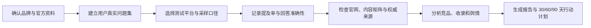
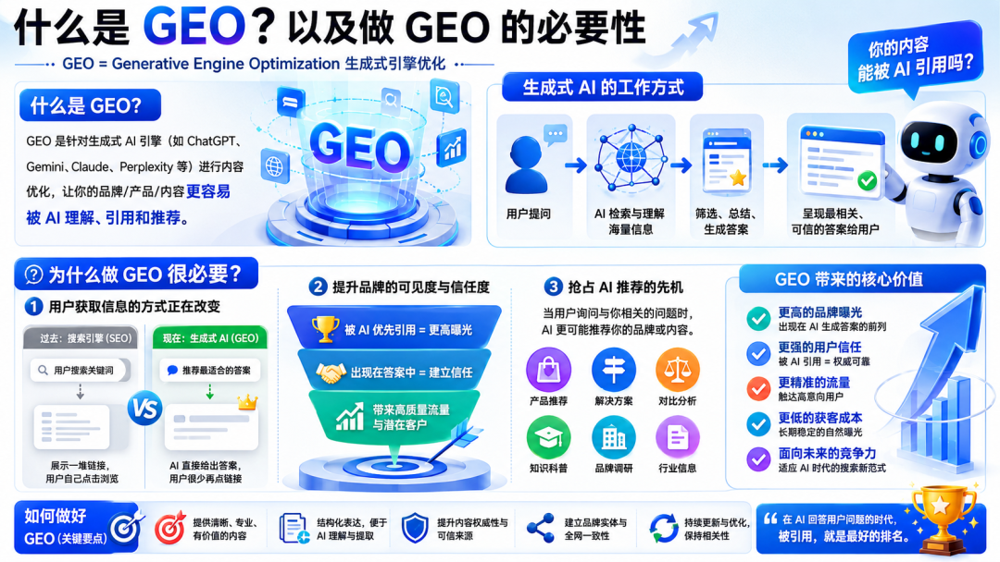
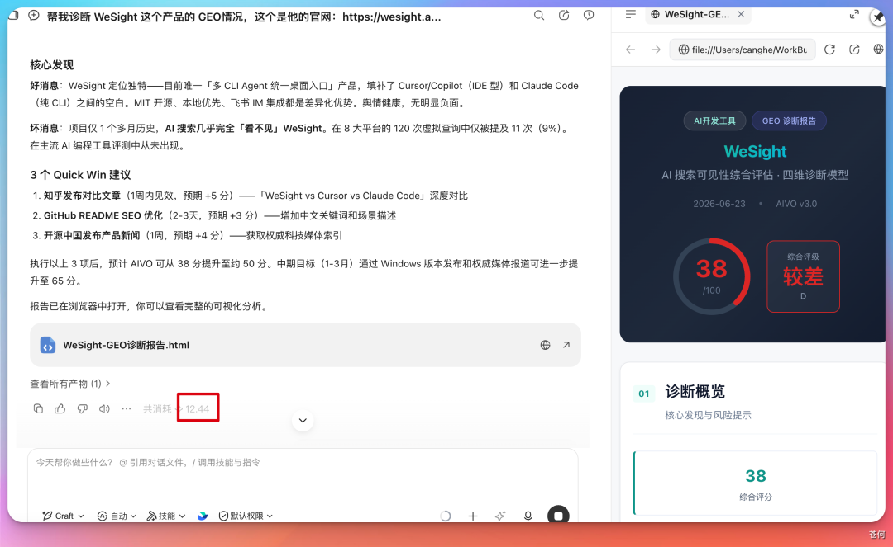
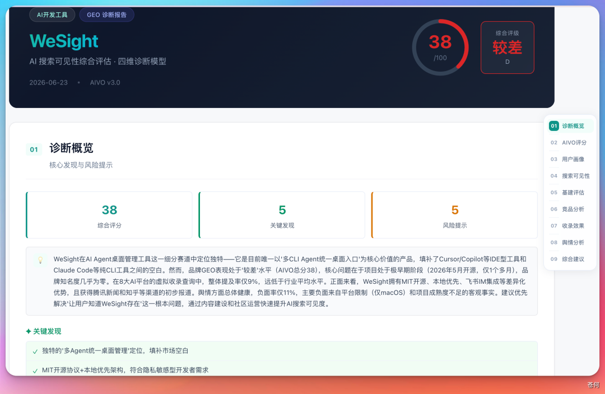
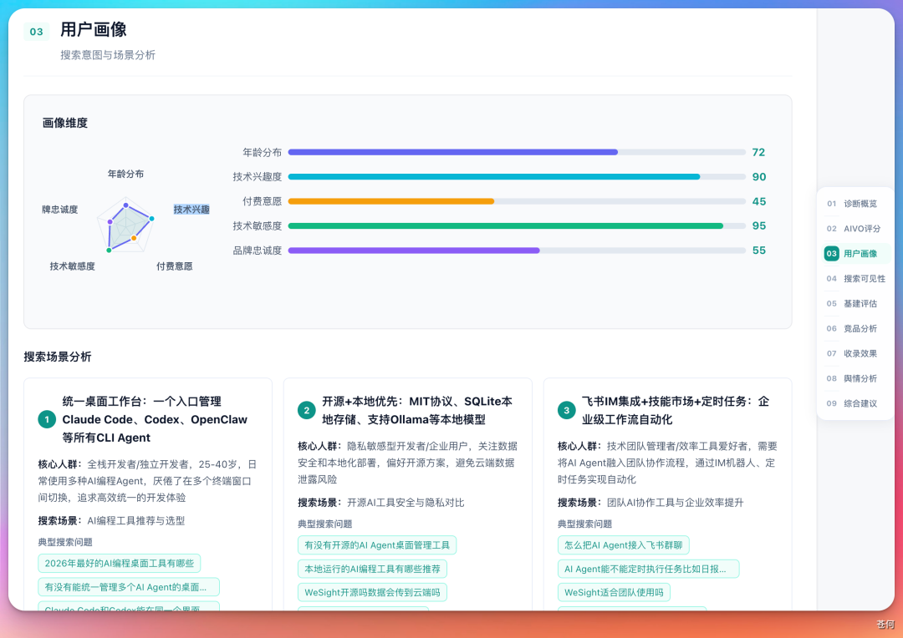
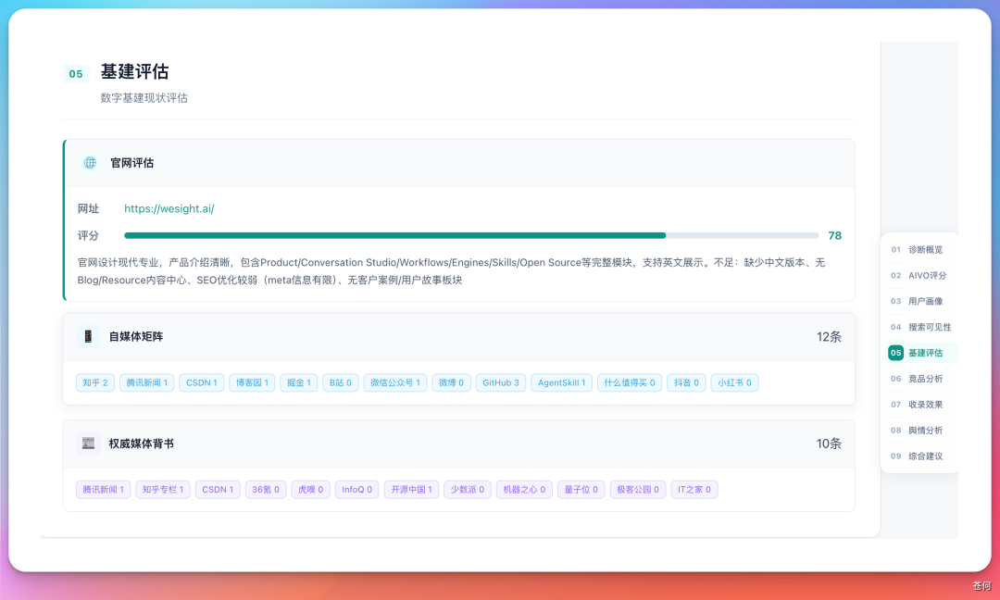
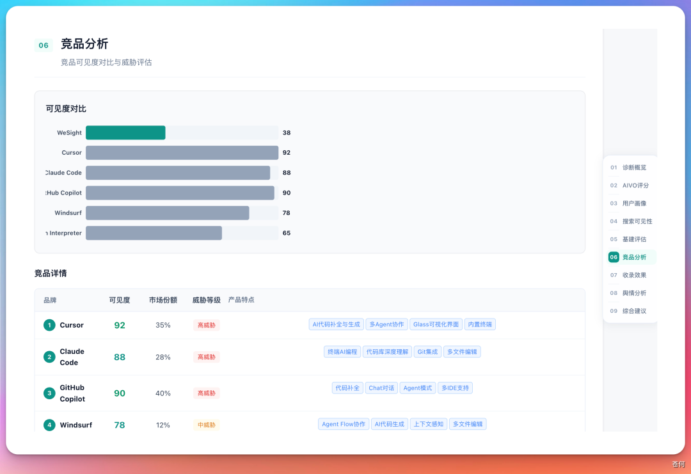
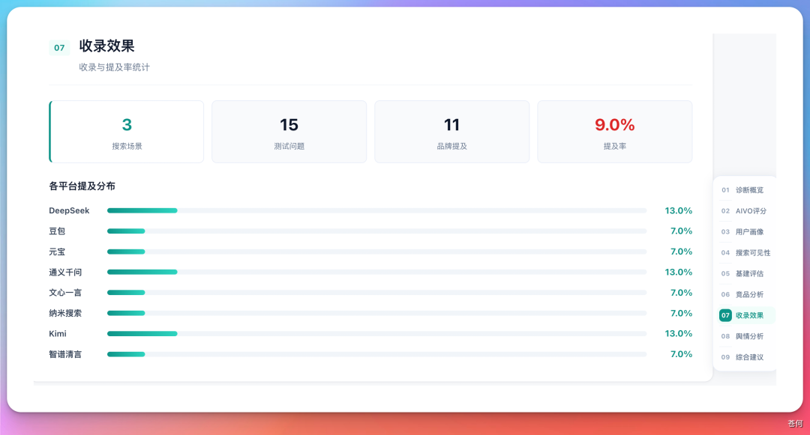

# 第 21 章 WorkBuddy也能做GEO专家

GEO 是 Generative Engine Optimization，中文常叫生成式引擎优化。

过去做品牌，很多人关心的是 SEO：用户在搜索引擎里搜某个关键词，官网、文章、媒体报道能不能排到前面。现在越来越多用户直接问元宝、DeepSeek、豆包、Kimi 这类生成式 AI：“哪个产品适合我？”“某个领域有哪些工具？”“这家公司靠谱吗？”品牌面对的问题就变了：AI 回答里有没有你，提到你时准不准，推荐你时有没有信任依据。


## GEO 诊断到底解决什么问题

GEO 不是让 AI 帮你写一篇品牌软文，而是回答一个更基础的问题：在用户真实提问的场景里，你的品牌有没有被 AI 理解、引用和推荐。

| 问题 | 要看什么 | 例子 |
|-|-|-|
| 可见度 | AI 回答里是否提到品牌 | 用户问“有没有能统一管理多个 AI Agent 的桌面软件”，WeSight 是否被提及。 |
| 准确性 | AI 对品牌描述是否正确 | 功能、适用平台、目标用户、价格、开源状态是否被说错。 |
| 竞争位 | 同一个问题下，AI 把推荐位给了谁 | 竞品被频繁推荐，而你的产品几乎不出现。 |
| 信任源 | AI 能不能找到可信资料支撑回答 | 官网、GitHub、媒体报道、自媒体矩阵、用户评价是否形成闭环。 |
| 行动点 | 诊断之后应该先改哪里 | 补官网说明、优化 README、补竞品对比页、处理负面舆情。 |

## 先选对专家：品牌 GEO 诊断专家

GEO 诊断 Skill 上架到了 WorkBuddy 的专家市场，变成一个可以直接召唤的「品牌 GEO 诊断专家」，已经封装好一套诊断流程：从品牌输入、问题集设计、平台测试，到可见度、基建、竞品、舆情、路线图输出。


### 这个专家适合谁用

- **产品团队**：想知道产品在 AI 搜索里的可见度、竞品压力和内容短板。
- **企业品牌**：想知道公司是否被 AI 准确识别，官网和媒体资料是否足够可信。
- **个人 IP / 自媒体**：想知道自己的名字、账号、代表作品是否被 AI 正确召回。
- **市场和增长团队**：想把“发内容”变成有目标、有复测、有证据的 GEO 优化计划。

### 推荐输入材料

| 输入项 | 为什么需要 | 示例 |
|-|-|-|
| 官网 / 产品页 | 作为品牌事实的第一信源 | 官网、产品介绍页、定价页、帮助中心。 |
| 项目地址 | 技术产品需要证明活跃度和能力边界 | GitHub、开源仓库、更新日志。 |
| 官方账号 | 让 AI 能识别权威发布渠道 | 公众号、知乎、掘金、小红书、B 站、视频号。 |
| 目标用户 | 问题集要从真实用户意图出发 | 开发者、企业管理者、内容创作者、采购负责人。 |
| 竞品名单 | 判断语义推荐位被谁占据 | 2-5 个已知竞品或替代方案。 |

## GEO 诊断

GEO 诊断也可以先拆成一条稳定工作流。不要一上来就问“我的 GEO 怎么样”，而是让专家先把诊断范围、测试问题和评分口径说清楚。



| 步骤 | WorkBuddy 做什么 | 人要确认什么 |
|-|-|-|
| 1 | 读取品牌官网、项目地址和公开资料。 | 哪些信息是官方事实，哪些只是参考资料。 |
| 2 | 生成一组用户真实问题，而不是只测品牌名。 | 这些问题是否真的来自目标用户的搜索意图。 |
| 3 | 在多个 AI 平台或搜索场景中测试品牌提及情况。 | 测试平台、采样次数、是否登录、测试日期。 |
| 4 | 分析 AIVO、用户画像、竞品、基建、舆情和收录。 | 每个分数能不能追溯到样本和证据。 |
| 5 | 输出 HTML / 飞书文档报告和优化路线图。 | 哪些行动先做，哪些结论需要人工复核。 |




### 提示词示例：产品 GEO 诊断

```text
召唤“品牌 GEO 诊断专家”，帮我诊断 WeSight 这个产品的 GEO 情况。
官方资料：官网、开源项目地址、官方账号。
目标用户：需要统一管理多个 AI Agent、桌面工作流和开发工具的用户。
已知竞品：请先根据用户问题自动识别，再让我确认。
请先输出测试问题集、测试平台、采样次数、评分口径和局限，等待我确认后再执行。
最终输出：诊断概览、AIVO 评分、用户画像、搜索可见性、基建评估、竞品分析、收录效果、舆情分析和优化路线图。
无法重复验证的结果标为“样本观察”，不要写成绝对事实。
```




**可得到的结果**：不是一句“GEO 做得好不好”，而是一份能拆解问题的报告。案例中，WeSight 的问题不是产品没有差异化，而是在测试样本里 AI 搜索可见度和竞品对比优势偏弱，导致综合得分被拖低。


### 报告模块一：诊断概览与风险提示

诊断概览的作用是先给经营者一个全局判断：当前品牌总体表现如何、最主要风险是什么、哪些问题应该立刻处理。它不应该只给一个分数，而要解释分数从哪里来。



| 概览里要看 | 为什么重要 | 如何复核 |
|-|-|-|
| 综合评分 | 快速判断当前 GEO 基础水平 | 确认评分口径和测试样本，不把一次分数当永久结论。 |
| 关键发现 | 找到最影响结果的短板 | 每条发现都要能回到具体平台、具体问题、具体回答。 |
| 风险提示 | 提前发现会影响推荐的负面因素 | 区分事实风险、内容缺口和模型误解。 |

比如 WeSight 仅支持 macOS Apple Silicon 这类产品边界，如果官网、README 和外部资料没有解释清楚，AI 可能会在推荐时附带限制提醒，甚至把它排除在部分用户需求之外。


### 报告模块二：AIVO 评分，看清短板在哪

把 GEO 拆成四个维度：AI 搜索可见度、基建完善度、竞品对比优势、舆情健康度。这个拆法比单一总分更有价值，因为它能告诉你到底是“没人提你”，还是“有人提你但说不准”，或者“竞品资料更强”。


| 维度 | 它衡量什么 | 低分时先做什么 |
|-|-|-|
| AI 搜索可见度 | 用户问相关问题时，品牌被提及的比例和位置。 | 补用户问题对应的内容页、对比页和场景页。 |
| 基建完善度 | 官网、官方账号、技术文档、权威来源是否完整。 | 修正官网事实、统一名称、补充结构化介绍。 |
| 竞品对比优势 | 同一条 query 下，AI 更容易推荐谁。 | 写清差异化、适用边界和与竞品的取舍。 |
| 舆情健康度 | 外部评价、负面信息、风险提示对推荐的影响。 | 处理真实问题，补充官方澄清和可信第三方证据。 |

WeSight 的案例中，综合得分约 38 分；舆情健康度相对较好，但 AI 搜索可见度和竞品对比优势偏弱。这个结果说明问题不一定在产品本身，而在“用户提问语义”和“品牌内容供给”之间存在断层。


### 报告模块三：用户画像与意图漏斗偏移

很多品牌做内容时只写自己想表达的卖点，但 GEO 更关心用户真实怎么问。公众号案例中，专家发现用户在大模型里更容易提出“有没有能统一管理多个 AI Agent 的桌面软件”这类问题。这意味着用户关心的是场景和任务，而不一定知道你的品牌名。



### 报告模块四：搜索可见性，提及率就是新的排名

在传统搜索里，用户至少还会看到一页链接；在 AI 搜索里，用户往往只看一段回答。品牌是否被提及、在什么位置被提及、是否被作为推荐项出现，就成了新的“搜索排名”。


### 报告模块五：数字基建，先让 AI 有可信资料可读

GEO 不是只靠“发声量”。生成式 AI 需要可引用、可验证、相互印证的可信来源。把基建评估拆成三类：官网评估、自媒体矩阵、权威媒体背书。



### 报告模块六：竞品分析，争的是语义心智份额

GEO 的竞品分析不是简单列出市场竞品，而是看同一条用户问题下，AI 把推荐位给了谁。你和竞品争夺的不是网页排名，而是语义心智份额。



### 报告模块七：收录效果，最终看 AI 回答里有没有你

收录效果可以理解为 GEO 的结果指标。前面的官网、内容矩阵、舆情、竞品分析最终都要落到一个问题：AI 回答里有没有你。



这里最容易犯的错误，是只测品牌名。品牌名能被搜到，不代表用户问场景问题时会出现你。正确做法是把问题分层：

- **品牌名问题**：某品牌是什么，官网是什么，是否开源。
- **品类问题**：某类工具有哪些，适合谁，怎么选。
- **场景问题**：我遇到某个具体任务，有什么产品能解决。
- **对比问题**：A 和 B 有什么区别，哪个更适合某类用户。

### 报告模块八：舆情分接绕开。


| 舆情类型 | 处理方式 | 注意事项 |
|-|-|-|
| 真实产品问题 | 先修产品，再公开说明修复进展。 | 不要只做内容压制。 |
| 过期信息 | 在官网和权威渠道更新最新事实。 | 让新资料能被 AI 明确识别。 |
| 误解或谣言 | 用 FAQ、澄清文、第三方证据纠偏。 | 避免情绪化回应。 |
| 竞品对比劣势 | 明确适用边界和差异化场景。 | 不要把所有对比都写成“我最好”。 |


## 个人 IP 也可以做 GEO 诊断

GEO 不只适合产品和企业，也适合个人 IP。用“苍何”做个人 IP 诊断，得到约 72 分，并用元宝做了额外搜索验证。


### 个人 IP 诊断要额外注意什么

- **身份消歧**：同名人物很多，必须提供所在地、职业、代表作品、官方账号。
- **平台分散**：公众号、知乎、小红书、B 站、视频号的信息可能不一致。
- **代表作品**：AI 需要知道你最重要的作品、观点和标签。
- **内容定位**：个人 IP 不只是“被搜到”，还要看 AI 如何描述你。

```text
召唤“品牌 GEO 诊断专家”，帮我诊断个人 IP 的 GEO 情况。
姓名 / 昵称：____。
身份消歧：所在地、职业、公司或组织、代表作品、官方账号。
目标问题：用户问哪些主题时，我希望被 AI 正确提到？
请测试品牌名问题、领域问题、作品问题和对比问题。
输出：可见度、身份准确性、代表作品识别、同名混淆风险、内容缺口和 30 天优化建议。
```


## 企业品牌诊断，不要为了 GEO 而 GEO

企业做 GEO 最容易走偏：还没诊断，就开始批量买内容、铺渠道、刷曝光。公众号案例里提到，给企业做 GEO 诊断时，真正重要的是先知道品牌在 AI 眼里是什么样：有没有被提及，是否被误解，风险在哪里，竞品为什么更容易被推荐。

### 企业品牌建议重点检查

| 检查项 | 关键问题 | 常见行动 |
|-|-|-|
| 品牌基础事实 | 公司是谁，做什么，服务谁，核心优势是什么。 | 统一官网、百科、媒体稿、产品页的表达。 |
| 业务场景 | 用户问哪些业务问题时应该出现你。 | 补场景页、解决方案页、行业案例。 |
| 可信背书 | 有没有客户案例、媒体报道、行业评价。 | 建立可引用的公开资料矩阵。 |
| 负面与风险 | AI 是否会提到负面、过期或错误信息。 | 处理真实问题，发布事实澄清和更新说明。 |

### 从诊断到行动：不要追求一次性刷高分

一份 GEO 报告如果不能转成行动，就只是漂亮仪表盘。给出快速赢利点、优先行动建议和阶段路线图，比如补齐 GEO 曝光、处理舆情、优化可信来源等。


| 阶段 | 优先行动 | 复测方式 |
|-|-|-|
| 30 天 | 修正官网、README、官方账号中的名称、定位、功能边界和过期信息。 | 重测品牌名问题和核心场景问题，检查回答准确性。 |
| 60 天 | 补用户真实 query 对应的场景页、对比页、案例页和 FAQ。 | 重测品类问题和场景问题，观察提及率变化。 |
| 90 天 | 建设外部可信来源：媒体报道、客户案例、社区讨论、行业观点。 | 检查引用来源多样性、竞品推荐位和舆情风险变化。 |