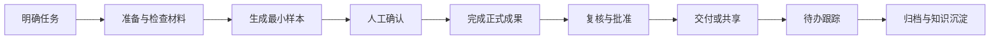

# 第 28 章 从任务到成果归档的通用工作流

本章把前面的能力连接成一条通用成果链，不描述公司真实业务链条。实际使用时应根据正式制度、职责和审批要求删减或调整步骤。

## 通用成果链



## 第一阶段：明确任务

使用第14章任务卡确认目标、读者、输入、输出、验收和禁止动作。范围不清时不进入批量执行。

## 第二阶段：准备材料

使用第12章建立文件清单和版本关系；涉及制度或多文档时使用第20章建立来源与引用关系；涉及项目材料时使用第21章检查完整性。

## 第三阶段：生成样本

按照第11、17、18或19章生成最小可验收样本。长报告先做一页，批量表格先处理少量记录，复杂流程先输出结构和检查表。

## 第四阶段：人工确认与正式成果

人工确认事实、口径、责任、格式和权限后，再扩大处理范围。WorkBuddy 输出正式成果、修改说明、待确认问题和验收记录。

## 第五阶段：交付与跟踪

外发、审批和正式写入由有权限人员执行。会议或项目产生的后续事项进入待办台账，保留责任、时限和状态。

## 第六阶段：归档与复用

按照第12章归档成果和版本；按照第16章沉淀来源和知识卡；重复稳定的流程按第23章制作 Skill，可靠重复任务再按第26章考虑自动化。

## 合成示例

任务是制作一份虚构专题工作的阶段汇报。先形成任务卡和材料清单，再生成一页摘要样本；确认后完成报告、数据表和汇报材料；复核通过后由责任人交付，最后归档成果并记录可复用模板。

### 可复制工作流模板

```text
请把以下任务设计成“任务—材料—样本—确认—成果—复核—交付—归档”的工作流。

任务：{任务}
输入：{材料}
输出：{成果}
验收：{标准}
权限边界：{边界}

请为每个阶段列出：负责人角色、输入、动作、输出、人工确认点和失败处理。
先给出最小流程，不要虚构部门、审批链和公司正式制度。
```

## 验收标准

- 每个阶段都有明确输入、输出和责任角色。
- 样本确认发生在批量处理之前。
- 外发、审批和高风险写入不会自动执行。
- 成果、依据、修改记录和待办可以追溯。
- 流程结束后形成归档记录和可复用资产。

## 常见弯路与安全边界

- 把所有章节一次串联，会造成流程过重。只选择任务需要的能力。
- 只交付成果不保存依据，后续无法复核。归档应包含证据和修改记录。
- 把通用流程画成公司现状，会制造错误事实。正式流程始终以批准文件为准。
