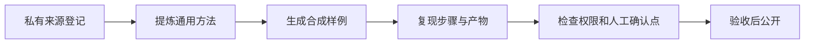

# 安居建业 WorkBuddy 共创规范

蓝皮书公开页面只收录来源清楚、边界明确、能够复现并可验收的通用方法。内部事项先在私有范围完成来源登记和方法抽象，公开时只使用合成样例。

## 可以提交什么

- 一个反复出现的办公任务和当前难点。
- 能复用的提示词、空白模板、检查表或 Skill 结构。
- 已脱敏的失败现象、原因和安全处理办法。
- 对现有章节的事实修正、步骤补充或过时截图提醒。

## 不要提交什么

- 真实项目、内部系统、部门、人员和群聊记录。
- 未公开经营数据、合同信息、审批意见和项目结论。
- 账号、密钥、本机路径和无权传播的第三方材料。
- 能通过名称、数字、截图或时间组合反推出具体事项的内容。

## 共创流程

## 统一章节结构

- 可应用到哪些任务
- 任务目标
- 输入材料
- 执行步骤
- 合成样例与可复制模板
- 人工确认点
- 输出物与验收标准
- 常见弯路
- 安全边界与可复用资产

## 提交共创建议

请只描述通用任务、期望输出、当前难点、验收方式和需要人工确认的步骤。具体内部材料由有权限人员在私有范围审核，不直接进入公开页面。

::: warning 公开边界
通用方法不得写成公司已经正式采用的流程。外发、删除、覆盖、审批和专业判断必须保留人工确认、日志和回退要求。
:::
