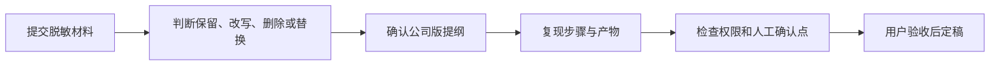

# 安居建业 WorkBuddy 共创案例规范

这本蓝皮书只收录来源清楚、边界明确、能够复现并可验收的真实工作案例。案例材料由员工提供，蓝皮书共创过程负责提炼方法，不虚构内部流程、项目成效或岗位职责。

## 可以提交什么

- 已经完成或正在验证的真实工作任务。
- 能复用的提示词、模板、Skill、自动化或检查清单。
- 失败案例、风险点和人工确认经验。
- 对现有章节的事实修正、流程补充或过时截图更新。

## 提交前检查

1. 去除姓名、联系方式、账号、密钥和其他个人信息。
2. 隐去未公开项目名称、金额、合同条款和经营数据。
3. 确认材料拥有内部使用和改写权限。
4. 标明哪些步骤涉及外发、删除、覆盖、审批或专业判断。
5. 保留可用于复现的脱敏样本，不提交真实生产数据。

## 逐章共创流程

## 统一章节结构

- 适用场景
- 任务目标
- 输入材料
- 执行步骤
- 人工确认点
- 输出物
- 验收标准
- 安全边界
- 可复用资产

## 提交案例

第一轮从原第 11 章开始逐章讨论。请提供该场景的脱敏材料、当前做法、期望产物和验收方式；在确认章节方向前，不会批量删除或改写后续章节。

::: warning 内部资料边界
请勿在共创材料中包含个人信息、账号密钥、未公开经营数据或无权传播的项目资料。高风险动作必须写明权限、人工确认、日志和回退方式。
:::
